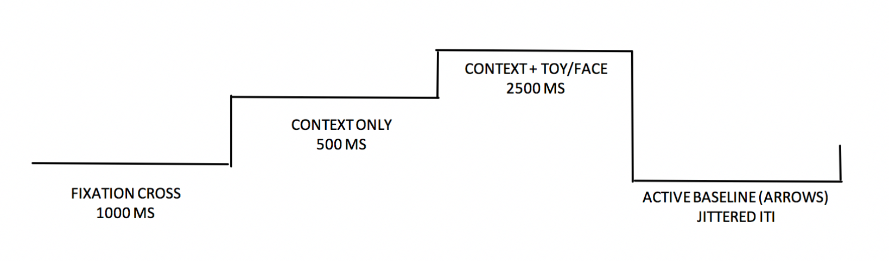
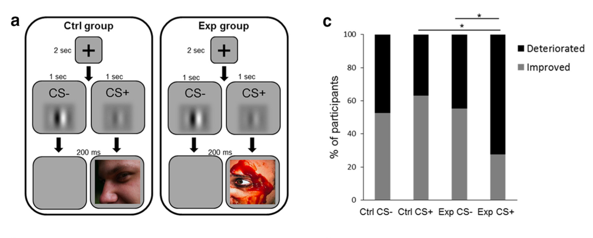
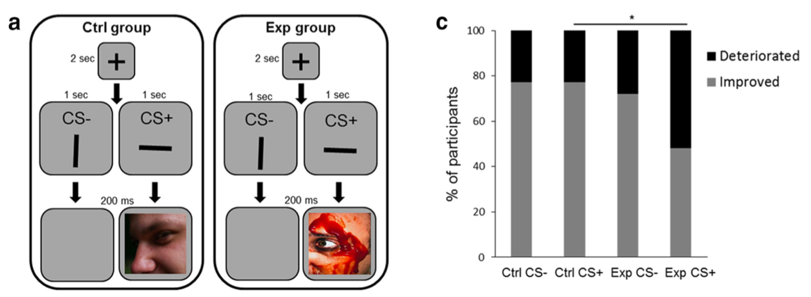
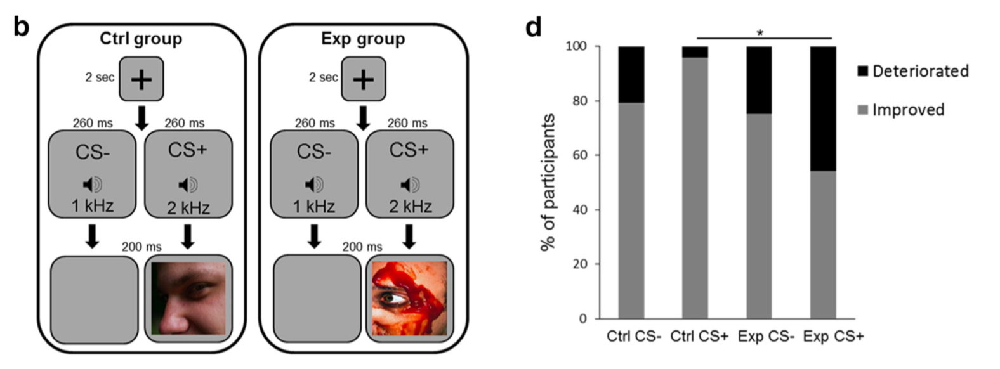
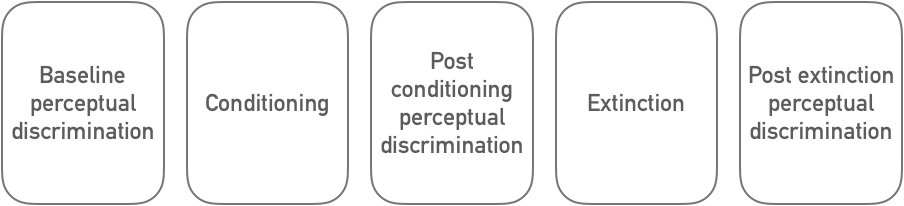

# Information

## Summary

### Abstract

The Mind, Brain, Body (MBB) study examines links between early life adversity (ELA), the gastrointestinal microbiome, memory and affective neurodevelopment, across three years in middle childhood through adolescence. The specific aims of this study are to (1) determine how adversity affects developmental change in the microbiome in middle childhood and adolescence, (2) establish associations between the microbiome, memory development, and the hippocampus, and (3) identify independent and joint influences of adversity exposure, the microbiome, brain and memory performance on the emergence of anxiety symptoms across development. We are recruiting N = 75 ELA exposed, and N = 75 not adversity exposed (Comparison) children and adolescents to take part in 3 waves of data collection. Children in the ELA group must be 6-16 years of age, while children in the comparison group must be 6-9 or 13-16 years of age. Participants complete a laboratory session (in-person or online) in Wave 1-3, and also complete a neuroimaging session in Wave 2. Study procedures for the laboratory session in Wave 1-3 remain similar. For the ELA group, we are recruiting youth who were adopted from institutional or foster care: previously institutionalized and who are now adopted internationally (PI), adopted domestically from foster care (DA). Comparison youth have not experienced these forms of early life caregiving adversities (i.e., they have always been with their biological parents). In addition to the primary aims of the MBB study, described above, we are also collecting a range of supplemental biological, questionnaire, and MRI measures aimed at assessing cognitive and emotional functioning, family functioning, as well as immune, biomarkers, and physical health assessments to aid in understanding the mechanisms behind the specific aims under investigation. The MBB study will test for links between the microbiome, memory, hippocampal function, and anxiety across a three-year time frame in middle childhood – adolescence (6-16 years of age). Participants may opt out of the study at any point in time but will be asked to participate in testing every year until funding ceases (current grant funding this research – R00 NIMH – ends in 2022).

-----------------

### Aims

The study will test four primary and two supplemental hypotheses. The primary hypotheses are: (H1) that there will be greater stability in microbiome composition across 3 years in the ELA than Comparison group, (H2) ELA will be associated with higher expression of anxiety symptoms across time, (H3) the microbiome in Wave 1 will predict developmental change in memory performance between Wave 1-3, and that hippocampal activity during learning will mediate that association, (H4) that the microbiome, hippocampal encoding patterns, and memory behavior longitudinally mediate the adversity and anxiety association across development. The supplemental hypotheses are: (SH1) that ELA will be associated with a higher incidence of physical health (particularly gastrointestinal) problems, as well as dysregulation in stress response and immune systems, (SH2) that physical symptoms, stress response and immune system will mediate the link between adversity exposure, microbiome changes, hippocampal neurodevelopment, and memory.

-----------------

### Background

An individuals early rearing history has a significant effect on their emotional functioning across the lifespan. In particular, access to consistent/stable caregivers is strongly associated with mental health [@repetti_2002], and parent-related early adversities (e.g., abuse and neglect) contribute to more than a third of mental illnesses [anxiety being the most common diagnosis; @kessler_2005]. Clinical, epidemiological and basic science suggests that two systems affected by early adversity – the gastrointestinal microbiome, and the hippocampal memory system, are also consistently associated with the emergence and maintenance of anxiety symptoms. Rodent and monkey models have established that adversity alters microbial communities in the gut [@bailey_1999; @bailey_2010; @omahony_2009] and that microbial populations are causally related to the expression of anxious behaviors [@collins_2013]. In humans too, microbiome-related gastrointestinal disturbances (e.g., irritable bowel syndrome) and anxiety are highly comorbid [@kennedy_2014; @callaghan_2019]. In terms of the memory system, rodent studies show that typically weak memories in childhood get stronger following adversity [@callaghan_2012a; callaghan_2012b; @cowan_2013], and exposure to early stress promotes hippocampal synaptic development [@huang_2005], which aids long-term memory persistence. Memory dysfunction is key to maintaining anxiety disorders, which are characterized by persistent and intrusive memories of threat[@acheson_2012; @zlomuzica_2014], and hippocampal dysfunction is common in anxiety disorders [@godsil_2013]. Importantly, hippocampal development is causally tied to the microbiome in early life [@callaghan_2016; @clarke_2013; @cowan_2016; @gareau_2011], suggesting that interactions between these two systems could contribute to anxiety emergence. Although microbial and hippocampal memory systems exert their effects on anxiety in the context of one another, until now, they have always been studied independently.

Using a completely novel longitudinal design, we will test the hypothesis that changes in the gastrointestinal microbiome are associated with early adverse caregiving and underlie altered hippocampal development and memory functioning in middle childhood – adolescence. Moreover, we will examine whether those microbial, and neurodevelopmental changes mediate the progression towards anxiety symptoms in early adversity exposed individuals. To answer these questions, we will compare longitudinal data from a group of adolescents who have experienced early caregiving adversity, to a group of comparison youth who have not experienced those same events. The study will involve examining the gastrointestinal microbiome (measured through stool samples), and functional magnetic resonance imaging (fMRI) to understand hippocampal functional development. In addition, the study will collect saliva and blood spot samples to assess saliva biomarkers (e.g., cortisol, testosterone) and blood immune markers (e.g., CRP, interleukins), as well as hair samples to assess chronic cortisol exposure, which can be used to understand the mechanisms behind microbiome-brain associations in youth.

-----------------

### Contributions

Study was designed by Dr. Bridget Callaghan.

Database formation, REDCap creation, task development, and setup was carried out by Dr. Bridget Callaghan, Emily Towner, Kristen Chu, Eason Taylor, Francesca Querdasi, Aileen Gozali, and Danielle Ladensack, with assistance from Alyssa Wieand, Reese Wix, and Nicole Fonacier.

Wiki Protocol development and modification was conducted by Dr. Bridget Callaghan, Kristen Chu, Emily Towner, Francesca Querdasi, Maria Calderon, and Chloe Schwartz.

Recruitment was carried out by Dr. Bridget Callaghan, Kristen Chu, Emily Towner, Sienna Osadon, Deborah Banner, Francesca Querdasi, Eason Taylor, Aileen Gozali, Danielle Ladensack, Maria Calderon, Charis Stanek, Megan Ngai, Ananya Eeraveni, Alyssa Wieand, Reese Wix, Nicole Fonacier, Leti Herrera, Grant Grech, Keegan Buch, Genesis Flores, Daisy Ramirez, Alyssa Ortega, Tiffany Nassirian, Yash Mehta, Lorena Gonzalez, and Andre Chan.

Scheduling/contacting participants/maintaining participant databases was carried out by Danielle Ladensack, Aileen Gozali, Maria Calderon, Charis Stanek, Tiffany Nassirian, Sienna Osadon, Deborah Banner, Yash Mehta, Madelyn Robinson, Andrew Hanna, Lorena Gonzalez, Kristen Chu, Emily Towner, Eason Taylor, and Anna Bretz.

Primary Data Collection for Wave 1 (in person) was carried out by Dr. Bridget Callaghan, Emily Towner, Eason Tayler, Aileen Gozali, Danielle Ladensack, and Kristen Chu with assistance from Alyssa Wieand, Reese Wix, and Nicole Fonacier.

Primary Data Collection for Wave 1 (online) was carried out by Francesca Querdasi, Kristen Chu, Maria Calderon, Charis Stanek, Deborah Banner, Sienna Osadon, Yash Mehta, and Andrew Hanna. 

Primary Data Collection for Wave 2 (online) was carried out by Dr. Bridget Callaghan, Francesca Querdasi, Naomi Gancz, Kristen Chu, Yash Mehta, Andrew Hanna, Deborah Banner, Sienna Osadon, Madelyn Robinson, Lorena Gonzalez, and Anna Bretz.

Data Entry and Data Quality checks were carried out by Kristen Chu, Emily Towner, Francesca Querdasi, Eason Taylor, Alyssa Ortega, Megan Ngai, Daniel Huang, Aileen Gozali, Danielle Ladensack, Maria Calderon, Charis Stanek, Deborah Banner, Sienna Osadon, Andre Chan, Keegan Buch, Yash Mehta, Lorena Gonzalez, Madelyn Robinson, Genesis Flores, Rory Simpson, Ananya Eeraveni, Alyssa Wieand, Reese Wix, Nicole Fonacier, Leti Herrera, Grant Grech, Daisy Ramirez, Elizabeth Harty, and Tiffany Nassirian.

Data Reviews and Data Audits were conducted by Kristen Chu, Emily Towner, Deborah Banner, Yash Mehta, Madelyn Robinson, Danielle Ladensack, Chloe Schwartz, and Tiffany Nassirian.

Behavioral coding was carried out by Rory Simpson, Elizabeth Harty, Danielle Ladensack, Grant Grech, Genesis Flores, Daniel Huang, and Nicole Fonacier. Dr. Bridget Callaghan and Kristen Chu are also validated behavioral coders using the Family Interaction Macro-Coding System (FIMS).

-----------------

## Procedure

All youth will be recruited through community settings, clinics (e.g., pediatricians office), specialized services (e.g., adoption services), and through the internet (community boards, targeted advertisements).

Three assessments (spaced 12 months apart – Wave 1-3) will occur with youth who fall within the period of development in the hippocampal and microbiome: ‘children’, and ‘adolescents’ aged 6-16 years. Biological (stool, saliva, blood spots, hair), questionnaire, and behavioral data will be collected in each wave of the study, and an fMRI scan will be collected in Wave 2. Participants will be recruited who have either experienced early life adversity (ELA) through adverse caregiving (previously institutionalized, domestically adopted), or who have not been exposed to those caregiving experiences (Comparison). A sample size of N = 75 youth will be recruited into each of those groups, resulting in a final target of N = 150 youth in the study (N = 37-38 in each of the age groups = children versus adolescents, for the ELA and Comparison groups at Wave 1). That target sample size takes attrition into account across the longitudinal study (expected at 20%, to arrive at a final sample size of N = 120). Study procedures for each wave of data collection will be similar, except for Wave 2 where an fMRI scan will occur in a second session. In addition, Wave 1 of data collection was transitioned online due to the outbreak of the global COVID-19 pandemic.

Participants will therefore range in age from 6-16 years at Wave 1, 7-17 years at Wave 2, and 8-20 years at Wave 3. Participants will be recruited through targeted mailout (birth records), online advertising (e.g., Craigslist), school and community organization partnerships, street-fairs and community gathering events, and flyers. After contacting the lab to express interest in study participation, parents of child and adolescent participants are contacted by telephone or email to be screened for study eligibility. An experienced research associate will conduct a scripted telephone interview to assess whether the participant/s meet criteria for inclusion/exclusion. If participants prefer to communicate via email, they will be sent a detailed infographic which contains the same key information communicated in the telephone script. In addition to this informational infographic, in the body of the email, participants will be sent a few brief questions to determine eligibility and basic demographics.

During this initial contact, if eligible and interested, participants will be scheduled for their Wave 1 session and sent the consent and assent forms. They will also be told about Wave 2-3 and that scheduling for those visits will take place approximately 12 and 24 months after Wave 1. Participants involved in any wave will be told that they will be invited to participate in future waves, but are not required to do so. When the study transitions to Wave 2, parents of children and adolescents who participated in Wave 1 will be re-contacted and screened for eligibility in Wave 2 using the same procedure. When the study transitions to Wave 3, parents of children and adolescents who participated in Wave 1 and/or Wave 2 will be re-contacted and screened for eligibility for Wave 3.

-----------------

## Measures

### Observations

#### Parent-Child Interaction

##### Description

Parents and children participated in a discussion where they were filmed having a conversation. They were presented with a laminated sheet which contained a list of pleasant events on one side and a list of issues on the other side. These lists contained topics and events that children and parents might experience (for example, pleasant events included talking about sports, going to a concert, camping, etc., while issues included cleaning, homework, cleanliness, etc.). Participants were instructed to take 1-minute to choose something on the list and then were given 5-minutes to discuss what they had chosen. They were instructed to try to resolve the conflict and to try to plan the pleasant event. Participants were permitted to expand beyond topics on the list. Participants were filmed during the interaction. The conflict interaction was completed first, and the pleasant event was discussed second to ensure that parents were not thinking about the negative interaction upon completing the clinical interview and questionnaires about their child immediately after the observation. Videos were coded using the Family Interaction Macrocoding System (FIMS)[@holmbeck_1995].

##### Details

##### Pleasant Events & Issues

Participants choose events from these two lists [@macphillamy_1982]:

| Pleasant Events Checklist                                         | Issues Checklist                                           |
| ----------------------------------------------------------------- | ---------------------------------------------------------- |
| Being in the country                                              | Telephone calls                                            |
| Talking about sports                                              | Bedtime                                                    |
| Going to a concert                                                | Cleaning bedroom                                           |
| Planning trips or vacations                                       | Doing homework                                             |
| Being at the beach                                                | Putting away clothes                                       |
| Doing art work (painting, sculpture, drawing, movie-making)       | Using the television                                       |
| Rock climbing or mountaineering                                   | Cleanliness (washing, showers, brushing teeth)             |
| Playing golf                                                      | Which clothes to wear                                      |
| Re-arranging or redecorating my room or house                     | How neat clothes look                                      |
| Going to a sports event                                           | Making too much noise at home                              |
| Reading stories, novels, poems, or plays                          | Table manners                                              |
| Making music together                                             | Fighting with siblings (brothers and sisters)              |
| Boating (canoeing, kyaking, motorboating, sailing, etc            | Cursing                                                    |
| Watching TV                                                       | How money is spent                                         |
| Camping                                                           | Picking books or movies                                    |
| Playing cards                                                     | Allowance                                                  |
| Completing a difficult task                                       | Going places without parents (shopping, movies, etc)       |
| Laughing                                                          | Playing stereo or radio too loudly                         |
| Solving a problem, puzzle, crossword                              | Turning off lights in house                                |
| Playing tennis                                                    | Taking care of records, games                              |
| Driving long distances                                            | Buying records, games, toys, and other things              |
| Woodworking, carpentry                                            | Going on dates                                             |
| Writing stones, novels, plays or poetry                           | Who friends should be                                      |
| Being with animals                                                | Selecting new clothes                                      |
| Riding in an airplane                                             | Coming home on time                                        |
| Exploring (hiking away from known routes)                         | Getting to school on time                                  |
| Going to a party                                                  | Getting low grades in school                               |
| Playing a musical instrument                                      | Getting in trouble at school                               |
| Making snacks                                                     | Lying                                                      |
| Snow skiing                                                       | Helping out around the house                               |
| Doing craft work (pottery, jewelry, leather, beads, weaving, etc) | Talking back to parents                                    |
|                                                                   | Getting up in the morning                                  |
|                                                                   | Bothering parents when they want to be left alone          |
|                                                                   | Bothering child/adolescent when they want to be left alone |
|                                                                   | Putting feet on furniture                                  |
|                                                                   | Messing up the house                                       |
|                                                                   | What time to have meals                                    |
|                                                                   | How to spend free time                                     |
|                                                                   | Earning money away from the house                          |
|                                                                   | What child/adolescent eats                                 |

##### Coding the Interaction

- After the observation are collected, videos will be coded by two observers blind to the caregiving group of the child (adversity or comparison).
- Videos will be coded using the Family Interaction Macrocoding Schedule (FIMS)[@holmbeck_1995].

- We ultimately decided to go with FIMS for several reasons:
    - Expense - Approximately \$1000 USD for a 10 hour skype training session with one of Holmbeck’s team
    - Validation in age range - FIMS was designed for older children and adolescents, and Sarah Whittle has validated it in a community sample of 8 year olds and their mothers.
    - FIMS is a less intensive coding schedule, producing global codes, rather than micro coded (i.e., minute to minute) scales - which makes more intuitive sense in the age range for MBB.
    - FIMS has a peer version that we might branch out to in the future (but likely not needing further training)[@holbein_2014].
    - Sarah Whittle’s group looked at the component structure for the FIMS and found components that seemed close to what they were finding with the Hops LIFE system - namely: negative maternal affect during pleasant event, negative maternal during conflict discussion, and pleasant maternal affect across both tasks (warmth). The negative maternal during pleasant event was the most predictive of child behavior problems. Overall, the correlations they report in their paper are all very sensical and convinced me that we should use the FIMS [@richmond_2018]

-----------------

### Interviews

#### KSADS

-----------------

### Physiology

##### ECG - Electrocardiogram

Child and adolescent participants will have their heart rate recorded using a Biopac recording device. Two small stickers containing a recording electrode are placed on the front of participant’s bodies (underneath their collarbone on the left and right side). A third sticker, also containing a recording electrode, will be placed on participant’s left lower rib. The electrodes are attached to recording wires, which lead to the Biopac machine, which is itself hooked up to a computer. Participants will have their heart rate measured during all of the computer tasks (which include playing computer games and watching movie clips).

##### GSR - Galvanic Skin Response

Child and adolescent participants will have their GSR (sweat) response measured while they are undergoing the computer tasks. GSR is measured by small stickers with electrodes that are placed on the participants hand to measure very small variations in sweating (which are a marker of attention). Two stickers are placed on the participants non-dominant hand, with wires leading to the Biopac machine and computer.

##### EGG - Electrogastrogram

Child and adolescent participants will have their gastric activity monitored through an EGG. Similar to measures of heart rate, the EGG is collected through small stickers containing recording electrodes that are stuck on the abdomen, and are connected through recording wires to the Biopac machine and then computer. EGG will be measured at the same time as participants heart rate and sweat response (during the computer tasks).

-----------------

### Tasks

#### Memory Intrusion

##### Description

Child and adolescent participants will listen to a list of words that surround a theme (e.g., for the theme sleep, they might hear – ‘pillow’, ‘bed’, ‘night’, ‘tired’, ‘cosy’). There will be a series of words that are conceptually related to the theme that they do not hear (e.g., they will not hear ‘sleeping’). Then participants are asked to recall the words they heard from the list, and the number of memory intrusions from related but not presented words (i.e., ‘sleeping’) is recorded. Participants will do two versions of this task, one preceded by a relaxing task (neutral movie clips described above), and another preceded by a mild stressor (sad/scary movie clips).

Note that the movie clips are age appropriate and follow film classification guidelines for the child’s/adolescent’s age (i.e., G-rated movies for the child age group). Such movies might involve scenes like the stampede scene from ‘The Lion King’.

##### Details

Physiology Marks - We have inserted start and stop times for the physiology for the movie component of the task, which will be used for one of the analyses. We have also inserted physiology marks for the start and stop times for each of the word lists, and finally for the recall phases.

*Note: Be careful using physiology during the recall phase, as the participant is talking during that phase.*

-----------------

#### Halloween

##### Description

The Halloween task is a memory task comprised of both recognition and associative memory components. Children are told that they are going to play a Halloween game. In one block, they see bright and cheery indoor and outdoor scenes, and in the next block the scenes are dark and haunted looking. In addition to these scenes, an item (toy or candy) is overlaid somewhere in the scene. They are told that their job is to collect the toys and sweets and remember what house the toys/candy came from. Each block has 20 trials (10 are the house + toy, 10 are the house + candy). The toys/candy that are paired with the houses are not counterbalanced, but the order of the blocks will be counterbalanced between participants (some will have day then night, and some will have night then day). The context is presented for 500ms before the item is overlaid on the context image for an additional 2500ms (3000ms total). There is a 500ms interstimulus interval between trials. There is a self-advancing break between the blocks.

##### Background

In prior work, across typical development, the research team found that during an associative learning task (contexts paired with objects or faces) there were different levels of granularity in the anterior third versus posterior third of the hippocampus - where representations were more granular in the posterior than anterior and that this granularity increased across age. Although brain data from previously institutionalized youth have not yet been analyzed, we have seen interesting behavior associations with adversity. Specifically, we see an age by adversity interaction on memory retention, where previously institutionalized children have better long-term memory retention, which becomes normalized by adolescence.

To further this line of research, we will continue looking at the association between granularity in the anterior versus posterior hippocampus and long-term memory retention. In this task, we also include a component looking at the role of emotion in processing. To incorporate this, we have one block of the task being emotional or threatening in some way – the contexts (scenes) will be either scary or not scary. The idea for this task comes from several papers [@brunec_2018; @lambert_2019; @tambini_2010].

##### Details

The idea from this task comes from four papers:

1. @tambini_2010 - enhanced brain correlations at rest are associated with long term memory. Based on the results of this paper, Callaghan, Tottenham and Davachi developed the task that Bridget subsequently used for the K99 grant. See details below.
2. @brunec_2018 - Multiple scales of representation along the hippocampal anteroposterior axis in humans. The analysis used in this paper - representational granularity - we adopted for my K99 project.
3. Results of the K99 project - in the K99, across typical development, we found that during an associative learning task (contexts paired with objects or faces) there were different levels of granularity in the anterior third vs. posterior third of the hippocampus - where representations were more granular in the posterior than anterior and that this granularity increased across age. Although we have not yet analyzed the brain in PI youth, we have seen interesting behavior associations with adversity. Specifically, we see an age x adversity interaction on memory retention, where PI children have better long term memory retention, which becomes normalized by adolescence.
4. @lambert_2019 - altered development of hippocampus dependent associative learning following early life adversity. In this paper they found that adversity (violence exposed youth) were impaired in hippocampus associative memory only when the item (faces) were angry. That is, when threat cues were present, they suggested that is hijacked encoding and made more elemental and less context integrated.

In the R00, I wanted to continue looking at the association between granularity in the anterior vs. posterior hippocampus and long term memory retention. However, rather than do the exact same task as the in the K99, I wanted to include a component that looked at the role of emotion in processing. One way to do this is doing the same item + context task as I did during the K99, but having one of the runs of the task being emotional or threatening in some way.

Idea for the halloween game:

Items will be toys and sweets, and the contexts will either be scary or not scary. This is different than the Lambert study in that her contexts were neutral and the items (i.e., faces) were angry or not. So therefore the scary item prevented the processing of the context. In this version, the context will be scary and the item will be neutral - so will the context hijack the processing and make the scary run harder for adversity exposed kids to learn the association? Or will it be the opposite, heightening attention and improving learning?

Structure of the game:
Children will be told that they are going to play a halloween game. In one run, they will see bright and cheery indoor and outdoor scenes, and in the next run the scenes will be dark and haunted looking. They will be told that their job is to collect the toys and sweets and remember what house the toys/sweets came from.

This is the basic structure of each block. First there is a fixation cross for 1 second, then a house will appear on the screen for 500ms, then the house+toy/sweets will appear on the screen for an addition 2.5 seconds (total of 3 seconds for the house and the house+toy/sweet, then there will be a baseline period that is jittered in length. The baseline is jittered in the MRI but it will be a fixed length of 1 seconds in the lab-based version of the task. In the MRI the active baseline will involve pressing buttons to indicate the direction of arrows on the screen, in the lab-based version of the task, it involves simply looking at a fixation dot.

There will be two blocks (day, and night). The day block is the emotionally neutral block, whereas the night block is the scary block. Each block has 20 trials (10 are the house + toy, 10 are the house + sweets). The toys/sweets that are paired with the houses are not counterbalanced, but the order of the blocks will be counterbalanced between participants (some will have day then night, and the rest will have night then day).

As an added layer to this task, we will not only pair an item with a house, but we will place it on top of the house in one quadrant. To encode a detailed associative memory, the individual will need to remember what item was paired with the house and then what quadrant it was in. For this test, a picture of a house will be shown along with 3 choices for which item matches with the house, one being correct and 2 serving as filler “foils.” The two “foil” options are items from other houses, so the child will have seen them before. Each item will both be a correct answer for the house it was initially paired with and a foil answer for two other houses throughout the trial. Additionally, the child will have to recall which quadrant the selected item was in on the house. The quadrants appear

For the recognition test there should be an equal number of foils as target items.

-----------------

#### Characters (monsters/aliens)

##### Description

Participants are instructed that their job in this game is to learn which "character" is right and which is wrong through trial-and-error. Participants are presented two stimuli side-by-side for 3500 milliseconds and indicate which character they choose by using the left and right arrow keys on the keyboard. Stimuli are presented in pairs AB, CD, EF (and their counterbalanced version BA, DC, FE). Stimuli A is correct in the AB/BA trials 80% of the time. Stimuli C is correct in the CD/DC trials 70% of the time. Stimuli E is correct in the EF/FE trials 60% of the time. Stimuli are randomly shuffled and assigned a letter at the beginning of the task. For Mind, Brain, Body, the stimuli consisted of colorful monsters/aliens.

If participants choose "correctly" they will see a green check mark and hear "ding" sound. If they choose "incorrectly" they will see a red x mark and hear a "horn" sound. If they take longer than 3500 milliseconds to respond, they are shown a screen that says "Too Slow". All feedback is presented for 2000 milliseconds before moving on to the next trial. Stimuli pairs are presented 10 times each in random order in each block (total of 60 trials). PsychoPy tallies the correct and incorrect responses on a block-by-block basis. Participants move onto the test phase once they have reached a performance criterion (65% accuracy for AB/BA trials, 60% accuracy for CD/DC trials, 50% accuracy for EF/FE trials). If participants do not reach criterion, they are automatically directed to the test after reaching a certain number of blocks (3 for children, 5 for adolescents).

During the test, participants are presented with all training pairs (AB/BA, CD/DC, EF/FE), and novel pairs including A and B (AC/CA, AD/DA, AE/EA, AF/FA, BC/CB, BD/DB, BE/EB, BF/FB). Test pairs are each presented 6 times. This section is untimed, and no feedback is provided.

##### Background

The characters task assesses learning. It is a cognitive reinforcement learning task in which participants must learn to choose one stimulus over another through reinforcement. Participants can employ two strategies to learn the correct response—either they can learn to choose stimulus ‘A’ or to avoid stimulus ‘B’. At test, these stimuli are paired with novel stimuli. If participants choose stimulus ‘A’ over the novel stimulus, that is evidence of positive feedback learning. If participants choose the novel stimulus over stimulus ‘B’, that is evidence of negative feedback learning. As a result, this task allows for direct comparison of sensitivity to these two types of learning [@frank_2004].

##### Details

PsychoPy parameters should be set to:

- 10 trial_loop nreps
- 3 test_loop nreps
- Maximum 5 block_loops nreps (advances after criterion is met)

Physiology markers are set to:

- Channel 1 (28) - Train stimulus onset
- Channel 2 (29) - Check
- Channel 3 (30) - X
- Channel 4 (31) - Miss
- Channel 5 (32) - Test stimulus onset

Task based on original task by @frank_2004, re-programmed and adapted by Emily Towner and Ryan Burnell.

-----------------

#### Discrimination / Conditioning / Extinction

##### Description

Children and adolescent participants will take part in a visual perceptual threshold task. Participants will be shown visual stimuli (e.g., two black stripes at different orientations, or two Gabors with different levels of contrast) and asked to discriminate between them: “which stripe is rotated more clockwise 1 or 2?” for the stripes, or
“which picture is darker/clearer 1 or 2?” for the Gabors. The magnitude of the difference between the two choices will be decreased after two correct choices, and increased after one correct choice, and will be continued until 6 wrong choices are made. The smallest magnitude where participants were able to correctly identify the stripe or Gabor in question is their Just Noticeable Difference (JND) threshold. The JND will be calculated before and after the threat learning task, and after the extinction task.

##### Details

This task has two purposes.

1. The first is to simply look at threat learning and extinction in children and adolescents across typical development and after adversity exposure. This has been done many times before, but we will also have children attached to an electrogastrogram (EGG - which is completely novel), GSR (sweat - which is the common measure), and heart rate (which is somewhat common but less so in the conditioning literature) while they and learning and extinguishing.
2. The second purpose of the task is to look at how conditioning and extinction affect perceptual thresholds. This is built from a large literature in adults showing that threat learning can lead to a broadening or narrowing of tuning curves following threat conditioning, depending on the specific parameters in place (more narrowing - i.e., better, occurs when a discriminatory conditioning procedure is employed and where the CS- and the CS+ and really different; more broadening occurs when the CS- and the CS+ are similar and when there is not explicit discriminative conditioning. We are going to employ a form of conditioning that has been shown to lead to perceptual broadening in adults.

Past literature:
This paper by @shalev_2018 demonstrates the effect we are trying to test in children/adolescents. They use an across sensory modality procedure (CSs = auditory, USs = visual) and between subjects design (control group = CS+ are positive/neutral, and experiments group where CS+ are negative) with pre/post perceptual tuning curves to determine the effect of threat learning on sensory discrimination.

The basic task structure:

The task and results:

They find that when the CS+ is paired with the aversive picture, people show a deterioration in their ability to discriminate the CS+ from tones that are similar to it, whereas they show very little change in their ability to discriminate the CS- from tones that are similar to it. They saw the same thing with gabors that differed in contrast (right) and lines that differed in orientation (left).

Current Task Structure:

We will use an approach where we pair aversive/pleasant noises (USs) with lines at different orientations (CSs). In the control group the noise will be pleasant or neutral. In the experimental group the noise will be aversive.

The timeline of the task will be as follows:

- Number of trials was based on review of five papers [@norrholm_2011 (56 trials); @norrholm_2006 (72 trials); @schiller_2013 (32 trials); @phelps_2004 (34 trials); @jovanovic_2014].

The experimental protocol consisted of two phases: fear acquisition and extinction. The sessions were separated by 10 minutes. The acquisition phase consisted of 3 blocks, each with 3 CS+ trials, 3 CS− trials, and 3 noise alone (NA, no CS presented during startle probe) trials, for a total of 27 startle trials. Both CSs were colored shapes presented on a computer monitor for 6000 ms prior to the delivery of the startle probe, and co-terminated with the US 500 ms after the presentation of the startle stimulus. The CS+ was reinforced with the airblast 100% of the time. The extinction phase consisted of 4 blocks with 3 trials of each type. The CSs were same as above, except that the CS+ was no longer paired with the airblast. In all phases of the experiment, inter-trial intervals will be randomized between 9 and 22 seconds.

| Person            | Role                                                                                                              |
| ----------------- | ----------------------------------------------------------------------------------------------------------------- |
| Bridget           | Developed concept                                                                                                 |
| Psychopy tutorial | The structure of the staircase                                                                                    |
| Paul Bloom        | Helped to adapt the staircase (changed from sequential to serial, centered stimuli, randomized order, added mask) |
| Emily Towner      | Building the task and completing the staircase                                                                    |

-----------------

#### Memory Generalization

-----------------

### Tests

#### WASI

#### WIAT

Wechsler Individual Achievement Test (WIAT) – 4-85 years. Child/adolescent self-report. Domain assessed cognitive function. The WIAT is a comprehensive yet flexible measurement tool useful for achievement skills assessment, learning disability diagnosis, special education placement, and clinical appraisal for preschool children through adults. Norms allow for assessment of those from ages 4 to 85.

-----------------

### Measurements

#### Height & Weight

Tri-ponderal mass (TPM) and body mass index (BMI) will be calculated using height and weight measurements. TPM/BMI has been related to the microbiome in past studies and is important to consider as a confounding variable in those analyses, as well as an outcome variable related to early adversity.

#### Waist Circumference

Waist circumference will be taken using measuring tape around the child and adolescent participant’s waist. This will be an outcome measure related to effects of early adversity exposure on physical development.

-----------------

### Biological Samples

#### Hair sample

Child and adolescent participants will donate a head hair sample for the purpose of measuring average cortisol levels during the past month. To collect the sample, a few strands of hair behind the crown of the head will be cut close to the root. This method of collecting hair is not invasive and has been performed in babies [32 weeks of age; @staufenbiel_2013]. Hair samples will never be used for genetic analysis.

#### Saliva sample

Saliva samples will be collected from child and adolescent participants in the lab using omnigene oral tubes (dnagenotek). Participants spit into a tube using a saliva collection kit. If participants are unable to spit, they will place small sterilized sponges in their mouths to collect the saliva. The sponges are then placed into the tube. After the cap of the tube is closed, it will break open a seal inside that releases a stabilizing solution into the tube which stabilizes the saliva. The saliva will be used to analyze bacteria in the oral cavity. The stabilization technique we use allows the saliva samples to remain at ambient temperature for several months. In batches, the saliva will sent to the processing facility. The samples will be labelled with participant ID codes only – no personally identifying information. Only microbial DNA, not human DNA, is analyzed in these samples.

#### Blood sample

Dried Blood Spot Collection: Participants can opt into or out of participating in the dried blood spot collection (identified during the consent process). Those who opt into the blood spot collection will have one finger on their non¬dominant hand pricked in order to provide approximately ten drops of blood that will be placed on special filter paper cards and examined for circulating and molecular markers of inflammation. We will not collect blood from participants who are feeling ill or participants who take anticoagulants or blood thinners (e.g. Heparin, Warfarin – verified through medication checklist). Participants will be offered a Virtual Reality (VR) immersive headset to watch a video during the blood spot procedure. Previous studies have empirically demonstrated that VR can significantly reduce child/adolescent anxiety about blood spot/draw procedures. The trained researcher will massage the finger to be pricked to draw the blood circulation to that area, and will use BD Microtainer contact-activated lancets to make one prick the middle or ring finger on the non-dominant hand, disposing of the lancet in a bio¬hazard sharps container immediately. This procedure is similar to what children/adolescent may experience at a pediatrician visit. Five drops of blood are placed onto each of two Whatman 903 Proteinsaver cards (GE Healthcare Bio¬Sciences). After collection, the finger will be cleaned (with an alcohol swab), dried with gauze, and bandaged. Blood spot samples will be dried overnight, then closed, labeled with ID number and date, and stored in a small plastic bag with a desiccant pack. Bags are stored in -¬80 Celsius freezer until shipped for further processing. When shipped for further processing, the bags are placed in an insulated box with dry ice before being transported for analysis. Blood test results are not diagnostic and will not be shared with study participants. Risks of the procedure include temporary soreness at the site of the finger prick, or in very rare circumstances, infection. To minimize the risk of infection, we will follow sterile procedures, including the use of sterile, one-time-use lancets, sterile gauze/bandage, and alcohol wipes of the site. Blood will be collected in the Health Psychology Lab in Franz or in the SAND lab in Franz, which has a drape to maintain cleanliness of the collection area, a sharps container, as well as antibacterial cleaning materials to maintain cleanliness of the collection room. Experimenters performing the needle prick will wear gloves throughout the procedure and wear covered clothing as a safety precaution. The non¬dominant hand will be used and bandaged to avoid soreness from overuse at the site of the finger prick. If there is no blood, or not sufficient blood on the first finger prick, a second prick will be attempted on a different finger to avoid unnecessary discomfort. Experimenters performing the finger prick will be trained and certified in dried blood spot collection.

#### Stool sample

A stool sample will be collected from the child and adolescent participants in their home with the assistance of their parent using omnigene gut tubes (dnagenotek). Using a regular toilet, participants use the paper toilet hat to catch the stool. Participants will use a small sterile spatula to collect a pea sized amount of stool from the toilet hat and place it in the tube. After the lid is sealed, with the sample inside, the participant will shake the tube. A homogenization bead inside will break up the sample and cover all of the sample with a stabilizing liquid. The participant will place the stool sample into a biohazard bag, into a padded mailer, which will be returned to the lab through the registered post. The stabilization technique we use allows the stool samples to remain at ambient temperature for several weeks. Once the sample arrives at the lab, it will be placed into the locked -80 Celcius freezer until processing. Once all samples are collected we will pack the samples in dry ice and send to the processing facility. The samples will be labelled with participant ID codes only – no personally identifying information. Only microbial DNA, not human DNA, is analyzed in these samples.

Note: On Nov 16, 2020 there was a product change notification sent by DNA Genotek regarding the OMNIgene•GUT (OM/R-200, OM/R-200.100) and PERFORMAbiome•GUT (PB-200) devices. In brief, DNA Genotek removed “Made in Canada” from their packaging and updated the lot information (reflected in the barcode), to allow for an increase in manufacturing sites sand production lots sizes. This is to note that different sites may have made the omnigene packages we use in different study waves. Please see here for more information: [product_change_notification](https://ucla.app.box.com/file/748332038901)

-----------------

### Questionnaires

#### Child

| Title        | Description  | Reference  | Respondent  | Wave | Version |
| ------------ | ------------ | ---------- | ----------- | ---- | ------- |
| Alexithymia | Domain assessed: mental health/affective function. This questionnaire asks youth to endorse a number of items falling within three factors (1) Difficulty identifying feelings, (2) difficulty describing feelings, (3) externally oriented thinking. | (Rieffe, Oosterveld, & Terwogt, 2006) | Child/adolescent (self report) | Wave 1, Wave 1 Online
| Children’s Perception of Interparental Conflict Scale (cpic)– 6-18 years | Domains assessed: parenting and family structure. The CPIC assesses children’s/adolescent’s experience of parental conflict, including subscales (Conflict Properties, Threat, Self-Blame). | (Grych, Seid, & Fincham, 1992) | Child/adolescent (self report) | Wave 1, Wave 1 Online
| Child Somatization Symptom Inventory (cssi)– 6-17 years | Parent report for children under 8 years. Domain assessed: physical symptoms. The CSSI assesses a variety of nonspecific somatic symptoms. | (Walker et al., 2009) | Child/adolescent (self report) | Wave 1, Wave 1 Online
| Security Scale (ss) – 8-18 years | Domain assessed: attachment. This measure asks children/adolescents to endorse statements about their feelings towards their parents (in the positive or negative) and how much each endorsed statement is characteristic of them. Statements assess domains of being able to rely on parents in times of need, feelings of closeness with parent etc.| (Kerns et al., 2001) | Child/adolescent (self report) | Wave 1, Wave 1 Online
| Benevolent Childhood Experiences Scale- Revised (bce) | Child/adolescent self-report. Domain assessed: benevolent childhood experiences. This child/adolescent self-report questionnaire consists of 10 items used to identify favorable childhood experiences, with regards to potential child adversity. | (Narayan et al., 2018) | Child/adolescent (self report) | Wave 1 Online

Notes:

Attention checks were embedded in several child questionnaires beginning with MBB online.

- attention_check_1 (ss)
- attention_check_2 (cpic)
- attention_check_3 (alexithymia)
- attention_check_4 (bce)
- attention_check_5 (cssi)

-----------------

#### Parent

##### Parent Self

| Title        | Description  | Reference  | Respondent  | Wave | Version |
| ------------ | ------------ | ---------- | ----------- | ---- | ------- |
| Beck Depression Inventory – II (bdi_ii)| Mental health/affective functioning. Developed for the assessment of symptoms corresponding to criteria for diagnosing depressive disorders listed in the DSM IV. | (Beck, Steer, & Brown, 1996) | Parents (self report) | Wave 1, Wave 1 Online
| COVID-19 Objective Questionnaire (covid_objective) | COVID-19 objective measures. This questionnaire consists of 12 items to identify health changes and lifestyle changes made From the impacts of the COVID-19 outbreak. | (Made by BABLab) | Parents (self report) | Wave 1 Online
| Financial Hardship | This 2-item questionnaire asks how often in the past 12 months the participant was worried or stressed about having enough money to pay rent/mortage and to buy nutritious meals. | (Jachimowicz et al., 2020) | Parents (self report) | Wave 1 online
| Community Financial Support | This 3-item questionnaire assesses the degree that participants feel they can rely on others in their community for financial support if needed. | (Jachimowicz et al., 2020) | Parents (self report) | Wave 1 Online 

##### Parent Proxy

| Title        | Description  | Reference  | Respondent  | Wave | Version |
| ------------ | ------------ | ---------- | ----------- | ---- | ------- |
| Demographic Questionnaire | Demographics. The project developed questionnaire asks parents about their household income, their own and their child’s/adolescent’s race/ethnicity, the parent age, education, and marital status, and contact details. | (Made by BABLab) | Parents (proxy) | Wave 1, Wave 1 Online
| Pediatric Quality of Life - Gastrointestinal (pedsql_gi) | Physical symptoms. The PedsQL Gastrointestinal Symptoms Scale will be administered. These questionnaires are designed to assess the incidence of gastrointestinal symptoms in youth.| (Varni et al., 2015) | Parents (proxy) | Wave 1, Wave 1 Online
| Pediatric Quality of Life - Well Being (pedsql_wb) | Physical symptoms. The PedsQL General Wellbeing Scale will be administered. These questionnaires are designed to assess general feelings of wellbeing in youth. | (Varni et al., 2015) | Parents (proxy) | Wave 1, Wave 1 Online
| Pediatric Quality of Life (pedsql_f) | Physical symptoms. The PedsQL Multidimensional Fatigue Scale will be administered. These questionnaires are designed to assess the incidence of fatigue symptoms in youth.| (Varni et al., 2015) | Parents (proxy) | Wave 1, Wave 1 Online
| Revised Evaluation of Activity Survey in Youth (easy)| Physical symptoms. The EASY asks parents to rate how physically active their child/adolescent has been during COVID-19. | (Pate et al., 2018) | Parents (proxy) | Wave 1, Wave 1 Online
| Revised Traumatic Events Screening Inventory (tesi) | Caregiving adversity. The TESI-C assesses a child's/adolescent’s experience of a variety of potential traumatic events including physical/sexual abuse and neglect. | (Ippen et al., 2002) | Parents (proxy) | Wave 1, Wave 1 Online
| Child Behavior Checklist (cbcl) | Mental health/affective function. Assesses behavioral competency and behavioral problems in children and adolescents within the past six months. The following syndrome scales are assessed: anxious/depressed, withdrawn/depressed, somatic complains, social problems, thought problems, rule-breaking behavior, and aggressive behavior. | (Felitti et al., ) | Parents (proxy) | Wave 1, Wave 1 Online
| Child Sleep Habits Questionnaire (csqh) | Sleep. Multidimensional sleep assessment including sleeping difficulties, behavioral problems around sleep etc. | (Owens, Spirito, & McQuinn, 2000) | Parents (proxy) | Wave 1, Wave 1 Online
| Microbiome metadata questionnaire (mb_metadata) | Microbiome metadata. This study developed questionnaire asks parents to report on a number of variables known to influence the microbiome, including whether their child/adolescent was born prematurely, mode of birth, pre- or post-natal antibiotic usage, pets in the home, country of birth, breast or bottle feeding, special diets (e.g., vegetarianism or dairy free). | (Made by BABLab) | Parents (proxy) | Wave 1, Wave 1 Online
| Medication Checklist (med_check) | Parents are asked to list all medications that their children/adolescents are on. This information is used as a covariate in analyses of brain, microbiome, and biomarker data, as different medications can affect the readouts from these assays/analyses. | (Made by BABLab) | Parents (proxy) | Wave 1, Wave 1 Online
| Petersen Physical Development Scales (pds)| The Peterson Puberty Scale is an adaptation of an interview-based puberty-rating scale by Petersen, and includes scores for each of five items rating physical development, an overall maturation measure, and a categorical maturation score. It is designed to be non-invasive, not requiring the use of pictures. | (Petersen et al., 1988) | Parents (proxy) | Wave 1, Wave 1 Online | Male and female
| Digestive Health and Wellbeing Survey (dhws) |This survey asks parents to endorse whether a doctor has ever diagnosed their child/adolescent with a range of allergic and autoimmune conditions. | (Holoski et al., 2019) | Parents (proxy) | Wave 1, Wave 1 Online
| Hair-Care Practice Questionnaire (hpq). | This questionnaire consists of 9 items for parents to indicate their child/adolescent’s hair care practices for information relevant to the hair sample.| (Made by BABLab) | Parents (proxy)[for Wave 1 children under 10, for Wave 1 online all children] | Wave 1, Wave 1 Online
| Child Somatization Symptom Inventory (cssi) | The CSSI assesses a variety of nonspecific somatic symptoms. | (Walker et al., 2009) | Parents (proxy)[children < 8 years] | Wave 1, Wave 1 Online
| Foster Care Inventory (fci)| This instrument was made for the current study and assesses the number of foster care placements and care history. | (Made by Tottenham Lab) | Parents (proxy)[adopted only] | Wave 1, Wave 1 Online
| International Adoption Inventory (iai) | This instrument was made for the study and asks parents of internationally adopted youth about the quality of institution and details of the adoption process. | (Made by Tottenham Lab) | Parents (proxy)[adopted only] | Wave 1, Wave 1 Online
| Financial Support Questionnaire (financial) | The project developed financial support questionnaire assesses public assistance received, and health insurance information. All questions on this assessment (as with all assessments) will have an option not to disclose this information. | (Made by BABLab) | Parents (proxy) | Wave 1, Wave 1 Online
| Bristol Stool Scale (bss) | Stool sample short questionnaire: After collecting the stool sample, participants will be asked to indicate on a short questionnaire whether they were feeling ill on the day the sample was collected, what time the sample was collected, and consistency of stool. They will also be asked if their diet on the day of sample collection was typical. | (Developed by Bristol Royal Infirmary) | Parent (proxy) | Wave 1, Wave 1 Online
| COVID-19 Objective Questionnaire (covid_objective) | COVID-19 objective measures. This questionnaire consists of 12 items to identify health changes and lifestyle changes made From the impacts of the COVID-19 outbreak. | (Made by BABLab) | Parents (proxy) | Wave 1 online
| Parenting Stress (parenting_stress) | Designed to evaluate the magnitude of stress in the parent-child system, focusing on three major domains of stress: 1) child/adolescent characteristics, 2) parent characteristics, and 3) situational/demographic life stress. Revised questionnaire focuses on stress in the context of COVID-19.| (Made by BABLab) | Parents (proxy) | Wave 1 online

-----------------

#### Qualitative

##### COVID-19 Written Responses

| Title        | Reference  | Respondent  | Wave | Version |
| ------------ | ---------- | ----------- | ---- | ------- |
| COVID-19 Written Response (written_response_parentself) | (Pennebaker, 1997) | Parents (self report) | Wave 1 Online [optional]

Domain assessed: Emotional impacts of COVID-19. This self-report measure consists of one long-form qualitative response, prompting a parent to write continuously for five minutes about the impacts of COVID-19 on their life and family. This qualitative response was adapted from previous prompts in writing about emotional experiences, and seeks to assess the emotional and behavioral impacts of the Pandemic on children and families.

| Title        | Reference  | Respondent  | Wave | Version |
| ------------ | ---------- | ----------- | ---- | ------- |
| COVID-19 Written Response (written_response) | (Pennebaker, 1997) | Children (self report) | Wave 1 Online [optional]

Domain assessed: Emotional impacts of COVID-19. This self-report measure consists of one long-form qualitative response, prompting a child to write continuously for five minutes about the impacts of COVID-19 on their life and family (for children who cannot write or do not feel comfortable writing, children can dictate and parent can write). This qualitative response was adapted from previous prompts in writing about emotional experiences, and seeks to assess the emotional and behavioral impacts of the Pandemic on children and families. 

-----------------
