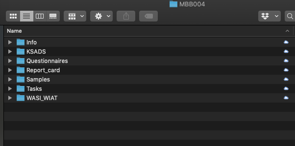
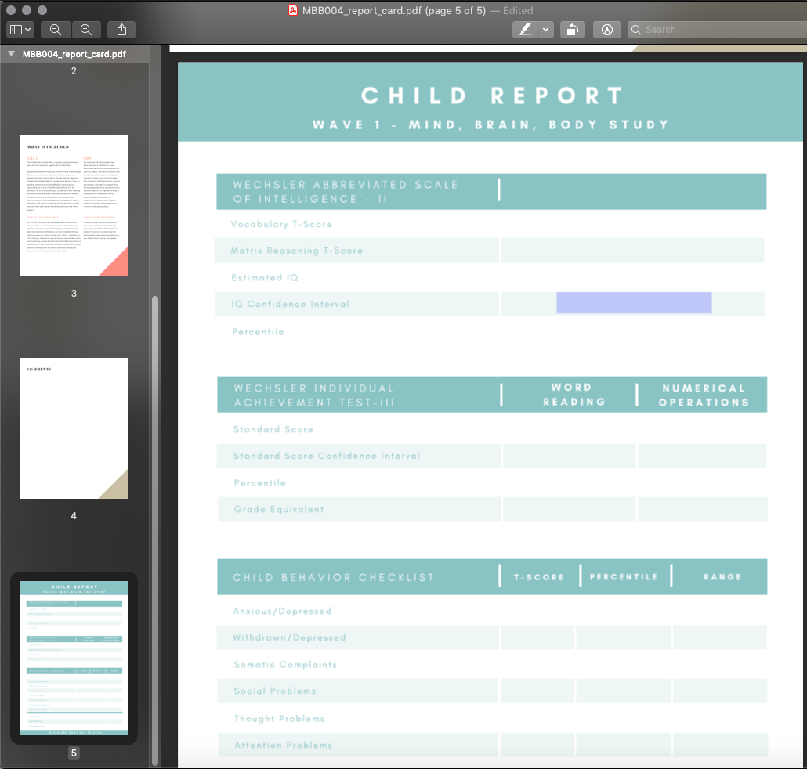

# Checklists

-----------

## Initial Checklist

**Scheduling and Confirmation**

- Schedule lab session
- Send confirmation email (in templates)
   - Attach [Next Steps](https://app.box.com/file/630326369239)

**Enrollment**

- Create participant Box folder using MBB_template (delete blank README from newly created folder)
- Enroll participant in Wave 1 on REDCap
- Fill participant instrument on REDCap
- Fill counterbalance order on REDCap (Checklist - Lab Session Child Instrument)

**Calendar**

- Create MBB calendar event lab session and invite researchers
- Create DBS calendar event (SAND calendar)
- Create MBB calendar event lab session reminder 1 (email) (1 week prior)
- Create MBB calendar event lab session reminder 2 (email and call) (3 days prior)
- Create MBB calendar event to send home session reminder 1 (email) (1 week after lab session)
- Create MBB calendar event to make home session reminder 1 (call) (8 days after lab session)
- Create MBB calendar event to send home session reminder 2 (email) (10 days after lab session)
- Create MBB calendar event to send home session reminder 3 email (14 days after lab session)

**Reminders**

- Send lab session reminder 1 email (in templates - attach next steps, consent/assent)
- Send lab session reminder 2 email (in templates - attach previous and parking info)
- Confirm participant 
   - Preferably by phone
   - Update lab session calendar status
   
------------

## Pre-Lab Session Checklist

### Lab Session Setup - 1 Day Prior

- Create participant manila folder
- Print assent/consent forms (Check IRB expiration)
   - [Parent consent](https://app.box.com/file/630320519707)
   - Assent - [Child](https://app.box.com/file/630320502379) or [Teen](https://app.box.com/file/630326888191) (None if under 7 years)
   - [Referral consent](https://app.box.com/file/630329099729)
   - [Contact list](https://app.box.com/file/639652767665)
   - [DBS consent](https://app.box.com/file/630326424318)
- Print [MBB Lab-Session Checklist-Child](https://app.box.com/file/630326484181) (Enter counterbalance order)
- Print [MBB Lab-Session Checklist-Parent](https://app.box.com/file/630325295018) 
- Print [KSADS Summary Diagnostic Checklists](https://app.box.com/file/630326477910) (Write participant ID on all pages)
- Print and prepare [WASI Form](https://app.box.com/file/630326463909) (Enter starting point; write participant ID on all pages)
- Print and prepare [WIAT Form](https://app.box.com/file/630318060264) & [Booklet](https://app.box.com/file/630326404817) (Enter starting point; Write participant ID on all pages)
- Print [Memory Intrusion Scratch Paper](https://app.box.com/file/630322810250)
- Print and insert [Bristol Stool Scale](https://app.box.com/file/630326499609) (MBB Specific Version)
- Print and fill in codes on [Participant Info Brochure](https://app.box.com/file/630317204624)
- File participant manila folder in front section of file cabinet (Upcoming)
- Charge
   - iPads
   - iPad pencils
   - Biopac transmitters
   - VR headset (Check remote battery)
   - Audio recorders
- Make sure audio recorder batteries have enough charge
- Label electrodes with color stickers 
   - Blue=EGG
   - Yellow=ECG
- Make [participant name tags](https://app.box.com/file/630320259767)
- Print [Payment Receipt Template](https://app.box.com/file/630326568873) 
- Assemble home kit
   - Insert gut kit
   - Insert toilet hat
   - Insert oral kit
   - Insert biohazard bag
   - Insert Bristol Stool Scale
   - Label all items with participant ID (in sharpie)
   - Insert MBB info cards
   - Attach FedEx slip to mailer
   - Label mailer with “Exempt human specimen” (in sharpie)

------------

### Lab Session Setup - 1 Hour Prior

- Place in Rainbow Room
   - Consent/assent/DBS/contact on clipboard with pens
   - Consent protocol
   - [Pleasant Events Checklist and Issues Checklist](https://app.box.com/file/630327764749)
- Place WASI & books (2)/WIAT & card/protocol in testing room
- Place audio recorders in testing rooms
- Attach researcher documents to clipboards
   - Child - Checklist, Memory Intrusion notes
   - Parent - Checklist, KSADS summary
- Turn iPads on airplane mode and WiFi off
- Clear and setup KSADS on iPad (duplicate blanks)
- Photograph FedEx slip
- Pre-load questionnaires on computers 
   - (Parent and Child; under 8-laminated faces)
- Pre-load physiology data templates (8)
- Move physiology station near Rainbow Room 
- Move iPad and iPad stand near Rainbow Room 
- Insert Participant Info Brochure in home kit
- Assemble hair sample materials
- Prep blood spot kit

--------------

## Lab Session Checklist

### Child

- Assent
- Physiology setup
- Parent-child observation (video record)
- Drink bottle of water
- Memory intrusion (audio record)
- Halloween training
- Characters (monsters/aliens)
- Halloween test
- Discrimination (run 1 of 3) *no physio
- Conditioning (sound)
- Discrimination (run 2 of 3) *no physio
- Height
- Hair sample
- Weight
- Saliva sample
- Memory generalization training (audio record)
- Extinction
- Discrimination (run 3 of 3) *no physio
- Memory generalization test
- Waist circumference
- Snack and water break
- WASI (audio record)
- WIAT (audio record)
- Blood sample
- Questionnaires
- Prize

### Parent

- Consent
- Parent-child observation (video record)
- KSADS (audio record)
- Transfer observation video/KSADS audio recording
- Questionnaires 
   - Parent Proxy or Parent Self
- Home kit issues and explained 
   - Take photo of Fedex label
- Payment issued and signed
   - Take photo of receipt

------------

## Post-Lab Session Checklist

### Clean Up

- Tidy lab
- Disinfectant spray
- Disinfectant wipe 

### Notes

- Make note in Trello of issues to discuss (if needed) (titled: MBB### Lab Session Discussion)

### Sample Storage

- Label and leave blood sample to dry 
- Store blood sample
- Label and store hair sample
- Label and store saliva sample
- Create and assign Trello reminder to store blood sample
- Update sample storage log on Box (after lab session)

### Filing

- File consent and assent forms in filing cabinet (consent manila folder)
- File contact list in filing cabinet (contact list manila folder)
- Log participant payment in reimbursement log book
- File payment receipt photo in Box payment folder
- File FedEx tracking photo in Box folder

### Data Entry

- Transfer and rename video recordings to external hard drive (delete originals)
- Transfer and rename audio recordings to external hard drive (delete originals)
- Copy behavioral task data to participant folder (raw)
- Copy physiology task data to participant folder
- Save and upload KSADS screen from iPad to participant Box folder
- Save and upload any KSADS supplements from iPad to participant Box folder

--------

## Final Checklist

### Scoring

- Fill out KSADS Summary Diagnostic Checklists
- Score WASI
- Score WIAT

### Filing 

- Scan DBS consent and file in participant Box folder
- Scan Memory Intrusion Notes and file in participant Box folder
- Scan KSADS Summary Diagnostic Checklist and file in participant Box folder
- Scan lab session checklists (parent & child) and file in participant Box folder
- Scan WASI/WIAT (once scored) and file in participant Box folder
- Make low-res parent-child interaction video and save on BABLab Drive
- Burn all audio and video (low res) files to CD and label/store CD in binder
- Check video transfer and delete original
- Check audio transfers and delete originals

### Data Entry

- Enter contact list information into recruitment database
- Enter KSADS Summary Diagnostic Checklist data to REDCap
- Enter height, weight, waist to REDCap 
- Score and enter WASI data to REDCap
- Score and enter WIAT data to REDCap
- Enter Memory Intrusion Notes to REDCap
- Enter lab session checklist - Child data to REDCap
- Enter lab session checklist - Parent data to REDCap

<iframe width="560" height="315" src="https://www.youtube.com/embed/aKdWA0ABOrU" frameborder="0" allow="accelerometer; autoplay; encrypted-media; gyroscope; picture-in-picture" allowfullscreen></iframe>

### Reminders

- Home session reminder 1 email sent
- Reminder 1 phone call made
- Home session reminder 2 email sent
- Home session reminder 3 email sent

### Home Session

- Halloween test delay
- Memory Generalization test delay
- Stool kit received
- Bristol Stool Scale data received
- ASA

### Data Entry

- Enter home session checklist child data to REDCap
- Download and upload ASA data to participant Box folder
- Scan and upload Bristol Stool Scale to Box
- Enter Bristol Stool Scale data to REDCap

### Sample Storage

- Label and store stool sample (add data quality to REDCap)
- Update sample storage log on Box (once all received)
- Upload sample photo to Box

### Reimbursement

- Send thank you email (in templates)
   - Attach letter, certificate, and parent report
- Mail gift card 
   - Include thank you letter, certificates, and any additional stool kits if needed

### Data Quality

- Data quality check 1
- Data quality check 2
- Data audit

<iframe width="560" height="315" src="https://www.youtube.com/embed/ZJJMLXLyiaw" frameborder="0" allow="accelerometer; autoplay; encrypted-media; gyroscope; picture-in-picture" allowfullscreen></iframe>

### Retention

- Prep report card
- Send report card email (in templates - attach report card)
- Update participant Wave 2 status

1. Open a participant data folder

2. Navigate to the report card folder and rename the template file - MBB999 to the relevant participant - and open the file

3. If an ASA nutrition report has been generated for this participant, delete page 4 of the pdf. If no ASA nutrition report has been generated, delete page 3 of the pdf. 

4. Navigate to the last pge of the pdf, and fill in the scores for this participant. You can type directly on the page - it is a fillable form. 

5. After you have entered the data, it should look like this

6. If there are any comments, enter them on the comments page. 

  - For example, if any NA's are present due to less than 70% of data for that subset being available to calculate a score - note that here. Or, for example if the child was too young to receive a grade based score, you could note the aged based reading of the table here. 

  - If there are no comments, delete this page. 

7. **Important** - Once you have completed the edits to the pdf, you must follow these steps to "lock" the data so that it is no longer editable before sending to the participant. To do so, click file/print/PDF/Save as PDF. Save the PDF to your desktop, then replace the original PDF with the desktop version.

8. The report card is now ready to be sent to the participant.

-----------------

