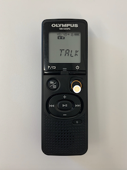
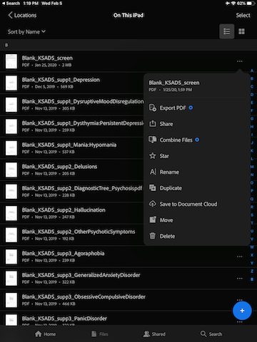
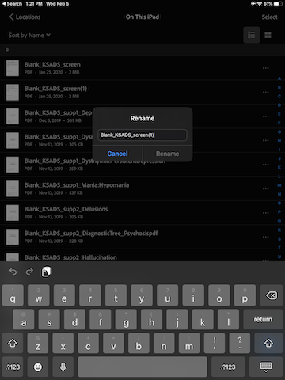

## W1 Protocols - Parent 

### W1 Protocol - Consent & Assent

Once the parent and child/teen come into the lab, seat them in the Rainbow Room on the couch for consenting (parent) and assenting (child aged 7+ or teen). 

Make some small talk - Ask the participant how they got here. If they have participated before in research. Offer them a bottle of water. Thank them for coming and for giving up their weekend to help science.

Tell the parent and child that the first thing you are going to do is go over all of the things they will do today, and have them sign the consent and assent forms. 

Speak to them and direct them through the whole process. 

#### Things you will do in the lab

- Stick stickers on you to measure heart rate, sweat, stomach muscles.
- Sit with parent and talk about fun things and hard things (filming).
- Parent stays in room and answers more questions. 
- Child goes next door to play computer games (look at pictures, watch movies). Some of the movies and pictures will be a little bit scary, others sad, others boring. 
- One of the games involves a loud annoying noise, we will adjust it for you. 
- You will also do some other games on paper and pencil - like puzzle and word games
- You will answer some questionnaires
- We will also measure your height, weight, and waist circumference. 
- We will take three biological samples: 
    - Hair - stress hormones
    - Saliva - microbiome 
    - Blood - immune - wear goggles
- Do you get sick or dizzy when you see blood or hurt yourself? 
- If we need to, can we prick two fingers?
- When you are done with all of that, you will get a big prize, then we will pay you and you will go home. 
- You will get $45 for the work you put in today.

#### Things you will do at home

<h4>Child</h4>

- Poop sample - microbiome
- Stool scale
- Memory game - to see what you remember from lab.

<h4>Parent</h4>

- 24 hour food recall

When you complete the poop sample and the games at home, we will pay you another $20 in the form of a giftcard. 

#### Things to know

You are a volunteer, which means that you do not have to do anything, or say anything that makes you uncomfortable. We would like you to try everything you can, and to do your best, but if there are things you absolutely do not want to do, just tell us, that is o.k.

We keep your participation confidential - ID number. 

We want you to come in again in the future, so we will ask for some information so we can contact you in the future. 

*Sign consent/assent forms including DBS form and Contact Sheet*

-----------------

### W1 Protocol - Parent/Child Observation

The parent and child will be in the Rainbow Room for 15 minutes. During that time they will be filmed while planning a conflict event, and then again while discussing a pleasant event. The conflict event will always go first, followed by the pleasant event. We did this to ensure that the parents were not thinking of the negative interaction upon answering the questionnaires about their child, which they did immediately after the observation interaction. Participants should complete this activity in English.

**Step 1**: 

Parent and child will be situated on the grey couch in the Rainbow Room. The iPad video camera will be placed about 4 feet away from the dyad, on a tripod stand. The screen of the iPad will be facing away from the parent and child.

**Step 2**:

The researcher will give the parent and child the Pleasant Events Checklist (PEC) on a piece of paper. 

*Researcher: Next we are going to take some film of you while you discuss a source of conflict (or something you disagree on) and try to resolve it. On this piece of paper is a list of things that parents and children sometimes have disagreements about. Please take a moment to read the list and think about some that you would like to discuss together. When I knock on the door, please start discussing the things you have selected from the list and try to resolve the areas of conflict you have chosen from the list. You do not need to tell us what you chose to discuss, and it does not matter if you chose something from the list, or decide to choose something else not included on the list. I will give you five minutes to discuss the event, then I will come back and give you further instructions.*

**Step 3**: 

Researcher press record on the iPad and leave the room. Start timer for 1 minute, then knock on the door and ask the dyad to begin discussing their event. Start timer for 5 minutes. At the end of 5 minutes, again knock on the door and enter the Rainbow Room. 

*Researcher: Thank you for taking the time to discuss the source of conflict and try to resolve it. Next we are going to take some film of you while you discuss a pleasant event you could do together. On this piece of paper is a list of events that parents and children sometimes find pleasant to do together. Please take a moment to read the list of events and think about what you would like to plan to do together. When I knock on the door, please start discussing the event you would like to do together and make a plan for how you could do it. You do not need to tell us what you chose to discuss, and it does not matter if you chose something from the list, or decide to choose something else not included on the list. I will give you five minutes to discuss the event, then I will come back and give you further instructions.*

**Step 4**: 

Researcher press record on the iPad and leave the room. Start timer for 1 minute, then knock on the door and ask the dyad to begin discussing their event. Start timer for 5 minutes. At the end of 5 minutes, again knock on the door and enter the Rainbow Room. 

**Step 5**: 

Researcher reenter the room, switch the iPad off and move the child/adolescent to their next session. 

-----------------

### W1 Protocol - KSADS

#### Audio Recording

- Make a separate recording for each KSADS administered if there is more than one child in one session.

**Step-by-step guide on how to use recorder:**

*Step 1: Press and hold highlighted Power button to turn recorder.*

*Step 2: Press highlighted button until "TALK" appears on the screen. Now you are on the "Talk" setting.*

*Step 3: Push highlighted button up to start recording. Push down to stop recording.*

#### Using the iPad for KSADS Summary Checklist

- Before the start of every session, be sure to duplicate and rename all the KSADS documents in Acrobat (25 documents per participant) and rename them (MBBXXX_KSADS_suppX_XXX). 
   - *Note 1:* This may take a while, especially if there are more than one participant, so be sure to do it ahead of time.
   - *Note 2:* With multiple participants in one session, keep them all on the same iPad as the same iPad will be used to administer all KSADS.

- Follow instructions below on how to duplicate and rename the documents:
   - Turn on iPad and go to the “Acrobat” app.
   - Your screen should look like this. If it does not, tap on “Files” at the bottom, and ensure that the Locations is set to “On This iPad”.
     
     
   - For each document, tap the three horizontal dot to the right, and select “Duplicate”.
     
   - The duplicated document should appear right below the original document.
   - Tape the three horizontal dot to the right of the duplicated document, and select “Rename”.
     
   - Replace the word “Blank” with the participant ID, and remove the “(1) at the end of the name. For example, if the participant ID is MBB001, the name of the duplicated document should be: MBB001_KSADS_screen
   - Do the same for all 25 documents (Duplicate, Rename).

-------------

### W1 Protocol - Questionnaires

#### Parent Proxy

Parents will complete REDCap questionnaires for each child.

#### Parent Self

Parents will complete REDCap questionnaires about themselves only once (under eldest child's [lower number] ID)

-------------

### W1 Protocol - Home Kit

Explain to the parent what is included in the home kit / home session and how to collect the stool sample.

----------