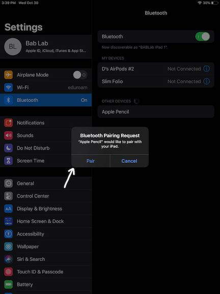
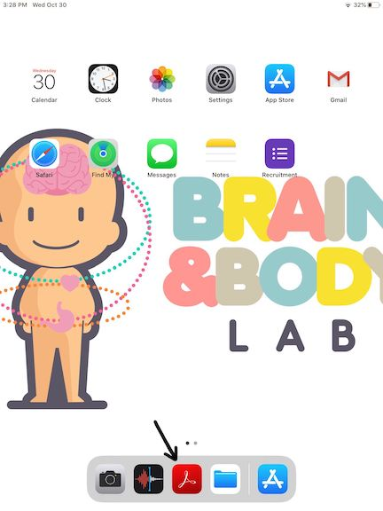
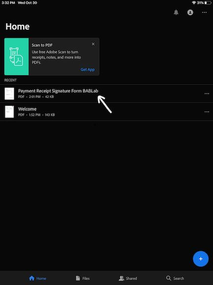
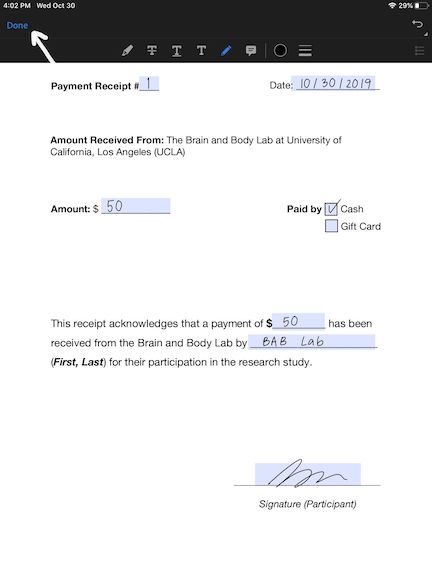

# Parent Protocols

## KSADS

### Audio Recording

- Make a separate recording for each KSADS administered if there is more than one child in one session.

**Step-by-step guide on how to use recorder:**

*Step 1: Press and hold highlighted Power button to turn recorder.*

*Step 2: Press highlighted button until "TALK" appears on the screen. Now you are on the "Talk" setting.*

*Step 3: Push highlighted button up to start recording. Push down to stop recording.*

### Using the iPad for KSADS Summary Checklist

- Before the start of every session, be sure to duplicate and rename all the KSADS documents in Acrobat (25 documents per participant) and rename them (MBBXXX_KSADS_suppX_XXX). 
   - *Note 1:* This may take a while, especially if there are more than one participant, so be sure to do it ahead of time.
   - *Note 2:* With multiple participants in one session, keep them all on the same iPad as the same iPad will be used to administer all KSADS.

- Follow instructions below on how to duplicate and rename the documents:
   - Turn on iPad and go to the “Acrobat” app.
   - Your screen should look like this. If it does not, tap on “Files” at the bottom, and ensure that the Locations is set to “On This iPad”.
     
     
   - For each document, tap the three horizontal dot to the right, and select “Duplicate”.
     
   - The duplicated document should appear right below the original document.
   - Tape the three horizontal dot to the right of the duplicated document, and select “Rename”.
     
   - Replace the word “Blank” with the participant ID, and remove the “(1) at the end of the name. For example, if the participant ID is MBB001, the name of the duplicated document should be: MBB001_KSADS_screen
   - Do the same for all 25 documents (Duplicate, Rename).

-------------

## Home Kit

Please refer to the diagram below for the complete list of items in a home kit:

- Take a white paper gift bag and paste a BABLab sticker at the center of the bag (one side only).
- Take a blue mailer and paste a FedEx slip on the front. Label the mailer with “Exempt Human Specimen” and the participant ID.
- Label the following 4 items with the participant ID and put them in the blue mailer:
   - a gut kit
   - a toilet hat
   - an oral kit
   - a biohazard bag
- Put two MBB note cards (one biological and one adoption) in the gift bag.
- Print and insert the Bristol Stool Scale. 
- Print, fill-out and insert MBB brochure.

----------

## Participant Payment

**Participant Reimbursement Signature**

### Setting up the iPad

- To obtain participant’s signature for payment receipt form, log into the BABLab iPad 1 or 2 with the password “0719”.
- Make sure the Apple Pencil is paired with the iPad by going into “Settings” and then selecting “Bluetooth”, ensuring that “Apple Pencil” is connected.

   
- If the Apple Pencil is not connected, remove the cap of the pencil and insert it into the charging port of the iPad. A pop-up should appear to ask you to “pair” the devices.

    

### To Obtain Signature

- Click the “Acrobat” app on the iPad.

   

- Select the file “Payment Receipt Signature Form BABLab”.

   
   
- Double tap the screen with the pencil. Ensure the pen icon is selected and fill in the payment receipt number. Now the form is ready to be filled out by the participant. 

    

- Ask the participant to fill out every highlighted spaces (except for the payment receipt #).
- After every space has been completed, click “Done” on the top left corner. 

   

### To Save the Filled-Out Form

- Click the “share” icon. 

   
 
- Click “Share a Copy” at the bottom.

   
   
- Click “AirDrop” to send the file to “Brain’s MacBook Air”.

  
  
- Save the file to a folder named “Reimbursement_signed” on the MacBook Air.
- Return to the iPad and tap the screen once. A box should appear that selects all the participant’s input. Clear the input by clicking on the trash icon on the top right.

    

- Now the file in Acrobat on the iPad is ready to be used for the next participant. 