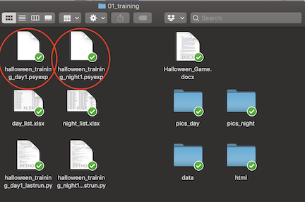
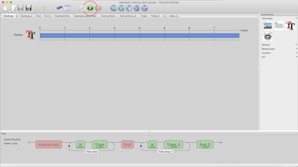
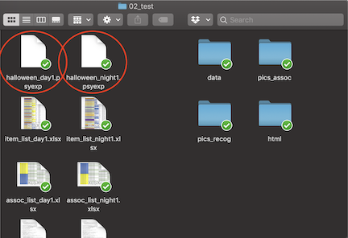
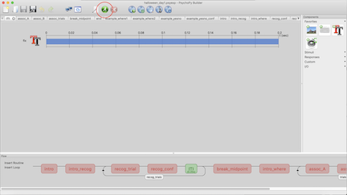
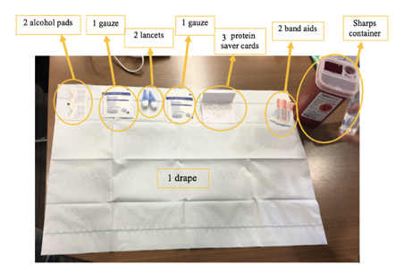
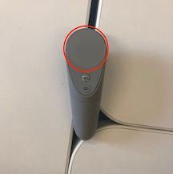
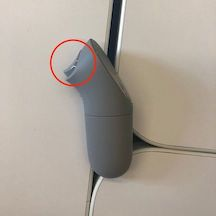
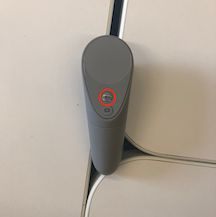

## W1 Protocols - Child/Teen

-----------

### W1 Protocol - BioPac Electrode Hookup

#### Electrode Placement/Preparation

- Wheel the cart into the Rainbow Room
- Prep 2 electrodes with Gel 101. Stick to the participant’s ring and middle fingers on their non-dominant hand (we want to keep the pointer finger free so they can use it for tasks)
- Wrap medical tape around these to secure them, but ensure that the metal poles are still accessible
- Look at the skeleton diagram and use the EL-PREP Gel to abrade the skin around the remaining electrode sites (below the collarbones, below the sternum, on the left lower ribs, and in the remaining two positions on the stomach and left ribs)
- Clean the remaining EL-PREP off with a tissue or baby wipe
- Prep 8 electrodes with Gel 100. Stick to the locations indicated on the skeleton diagram
- Let all electrodes sit for the duration of the parent/child observation

#### GSR

- Put on gloves
- Ensure that the finger electrodes are properly adhered and have had time to rest
- Make sure the lead wire module is connected to the transmitter (PPGED, green sticker) in the “EDA” channel
- Take the transmitter and secure it around the participant’s wrist as shown below
- Hook up the lead wires so that the black wire connects to the middle finger and the red wire connects to the ring finger
- Ask the participant to wear a glove over the whole setup to secure it throughout the tasks
- To check if the GSR is working properly, ask the participant to briefly hold his/her breath - you should see a rise in the signal on the graph

#### ECG

- Ensure that the chest electrodes are properly adhered and have had time to rest.
- Make sure the lead wire module is connected to the transmitter (RSPEC-R, yellow sticker) in the ECG channel. 
- Take the transmitter and secure it around the participant’s stomach as shown below.
- Hook up the lead wires so that the white lead connects to the Right Collarbone electrode, the black lead connects to the Left Collarbone electrode, and the red lead connects to the lowest Left Rib electrode.

#### EGG

- Ensure that the chest electrodes are properly adhered and have had time to rest.
- Make sure the lead wires are connected to the transmitter (EGG2-R, blue sticker). The lead module labelled “A” (3 short leads) should be in the EGG A channel, while the lead module labelled “B” (2 long leads) should be in the EGG B channel.
- Take the transmitter and secure it around the participant’s stomach as show below.
- Hook up the lead wires so that the “A” and “B” channel white leads connect to the sternum electrodes (which goes to which does not matter),  the “A” and “B” channel red leads connects to the upper left rib electrode and stomach electrode, and the “B” channel black lead connects to the remaining lower left rib electrode.

#### AcqKnowledge

- Turn off the wifi on the Mac Mini and turn on the BioPac/transmitters
- Open AcqKnowledge
- Choose the graph template file
- Once it loads, make sure all of the transmitters are connected
- Press run and click through all of the dialog boxes that are generated

-----------

### W1 Protocol - Memory Intrusion/Movie Watching

- There are 4 counterbalanced versions of this task:
  - DRM_A_incongruent_first.psyexp
  - DRM_A_congruent_first.psyexp
  - DRM_B_congruent_first.psyexp
  - DRM_B_incongruent_first.psyexp
  
- Choose the counterbalanced version that is correct for the participant
- First open the task, add the participant ID number and press start
- Read the instructions to the participant:

  *Welcome to the movie game. First you will watch some movies. Then you will hear a list of words. Try to remember the words on the list.*

- Press the space bar to progress to the next screen and read the instructions:

  *Get ready, to watch the movie. Turn to the laptop to watch.*
  
  
- Open up the first movie for the participant. It will depend on the counterbalancing condition what movie goes first. 
- For the two files that start with “DRM_A”:
  - DRM_A_congruent_first.psyexp
  - DRM_A_incongruent_first.psyexp

**The order will be: Sad –> Neutral –> Scary**

- For the two files that start with “DRM_B”:
  - DRM_B_congruent_first.psyexp
  - DRM_B_incongruent_first.psyexp

**The order will be: Scary –> Neutral –> Sad**

- Simultaneously press play on the movie on the laptop while also pressing the spacebar on the psychopy task. This will start the physiology and the movie at about the same time. While the movie is playing there will be a box of popcorn on the computer screen.
- When the movie is done, press spacebar on the psychopy computer to progress to the next screen. Read the instructions for the participant:
- Click on the face that shows how you feel after watching the movies.
- Participants can use a mouse to click on the face that matches the way they feel after watching the movie. The faces range in valence (negative to positive) across the X axis, and arousal (low to high) up the Y axis.
- After the participant has selected a face, you will be taken to the next screen where you can read the instructions for the participants:

  *Listen to the list of words and try to remember all of them.*
  
  
- When the participant indicates that they have understood the instructions, press the spacebar and progress to the next screen. Make sure that the computer volume is up and the participant can hear the words being pronounced on the computer screen. After the participant hears all the words the distractor task will start.
- Read the distractor task instructions to the participant:
  
  
  *Count backwards from the number 25 out loud for the researcher.*

**Note: Whether the participant completes the distractor task correctly or not doesn’t matter. The only purpose of the distractor task is to distract the participant for a brief period of time. Listen while they count backwards. If they can’t count backwards, ask them to count forwards.**

- When the participant is finished counting backwards from 25, or after approximately 30s has passed (whatever comes first), progress to the next screen by pressing the spacebar.
- Read the instructions out loud to the participant:

  *Recall 1. Please tell the researcher all the words that you can remember from the list.*

- Before the participant starts to tell you what they remember, start a new voice recording and then tell them to start while you record what they say (on the talk setting). Also write what they say on a piece of paper. Make sure to note that this is ‘Recall 1’ (as there is a second recall later on). When the participant has told you all the words they can remember, or after 60s, progress to the next screen (instructions for the next word list). 
- Make one recording for all of the memory intrusion task
- Read the instructions aloud for the participant.

  *Now you will hear another word list. Get ready!*

- Press the spacebar to hear the word list. After the word list, move to the distractor task (counting backwards from 25). After the distractor task, move to the second recall task and record the participant like the first. When the second recall task is complete, a new loop will begin. Read the instructions to the participant then start the next movie (which will always be neutral). Repeat everything again for the final loop after they watch the final movie, which will either be sad or scary.

--------------

### W1 Protocol - Halloween

- Check master counterbalance sheet and fill out the participant’s ID # in the group which you assigned them.
- Seat the participant at the computer desk in the Bear’s Den. Close the door to ensure privacy and freedom from distractions.
- Set up the task:
   - a. Navigate through the Finder to get to the task following this path:
        Dropbox/BAB/Studies/Mind_Brain_Body/Tasks/Wave1/04_halloween_pilot
        

   - b. Start by going into the folder titled “01_training” and selecting “Halloween_training_day1.psyexp” if the participant is in the “day first” group or “Halloween_training_night1.psyexp” if the participant is in the “night first” group.
       
        
- When the task pulls up and the participant is situated and ready, select the run button indicated below:

  
- When prompted, fill in the participant’s ID # in the “participant” field:
  
- Guide the participant through the instructional slides by pressing the space bar every time [s] shows up on the screen. Make sure to remind the participant to read all of the instructions carefully.
- Once the training task starts, sit quietly and do not disturb the participant. It is important for them to pay their undivided attention to the images on screen during the training.
- When the break slide appears, ask them to let you know when they are ready to continue. Press the space bar to proceed on to the next set of images.
- Once the task is complete, you can exit out by pressing any key and then closing the the PsychoPy file.
- Prompt the testing phase of the exercise by saying something along the lines of:
       *“And now we want to see how much of your trick-or-treating adventure you remember.”*
- Go into the “02_test” file and select the “Halloween_day1.psyexp” file if the participant is in the “day first” group or “Halloween_night1.psyexp” if the participant is in the “night first” group. 
  
- When the task pulls up and the participant is situated and ready, select the run button indicated below:
  
  
- Guide the participant through the instructional slides by pressing the space bar every time [s] shows up on the screen. Make sure to remind the participant to read all of the instructions carefully. Remind them that they need to click the words for the answer they want to provide.
- When the break slide appears, ask them to let you know when they are ready to continue. Press the space bar to proceed on to the next tests.
- Guide the participant through the instructional slides by pressing the space bar every time [s] shows up on the screen. Make sure to remind the participant to read all of the instructions carefully. Remind them that they need to click the item for the answer they want to provide, and then click which quadrant of the scene image they want to pick.
- Once the task is complete, you can exit out by pressing any key and then closing the the PsychoPy file.
- Data is saved automatically in the data folder. You do not need to save anything before exiting out of the psychopy folder

*Troubleshooting:*

If the task exits due to an error, take a screenshot of the error screen and message Emily, Kristen, or Bridget for assistance. Move onto the next task in the meantime. 

----------

### W1 Protocol - Disc/Cond/Ext

#### Discrimination

- Click into the discrimination folder
- Right click on either discrimination_horiz.py or discrimination_vert.py (depending on counterbalancing) and open in PsychoPy
   - This task was not created in Builder view, so does not have a .psyexp file.
- Click the green running man and enter the Participant ID
   - Make sure to enter the correct run number
   - Discrimination will be repeated 3 times (run 1, run 2, and run 3)
- Move the keyboard over so that the you, the researcher, can control it 
   - You will press the buttons for the participant in this task (it is difficult to do and pay attention to on one’s own)
- Read the instructions for the participant
- Ask the participant to tell you which line was more tilted, the first or second and press the corresponding button for them

#### Conditioning

- Click into the conditioning folder
   - Test the sound file on the laptop - screech.ogg
   - Set so that the sound is loud and uncomfortable, but not hurting
   - Record the volume setting on the session checklist
- Open the .psyexp file for the appropriate counterbalance by right clicking and opening in PsychoPy
- Click the green running man icon and enter the Participant ID

#### Extinction

- Click into the extinction folder
- Open the .psyexp file
- Click the green running man icon and enter the Participant ID

---------

### W1 Protocol - Height

- Place participant directly against wall/frame
- Advise participant to stand up straight
- Make sure heels of participant are up against the wall/frame 
- Use a flat object (booklet, ruler, sheet of paper, etc.) to accurately measure height in centimeters 
- Record height on Lab Session Checklist 

--------

### W1 Protocol - Hair Sample

#### Training video

<iframe width="560" height="315" src="https://www.youtube.com/embed/iRv1VMdRdeI" frameborder="0" allow="accelerometer; autoplay; encrypted-media; gyroscope; picture-in-picture" allowfullscreen></iframe>

#### Set Up Hair Sample Station
- Ensure the hair-sample station is set up accordingly:
    - 1 sheet of aluminum foil
    - 1 small ziplock bag with participant ID
    - 1 salon grade scissor
    - 1 wide and narrow tooth parting comb
    - 1 alcohol swab
    - Painter-tape
    - 1 permanent marker
    - 1 pair of gloves
    - 2 alligator curl clips
    - 1 hair claw clip (for long hair)
    - Sample hair amount taken from wig

#### Prior to Getting Hair Sample 

- With the parent present in the room, explain to both the child and parent that we will be collecting 30-50 strands of hair. The amount of hair to be collected is less hair than is lost in normal everyday-brushing from the back of the head. 
- Inform them how the site for the sampling is hidden by the surrounding hair, therefore not visible after collection.
- Explain how the sample is used to measure a hormone called cortisol that is present in the hair.
- Show the hair sample taken from the wig to illustrate the amount of hair that will be collected (30-50 strands). 
- Complete the [Hair-Care Practice Questionnaire](https://app.box.com/file/630323877918). 

#### Hair Sample Prep  

- Ask the parent to be present in the room when we collect the child’s hair sample.
- Put on a pair of gloves.
- Wipe down the hair scissor/comb/clips with an alcohol swab. 

#### Hair Length 

- For short hair (less than 3cm), follow the Short-Hair Protocol below. 
- For medium-length hair (3-6cm), follow the Medium-Hair Protocol below. 
- For long hair (more than 6cm), follow the Long-Hair Protocol below. 
- Ideally, all hair sample should be at least 3cm long. If the hair is less than 1cm long, the sample cannot be used.

**Short-Hair Protocol (1-3cm)**

- Take the comb and part the hair horizontally between the tips of the ears.
- After parting, ask the participant to hold the parted hair close to the scalp.
- Hold the loose hair tightly with index finger and thumb, and cut the hair along the part.
- Place loose hairs in foil and fold it securely. Do not tape the hair to the foil.
- Fold the foil without bending the hair, and ensure that the hair does not fall out of the foil.
- Label the root-end on the aluminum foil and place it in the ziplock bag.
- Label the ziplock bag with the participant’s ID and Wave.
- Store the sample in a dry area at room temperature (in the plastic folder under the participant IDin cabinet 1).

**Medium-Hair Protocol (3-6cm)**

- Take the comb and part the hair horizontally between the tips of the ears.
- Take a clip to clip away the hair from the top of the parting.
- Place another clip at the bottom to expose a 5x10cm rectangle of loose hair between the two clips. 
- Ask if the child prefers the wide or narrow tooth comb to comb through the loose hair.
- Ask if it is ok to discard any loose hair from the comb.
- Grasp approx. 30-50 strands of hair to the right of the rectangle.
- Gently pull and twist the hair away from the scalp in a rolling motion between the fingers.
- Collect the sample as close to scalp as possible, but be careful to not cut the scalp. 
- Attach the hair to the center of the aluminum foil by taping with painter’s tape - do not cover the root end. 
- Label the root end on the tape. 
- Fold the foil without bending the hair, and ensure that the hair does not fall out of the foil.
- Label the root-end on the aluminum foil and place it in the ziplock bag.
- Label the ziplock bag with the participant’s ID and Wave.
- Store the sample in a dry area at room temperature (in the plastic folder under the participant ID in cabinet 1).

**Long-Hair Protocol (>6cm)**

- Part the hair left to right at the posterior vertex.
- Clip away any extra hair, then create a twist of hair and hold tightly with index finger and thumb.
- Make a clean cut as close to scalp as possible.
- If the hair is thin, cut 2-3 small areas (1cm apart) across the posterior vertex to conceal the site of the cut. 
- Attach the hair to the center of the aluminum foil by taping with painter’s tape - do not cover the root end. 
- Label the root end on the tape. 
- Fold the foil without bending the hair, and ensure that the hair does not fall out of the foil.
- Label the root-end on the aluminum foil and place it in the ziplock bag.
- Label the ziplock bag with the participant’s ID and Wave.
- Store the sample in a dry area at room temperature (in the plastic folder under the participant ID in cabinet 1).

------------

### W1 Protocol - Weight

- Instruct participant to step on weight scale
- Measure weight (in kg)
- Record weight on Lab Session Checklist

---------

### W1 Protocol - Saliva Sample

Sample Storage:

- Screw lids on very tight (to prevent evaporation)
- Log the location (grid) on the sample storage log

---------------

### W1 Protocol - Memory Generalization

#### Training

- There are two versions of this task (They differ in the pictures that are used for training):
   - memory_generalization_beta.psyexp
   - memory_generalization_beta_B.psyexp
- Run the task on PsychoPy.
- Read the instructions out loud to the participant.
- When you see “[s]” it means that you can progress to the next screen.
- There will be 60 photographs the participant has to see. They are presented in random order.
- There are 10 red triangles. The participant is asked to press a button when they see the red triangles so that we can later on gauge their attention in the task.
- After the 60 photographs are shown, the participant is asked to recall all of the photos they just saw. Press record on the recorder (on talk setting). Make one recording for the whole memory generalization task.
- They will go through this photo viewing and recall phase another 2 times. 
- When the task is complete, save the PsychoPy output file, as well as the recorded responses to the participant folder on the Dropbox.

#### Test

- Immediately after the memory generalization training, administer the memory generalization test.
- There is only one version of the memory generalization test: memory_test.psyexp
- Read the instructions to the participant, emphasizing that we only want them to respond YES if the picture is EXACTLY the same as the one they just saw in the training task.
- If the participant responds “Yes” or “No” they will progress to a confidence rating screen, asking them how sure they are in their response.
- If the participant responds “I Don’t Know” they will skip the confidence rating screen.
- When the task is complete, save the participants data output from PsychoPy into their participant folder on the server.

#### Physiology Marks

Markers for physiology have been included for each trial type (object neutral, object negative, scene neutral, scene negative). For the test, physiology markers are entered for every trial. That way, we might be able to go back and look at GSR for the times they got the item correct.

----------

### W1 Protocol - Waist Measurement

- Stand and hold tape measure at the participant’s belly button and bring it around their waist, over their t-shirt
- Make sure measuring tape is horizontal around the waist and even in the front and back 
- Keep the tape snug around the waist, but not compressing the skin
- Have participant breathe in
- Measure the participant’s waist just after they breathe out (in cm)

------------

### W1 Protocol - WASI & WIAT

- Ensure that you have all of the following materials in the testing room:
   - WASI Stimulus Book
   - WASI Manual
   - WASI Score Sheet (should be in participant folder)
   - WIAT Word Reading List
   - WIAT Math Booklet (should be in participant folder)
   - WIAT Score Sheet (should be in participant folder)
   - Pens and Pencils
   - Recording device
- Sit the child diagonally from you at the table
- Start your recording device (using the talk setting)
- Make one recording for the WASI and one for the WIAT
- Say the following:
    
*“We’re going to be doing a few things today, like playing some word games and answering some math questions. Some of these things might be really easy for you, but some might be hard. Most people do not answer every question correctly or finish every item, but please try your best. Do you have any questions?”*

#### WASI

- Open the WASI Stimulus Book to Vocabulary
- Say the following:
    
  *“First, I am going to say some words. Tell me what each word means. 
  If there’s one you don’t know, we can skip it. Are you ready?”*
    
- For ALL of our participants, we will skip the visual stimuli and go straight to the words (they are all ages 6+). Point to the words and say them aloud to the participant, asking 

*“What does ____ mean?” or “What is ____?”*
  
- Record answers in the WASI Score Sheet. Score by comparing their response with the Manual’s response criteria. If
- Once the end criteria are met (3 consecutive 0’s) OR the participant hits the max score for their age group (for age 6, item 22; for ages 7-11, item 25; for ages 12-14, after item 28), say: 

*“Okay, we are going to stop there and move on to the next task.”*
  
- Open the WASI Stimulus Book to Matrix Reasoning
- Say the following:
    
*“Now we’re going to look at some patterns, and I want you to tell me which picture completes the pattern.     If there’s one you don’t know, we can skip it.”*
  
- Flip to Sample Item A and ask “Which one of these items here (motion to the bottom row) goes here (motion to the blank space)?” Correct and teach if the participant gets the question wrong.
- Repeat for Sample Item B.
- If the child is 6-8 years old, start at Item 1. If the child is 9+, start at item 4. For each item, ask the same question as above, but do not give feedback or teach if they got the question wrong. Record answers in the WASI Score Sheet. 
- Once the end criteria (3 consecutive 0’s) are met OR the participant hits the max score for their age group (for ages 6-8, item 24), say: 

*“Okay, we are going to stop there and move on to the next task.”*

#### WIAT

- Next, get the WIAT Word Reading List and the WIAT Score Sheet
- Say the following:
    
*“Now you’re going to read some words out loud for me. Please read off of this list left to right, top to bottom just like a book (motion along with the directions as you say them). If you read all of the words on the front, flip over to the back and continue the same way. Go at your own pace, and say the words as clearly as you can. If there’s one you don’t know, we can skip it. Any questions?”*
  
- Hand the word card to the participant and begin recording their answers in the WIAT Score Sheet. Keep track of self-corrections, responses taking longer than 3 seconds, and ask for repeat pronunciations if they are sounding out the word or ambiguous.
- Once the end criteria (4 consecutive 0’s) are met, say: 

*“Okay, we are going to stop there and move on to the next task.”*
  
- Lastly, get the WIAT Math Booklet
- Ask the participant what grade they are in in school
- Say the following:
    
*“Now, I want you to solve some math problems. Start here (motion to the appropriate item, item 1 for Grade 1, Item 14 for Grades 2-4, Item 18 for Grades 5+) and work left to right, top to bottom. If you get to a problem you don’t know, just skip it. Continue on and let me know when you’re finished. Any questions?”*
  
- When they have indicated they’re complete, take all of their materials and put them back in their folder. Congratulate them and let them know they did well.

--------------

### W1 Protocol - Blood Sample (DBS) 

#### DBS Prep

- Label Whatman Protein cards with subject ID, date and time, and card number. 
   - Use cards in the order you have numbered them.
- Check DBS Collection Consent
   - Only proceed if no illness, phobia, bleeding disorder, blood thinners taken.
- Experimenter must wash hands.
- Participant must wash hands. 
   - Use water as hot as participant can stand and interlace fingers and rub together while washing as shown in photo to increase circulation in the hands.

 
- Prepare collection area. It should look like this:

 
 
#### VR Headset Setup

- Put VR goggles on for participant. 
- Ensure the headset has been charged before it needs to be used.
- Bring the headset and the remote to the DBS Collection room.
- Ask the subject if they are familiar with VR headsets, if they make them feel motion sick, and if they want to use the headset during the DBS protocol.
- One of the RA’s should pre-load the BABLab Youtube page:
   - Power on the headset (top center button on headset)
   - Go to Library
   - Select Youtube VR
   - Go to the “Account” tab
   - Go to the “Liked Videos” tab
- Show the child how the controller works:
   - moving your hand acts as the pointer/cursor
   - to make selections, use the large bumper button on the back or press down the touchpad at the top of the controller

 *Touchpad*   

 *Back bumper*

   -  to scroll, move your finger up and down on the touch pad
   -  to go back to the movie selection list, press the upper round button below the touchpad
      
 *Back button*

- To put on the headset, loosen the side velcro straps and ask the child to hold the goggles in a comfortable position on their face. If the child wears glasses, they should be fine to use the headset while wearing them.
- Tighten the straps so that the headset stays on its own but isn’t uncomfortable for the child to wear.
- Tell them they can watch any of the videos on the playlist.
- Periodically check in with the child to ensure they aren’t feeling motion sick or uncomfortable in any way.
- After the DBS is completed, take the headset off the child and power it down.

#### Blood Sample Administration

- Place heating pad on participant’s hand, making sure to cover fingers. Set to low or medium heat. 
   - Check to make sure it does not get too hot.
   - Set timer for 10 minutes.
- When 10 minutes are up, put on gloves. Have participant pull up heating pad and hold it with their free hand on the upper arm. Make sure the heating pad cable is not in the way of collection.
- Clean middle or ring finger with alcohol and wipe with gauze.
- Prick finger pad slightly off-center toward the side closest to the pinky finger and immediately dispose of lancet in sharps container.
- Wipe first drop with gauze then start collecting on Whatman Protein cards in numbered order.
- When finished, wipe with gauze, put pressure to stop bleeding and apply bandage.
- Remove gloves, use hand sanitizer immediately, then wash hands ASAP.

#### Precautions

- Before, during and after the procedure, ask if the participant is feeling lightheaded.
- Check the participant’s complexion - turning pale is a warning sign for impeding faintness.
- If participant feels faint/lightheaded, terminate the procedure, ask them to bend forward, and place their head between their knees. You may apply a cold compression to the back of the neck to speed up recovery. 
- Stay with them for at least 15 minutes until they feel completely fine.
- Report the incident to Bridget. 

#### Fainting Emergency 

- In case of fainting or any warning symptoms, lay the participant down flat on a surface on their back and elevate their feet if possible (to a level higher than their heart, about 30cm).
- Loosen any constrictive clothing/belts etc. 
- Symptoms usually disappear after a short rest.
- If the participant does not regain consciousness within 1 minute, call 911.
- If the participant regains consciousness, avoid having him/her get up too quickly.
- Have them sit for at least 15 minutes until they feel completely fine.
- Offer water or warm sweet drinks.
- Report the incident to Bridget. 

#### Biohazard Spill Emergency 

- Equipments:
   - Disinfectant (Sodium Hypochlorite (Bleach))
   - Absorbent materials sufficient to completely cover spilled liquid and can be disposed (e.g. paper towels)
   - Physical tools that allow safe handling of sharp materials (e.g. tongs, forceps, broom/dustpan)
   - Warning signs to notify others that a spill occurred in the area
- Check self for contamination and change PPE if necessary.
- Put on new PPE to proceed with clean up.
- Pick up broken glass/sharps with available physical tools and dispose as biohazardous sharps.
- Place absorbent materials on and around spill.
- Put disinfectant on paper towels and let it sit for at least 5 minutes. 
- Dispose of absorbent materials as biohazardous waste.
- Repeat step 4-6 as necessary.
- Remove PPE and wash hands with soap and water.
- Report all spills to Bridget.

*Note: Only proceed with biohazardous spill cleanup if you feel comfortable; 
       Always use physical tools for handling sharps.*
       
#### Incident Response and Reporting

An exposure incident is specific contact with hazardous agents. Exposure incidents at UCLA must be reported, investigated, and documented by UCLA Insurance & Risk Management; Environment, Health & Safety; and/or the supervisor of the facility. 

- Notify all personnel in the room of the incident.
- Move exposed individual(s) to a safe location, taking care to not spread biohazardous materials.
- Remove contaminated clothing, turn exposed areas inward, and place in a leak-proof bag or container for future decontamination.
- Wash skin with soap and water for 15 minutes.
- Go directly to the Occupational Health Facility at 67-120 CHS (M-F, 7am-4pm) or the RRMC ER.
- Notify Bridget ASAP.
- Report the incident to EH&S within 8 hours (24-hour hotline: 310-825-9797).
- Record the incident in the Incident and Near Miss Log in the Biosafety Manual.

*Note: Keep an extra set of clothes or shoes available to replace contaminated items.*

---------------

### W1 Protocol - Child Questionnaires

- Ask the participant how comfortable they are reading and comprehending in English
- If not fully comfortable, read the questionnaires for the participant
- Read the first questionnaire - the SS - to all participants

#### Children 8 & Under

- The researcher will need to read all questions to child
- PEDSQL GI & PEDSQL F need the laminated face sheet

---------------

