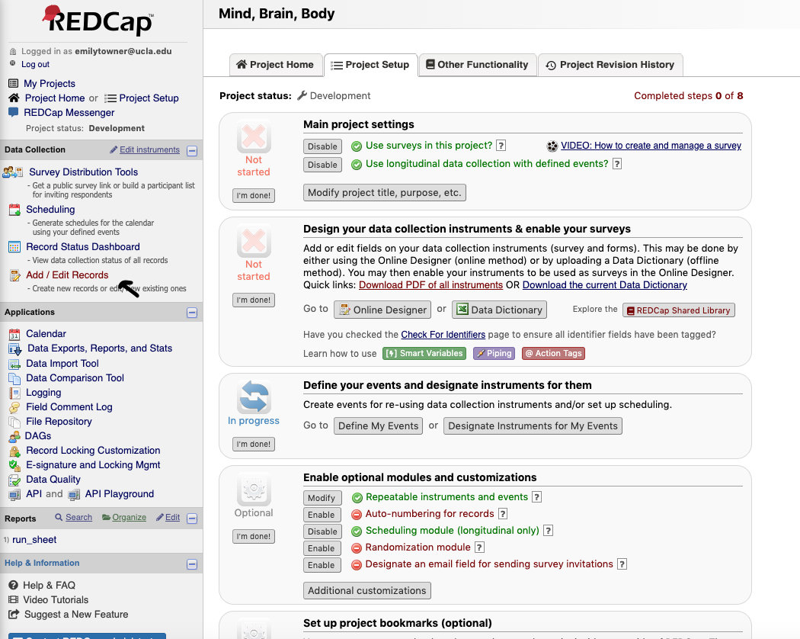
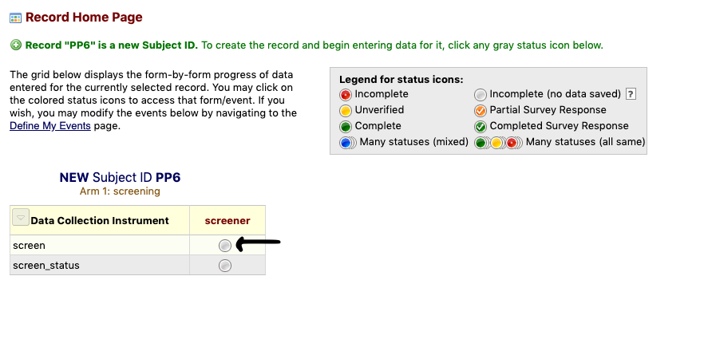
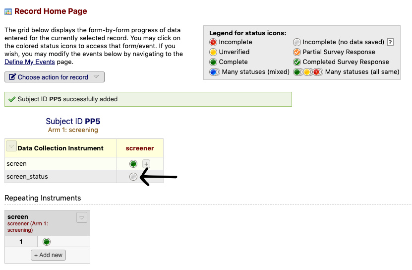
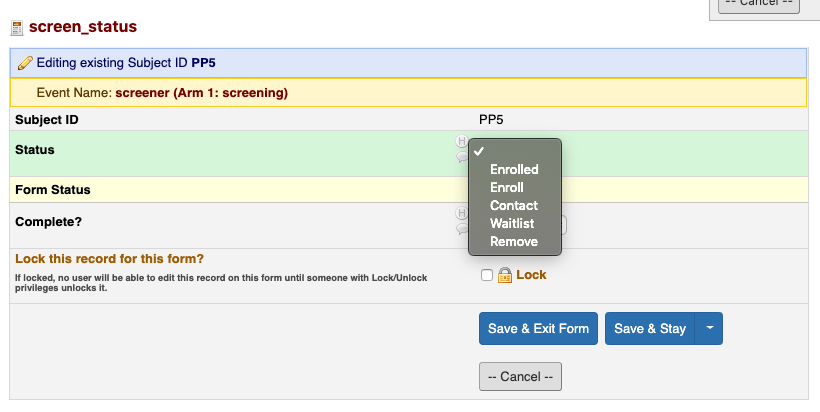
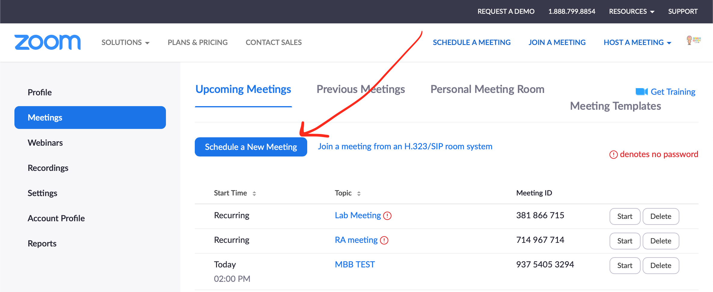
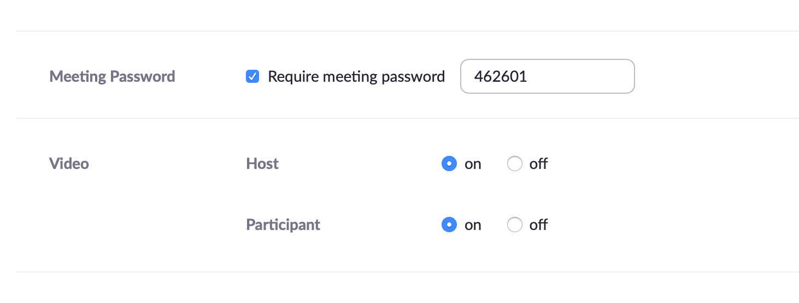
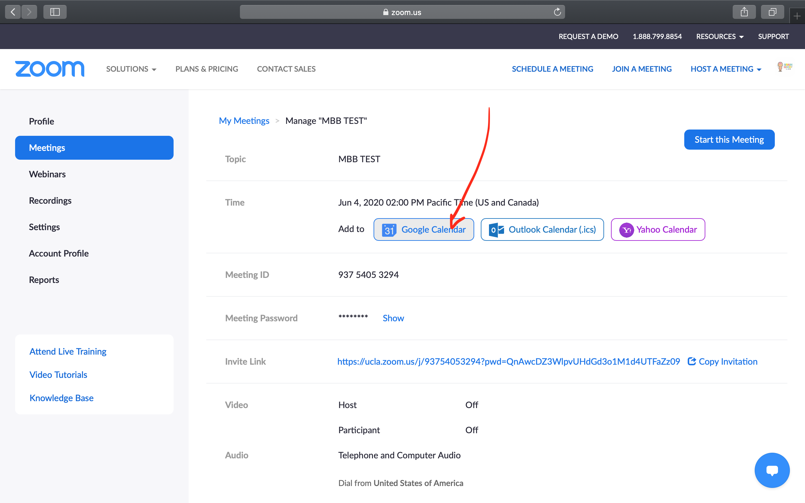
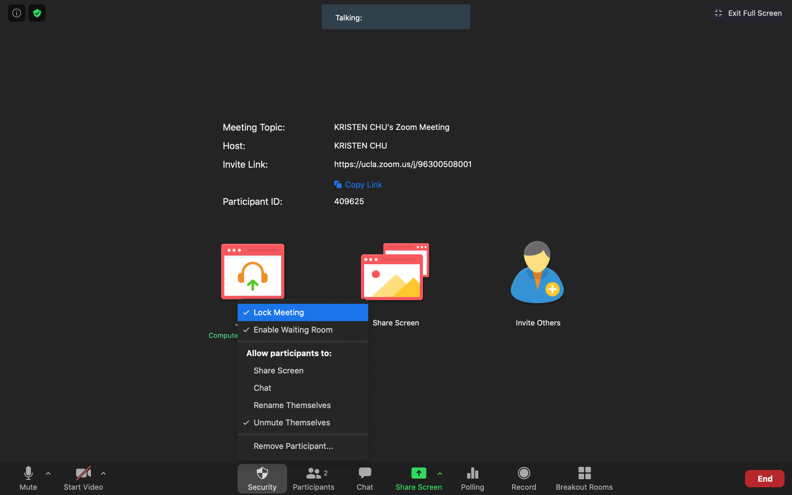
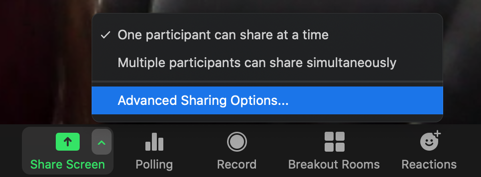
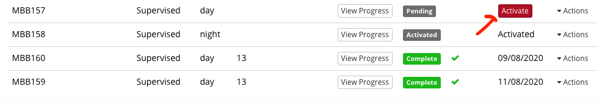

## Protocols - Pre-Session 1 

### Protocol - Recruitment Online

#### Adding Participants to Participant Database 

*For when there is a new email interest form *

1. Verify that potential participant is actually a new participant 
    - In other words check Participant Database to check that they didn’t previously participate / fill out interest form before 
2. Add the info provided on interest submission ( name, age, email, phone number) 3. For column labeled “Added”: 
    - Yes if you’ve added them to REDCap
    - No if they haven’t been added
    - Recommended that you add to REDCap immediately and reach out to them
4. Add participant to REDCap ( see below for full instructions) 
5. Move interest form email from inbox to “Added” tab of MBB 
    - “Move to” button is at top next to labels button, make sure you move not just put “Added” label 

#### Pre-Screening

1. Check if participant is in Participant Database
     - If not, add them to the Participant Database
2. Check if participant is in ID Drive
    - If yes, check if they have a Screener ID
    - If not, assign them a Screener ID once contact has been established based on the next available Screener ID # in REDCap and proceed with screening
    - If yes, proceed with screening under existing Screener ID in REDCap
3. Check participant tally before making call to see if they would be scheduled or waitlisted ( if we reached 15 participants for that age group) if eligible for study 

#### Screening

1. To screen a new participant click “Add / Edit Records”

2.  Click to enter a new Subject ID
    - Make sure Arm 1: Recruitment is selected
3. Type “SMBB#” (Screener ID) to create a record and hit “Enter”
    - Make sure to link the participants Screener ID and their name on the **ID Drive ONLY**
    - Before creating a new record, be sure to check the ID Drive to see if the participant already has an existing Screener ID
    - If a record exists, add a new instance of the screen instead of creating a new record

4. The screening arm contains two parts
    - The screen
    - The wave1_status
        - The wave1_status is to be updated after the first and each subsequent contact

5. Click on the radio button in the “screen” row to screen the participant

6. Click “Now” to enter today’s date and time
7. Select the appropriate choice to start the phone call and follow the skip logic
8. Follow the skip logic to the end
    - For items without a text field, write the information down in the Recruitment database (This identifying information cannot be on REDCap)
    - In “Notes” make detailed note of relevant info ( eg. Session scheduled for this day, participant has not responded to prior emails, etc )
9. Once done, select “Complete” and “Save & Exit Form”
    - The screen can be entered multiple times - for instance if there are multiple phone calls or contacts
    - It is important to keep a record of all instances of contact

10. Click the screen_status radio button

11. Select the appropriate option
     - Contact - Participant needs to be re-contacted (add Recruitment Database & ID Drive). Participants who are still too young to participate, or are unavailable at the moment should stay on this list but be set for a future recontact time/date. 
     - Ineligible - Participant not eligible for study
     - To Enroll - Participant to enroll (need to create subject ID, enter subject info, schedule participant, add to Recruitment Database, add to ID Drive)
     - Enrolled - Participant has been enrolled (all above have been completed)
     - To Remove - Participant wants to be removed
     - Out of Town- Participant lives outside of LA, and will not be returning after the pandemic. This is our "waitlist" of those we will contact if really necessary
12. Be sure to update the screen status after each contact
    - Update the recontact date on wave status 
        - One week from today (date you contacted them)
     - After 3 contacts (with no response) - review (time of day, contact method, etc.)
13. If enrolled, proceed to pre-session checklist in the participant log
    - Highly recommended to do all post-enrollment tasks by following the “Pre-Session Checklist” on MBB participant log

#### Scheduling

1. Open BabLab google calendar and note availability for designated data collection research team.
2. Check-in with the Lab Manager to see what the designated "package mailing day" of the week is.
Participants must be scheduled 2 weeks or more in advance from the "package mailing day", to ensure appropriate time for the package to be received by the participant.
3. Create event on google calendar for 2 hours. Notify the participant that sessions may not last the full indicated time, however, we like to designate additional time just in case.
4. As soon as the participant has been scheduled, create/add to a google calendar event for the designated "package mailing day" of the week the participant ID (MBB number).
5. This will notify the Lab Manager to create a package for this participant with session and post-session materials when they go into the lab for "package mailing day."

#### Other Screening Information

<h4>Accessing Lists</h4>

To find out where participants are in the recruitment process, there are several lists. 

1. Click on “Record Status Dashboard”

2. Participants who have been enrolled will be listed in the Enrollment - Wave 1 list
3. Participants in the process of recruitment will be listed in one of the 4 Recruitment lists
    - *These lists are populated based on the individuals “Screen Status” so be sure to update after each contact!

<h4>List Types</h4>

- Contact - List of individuals who need to be contacted or re-contacted (also includes waitlist)
- Ineligible - Participants are ineligible but interested
- To Enroll - Participants who have been screened and are eligible to enroll
- To Remove - Participants who were not interested in being contacted for this or future research
- Out of Town- Participants who do not live in LA and will not be returning after the pandemic. This is a waitlist of individuals who we may contact if (1) we are behind on recruitment for Wave 1 and will need to just schedule people who we know cannot come back for future waves so we make sure we get data or (2) we have to stay in the pandemic and future waves will be remote. 

#### Concerns

If a parent has a concern about the study before the session, send the email template: 

- [MBB_online - CONCERNS]

#### Making a Zoom link

1. Log onto https://zoom.us
2. Click to "Meetings" and "Schedule a new meeting" 
3. Title the meeting with the Participant's MBB number, set scheduled time, indicate 3 hours 
4. Set setting with password and turn host/participant on 
5. Save and click to add Zoom meeting to google calendar 
6. Click on the bablab.ucla@gmail.com 
7. Click allow 
8. Copy the Zoom link from the Description section and save 
9. Paste Zoom link into the "confirmation email" you send to the participant with their session confirmation, Zoom instruction sheet, and Next Steps sheet

----------------

### Protocol - Session Preparation 

#### Package creation

- There will be a designated "package mailing day" one day a week in which the Lab Manager will go into the lab to prepare necessary materials and send out packages from scheduled participants in the last week, on the same package mailing day.
- Once the package materials have been put together, it is time to bring the package down to the mailroom in the Psychology building, Tyler's Office, OR to the UCLA MDDS.
    - If you go to the mailroom or to Tyler's Office, you need to have your own box. Tyler can tape up the box for you if needed.
    - At MDDS, they provide free mailers (but no boxes), which can fit materials for up to 1 participant
- To mail the package to the participant, you will need the following information:
    - Recharge ID
    - Participant name
    - Participant mailing address
    - Lab mailing address
- From the mailroom: you can write the addresses directly on the box, and circle the recharge ID. Leave the box on the table above the "outgoing mail" sign. 
- From Tyler's office: you will receive a FedEx label in which you can write this information. Take a picture of the tracking number and save OFFLINE. Leave the box in Tyler's office for FedEx to pick up. 
- From MDDS: they will package your materials for you, and you will write the shipping information on provided labels. You can also request a tracking number, which they attach to the box for you. Take a picture of the tracking number and save OFFLINE Leave the box with MDDS to mail out. 

#### Zoom security Settings

1. Require Encryption for 3rd Party Endpoints*
2. Prevent participants from saving chat
3. Click on the "security" button and ensure the following items are checked and all other items unchecked 
    a. "Enable Waiting room"
    b. "Lock Meeting" after participant has entered
    c. Allow participant to "Unmute Themselves"
4. Disable Cloud recording*
5. Host-only screen-sharing
    a. click on the arrow next to "screen sharing" and click on "Advanced sharing options" 
    b. Ensure "one participant can share at a time" and "only host" options are selected 

*Note that #1 and #4 are the default settings (so those don't have to be changed).

#### Activating participant on Gorilla

1. Log in to Gorilla
2. Navigate to Projects/MBB/MBB_wave_1_online
3. Navigate to the participants tab
4. Click "Activate" for the designated participant

-----------------

