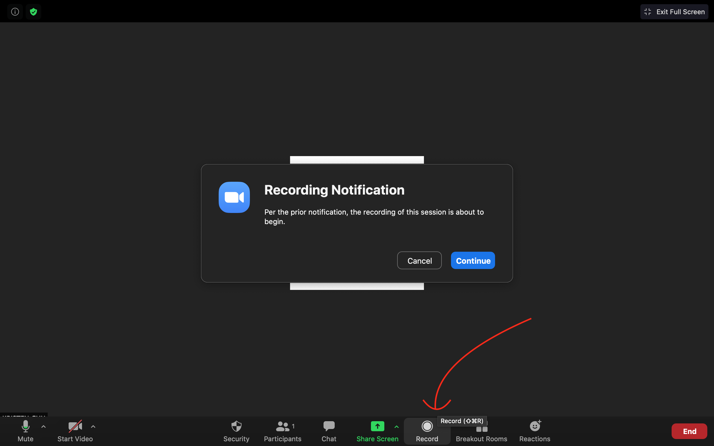
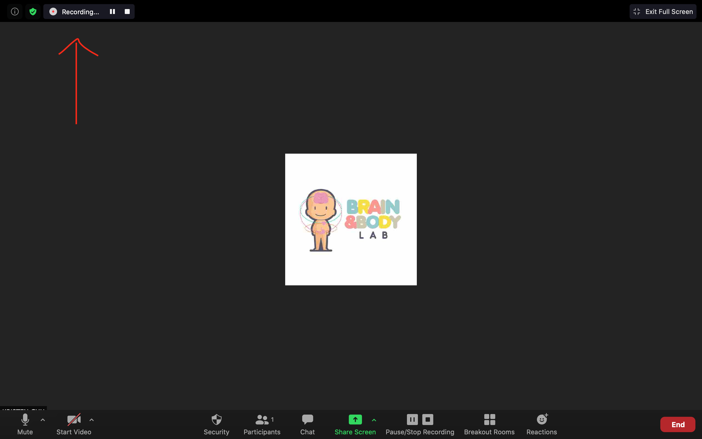
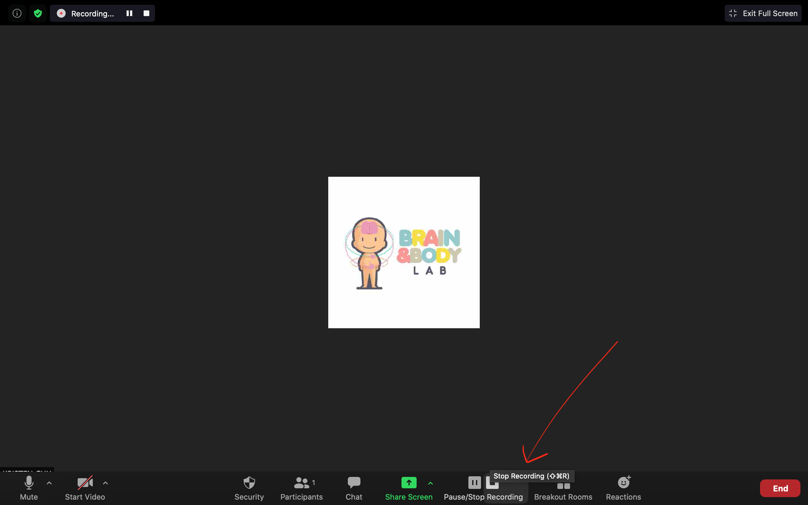
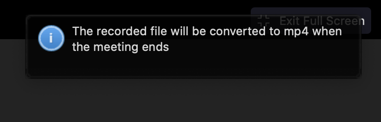
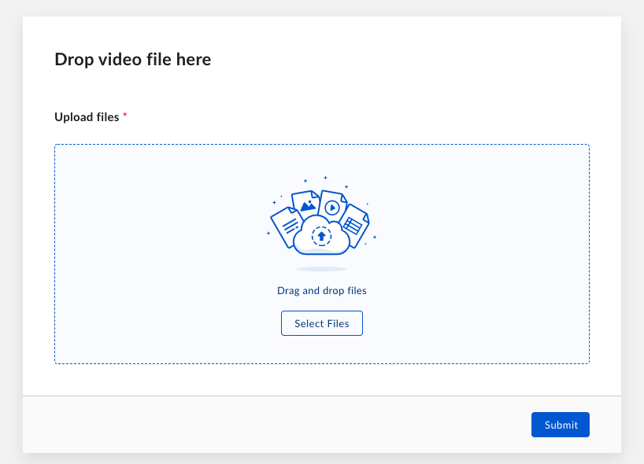
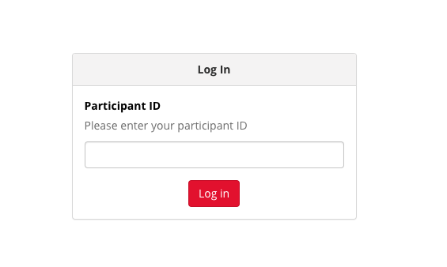
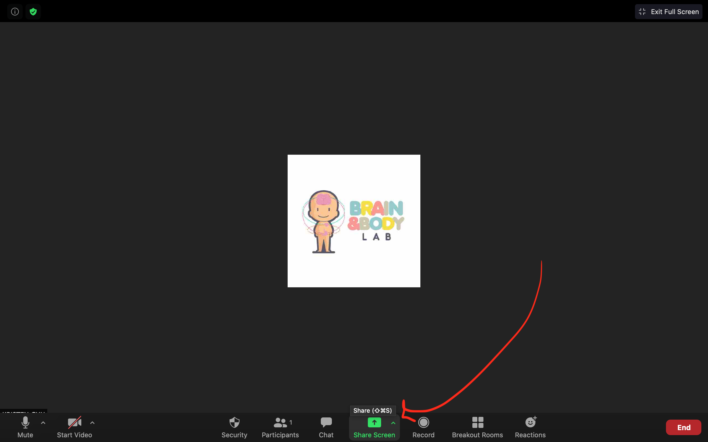
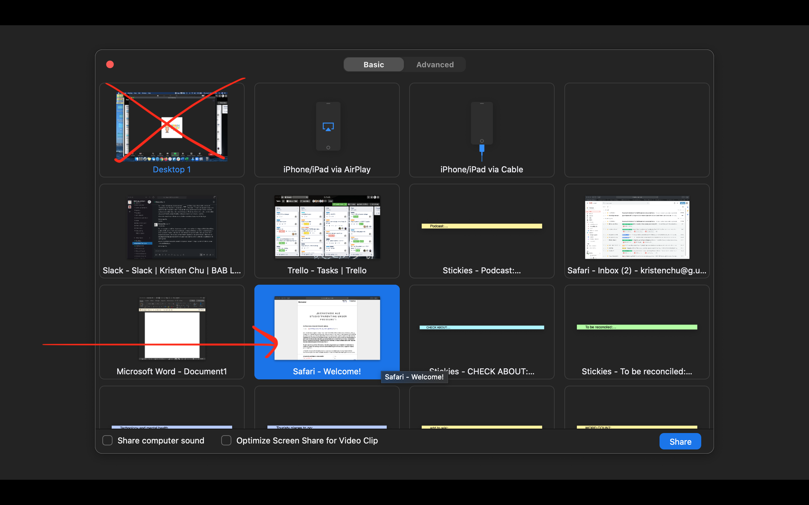

## Protocols - Session 1  

### Protocol - Consent & Assent Online

[ONCE ZOOM IS CONNECTED]

*Hi! Thank you so much for joining us today! We are so looking forward to today’s session with you. Usually, when we conduct a study such as this, we would do it our lab at UCLA. However, with COVID-19 we’ve decided it would be safer to carry out this study online for the time being- social distancing and all!* 

*Our session today should take around 1 hour long. In addition to what we do here today, there will be a follow up zoom appointment with us one week from now. At that appointment, we will reconnect on a second Zoom call in which your child will log on for 10 minutes and complete a computer game.*

*Sounds good? Let’s get started! I am first going to walk through some technical things, then I will do a little presentation of all the things we have planned for the session today!*

*So first, I'll just ask- have you ever used Zoom before?*

[If yes, say] *Great! So you are probably familiar with the different functions here, but I will just give you a little refresher on some buttons we will need for today. The most important thing you need to be aware of is the "chat" button below. If you click on it, a chat box should open- I will be using this throughuot the session to send you imporant links. You may already know this, but you can also display your camera so that it is in gallery view or speaker view in the top right corner. I think it might be best for you to do speaker view so it will feel more like we are in the room together!*

[If no, say] *No problem! Welcome to Zoom- it is very easy to use! The most important thing you need to be aware of is the "chat" button below. If you click on it, a chat box should open- I will be using this throughuot the session to send you imporant links. You can also display your camera so that it is in gallery view or speaker view in the top right corner. I think it might be best for you to do speaker view so it will feel more like we are in the room together!*

[Get them to have the links email open just in case]

*You should have received an email from us right before this session full of links for today. Can you please pull that up to have it ready just in case? I will be sending you all of these links through the Zoom chat, but it will a good reference in case we have any technical difficulties! Once you have it up, you can co ahead and minimize the window.*

[Try to get the best internet connection possible.]

*Are you working on a computer that is connected via ethernet cable? We want to ensure you have the best internet connection possible for the session, as we will be doing many activities today that may need strong internet connection.*

[If so, proceed]

[If not, say] *Thats alright! If possible, can you please move to the best area of your house for internet connection?* 

[Troubleshooting...]

*Great! If for any reason, we lose each other over Zoom, the connection seems to be bad, or one of us freezes, lets leave the session and try to reconnect on the same link again. If I am frozen- feel free to leave and come back. If you leave and I don;t see you come back, I will try to give you a phone call!*

*How does that sound? Do you have any questions?*

[If no, say] *Great! Lets switch gears and talk a little bit about what we are going to do today. Let me just pull up a little presentation we have got!* 

[Researcher to open up the [MBB_Consent_Script_Presentation](https://ucla.app.box.com/file/689404174873)]

*First thing we are going to do is go over what is on the consent and assent forms. (These are the attached documents we sent you in the emails leading up to this session.) We will walk through, in a little bit more detail, all of the things we will be doing during today’s session.*

*During today’s online session we are going to be doing some interactive things. First, we are going to have you and your parent sit and talk about some not so fun things and some fun things while on ZOOM. This conversation will be recorded but we will not be watching or listening in*

*Next, we are going to have you play a game on the computer. In this game, you will be looking at pictures. Some of the pictures will be a bit scary, some sad, others a bit boring. While you are playing this game, your parent will stay with you in the room but will be working on some surveys to fill out.*

*After the game is over, your parent [NAME] will help measure your height, weight, and waist circumference.*

*You will also be answering some surveys (for children) with the researcher OR (for teens) on your own.*

*Lastly for today, your parent will help take two biological samples during this session.*

1. One is the hair sample which helps measure hormones that everyone has in their hair
2. Two is the saliva sample which helps tell us learn a little bit more about your microbiome
  - Do you know what a microbiome is?
  - A microbiome is all the little bacteria that live inside your mouth. Everyone has these, they are healthy! We just want to know what kind and how many of each there are.

*For helping us out in today’s session, you will be getting $45 for the work you put in! After this online session is over, we’ll ask you to do three more things at home:*

1. One is the Child poop sample – this helps us learn a bit more about your microbiome
  - There are also little bacteria that live in your tummy! Everyone has these and we want to know more about them.
2. Two is filling out the stool scale – this is a short scale that gives a description of your sample
3. Three is the computer memory game – this is when you will log back on with us via ZOOM in a week’s time to see what you remember from today’s session

*Great! Do you have any questions for us about any of the samples*

*When you complete the poop sample and the computer game at home, we will pay you another $20!*

*We will send the full payment of $65 ($45 for today’s session and $20 for completing the home session) as soon as we receive the samples back through the mail.*

*Here are some things to keep in mind:*

*You are a volunteer in this study, which means you do not have to do anything, or say anything, that makes you uncomfortable. We would like you to try everything you can, and to do your best, but if there are things you absolutely do not want to do, just tells us, that is o.k.*

*We will keep your participation confidential. You are given an ID number in order to keep your data confidential and separated from your name. Therefore, any identifying information (like your name, email, address, etc.) will be kept private and not paired with your data. We will also use a secondary ID number to save the videos with (since your faces are in it), which will help separate this from your name and the other data we collect form you. Only members of our research team will have access to your name and ID numbers.*

*I will rename your "ZOOM Name" right now with your Secondary ID number, to prepare for the recordings we will take in our session today* 

[Researcher will rename the participant's name to the participant Secondary MBB ID number. 

*As this is a longitudinal study, and we want you to come again in the future if you are interested, we will ask for some information so that we may reach out to you in the future. Do you have any questions?*

*Ok- I will now send you a link through the Zoom chat, which will open up a survey that allows you to virtually indicate your consent to participate in the study. If you'd like, you can share your screen with us now and we can walk you through it. Once you get that pulled up, you will see the consent/assent documents attached there as well- please feel free to take your time reading through the consent and assent forms now if you’d like. As I mentioned earlier, these are the documents we had previously sent you in the emails leading up to today's session.*

[Then once they are done reading through]

*All set and any questions?*

[IF NO,] *Please click to indicate your consent/assent and verbally let us know each of the items you have consented/not consented for, so we can adjust the session in case there is something you/your child may not feel up for today!*

*You may press submit once you are finished to “send in the form.”*

Researcher to grab magic box.

*Once you are all set with that, we’d like you for to grab the magic box we sent you in the mail. This contains everything you will need for today’s session and what you will do at home after today’s session.*

*If you haven't already done so, please open the magic box up. The magic box should contain a sheet of paper at the top which details all of the contents, but we will let you know when you need to take each item out of the box. Please set aside the magic box for now but keep the materials near you as we may need to access materials from the magic box throughout today’s session!*

*What you can pull out now and use throughout the session is the Reward Board and Gold Star Stickers. Use this reward board to track all the steps you accomplish today! Each space is like each task for the session. Once you complete the task you can put a gold star on the space!*

*Are you ready to get started on the session? Great, lets dive in!*

-----------------

### Protocol - Parent Child Observation Online

The parent and child will be seated together in view on the Zoom camera. During that time they will be filmed while solving a conflict, and then again while discussing a pleasant event. The conflict event will always go first, followed by the pleasant event. We did this to ensure that the parents were not thinking of the negative interaction upon answering the questionnaires about their child, which they did immediately after the observation interaction.

Step 1:
The researcher will ask the parent to find the [Pleasant/Unpleasant Events Checklist](https://ucla.app.box.com/file/630327764749) piece of paper from their session package.

*Researcher: So the first thing we will have you pull out of the magic box is the paper packet titled "Online Session Booklet." You can flip to the page that says "Pleasant Events and Issues Checklist."*

Researcher will wait for the participant to find the Online Session Booklet and flip to the correct page.

*Researcher: Next we are going to take some film of you while you discuss something that's hard and try to resolve it. On this piece of paper (Issues Cheklist) is a list of things that parents and children sometimes have disagreements about. We will give you a moment to read the list and think about some that you would like to discuss together. Then after about one minute, you will start discussing the things you have selected and try to resolve them. You do not need to tell us what you chose to discuss, and it does not matter if you chose something from this list, or decide to choose something else. I'll be there while you choose, but once your five minute discussion starts, I am going to turn off my camera and mute myself to be out of the recording. When you are ready, I will begin the recording and give you a minute or so to choose. Then, I will let you know when to start discussing for five minutes! Are you ready?*

Step 2: 
- Researcher will ensure Zoom security settings are set up for the video.
- Parent and child will be situated side-by-side in view on the Zoom camera.
-Researcher will press record on the Zoom application.  Wait to hear the audio Zoom confirmation *"this meeting is now being recorded"* and view recording in progress at top left of screen to ensure recording is live.  
- Researcher set timer for 1 minute 

[After 1 minute has passed, say] *Ok, now it's time to get started. Remember, try to solve whatever problem or disagreement you talk about for the next five minutes. After, I will come back into the video call and give you further instructions. Do you have any questions?*

If no questions, proceed.

*Ok great! You can start chatting!*

Step 3:
- Researcher will mute themselves on Zoom and turn off their camera. 
- Researcher will start timer for 5 minutes. At the end of 5 minutes, reenter camera view and turn up volume on researcher's computer.

[After 5 minutes have passed, say] *Thank you for taking the time to discuss something difficult. Next we are going to take some film of you talking about something nice. On your "Pleasant Events Checklist" is a list of fun things that parents and children sometimes do together. I will give you a moment to read the list and pick something that you would like to plan to do together. Then after about one minute, you will start discussing the things you have selected and try to plan them. Again, you do not need to tell us what you chose to discuss, and it does not matter if you choose something from this list, or decide to choose something else. When you are ready, I will start the recording and then give you a minute to choose. Then, I will let you know when to start discussing for your five minutes!*

Step 4: 
- Researcher set timer for 1 minute.

*Ok, now it's time to get started. Remember, try to plan whatever fun thing you talk about for the next five minutes. After, I will come back into the video call and give you further instructions. Do you have any questions?*

If no questions, proceed.

Step 5:
- Researcher will start timer for 5 minutes. 

Step 6:
- After five minutes, researcher reenters the room and back into camera view, turns up volume on the computer, and stops the recording on Zoom.  You will view this notification in the upper right hand corner that states the recorded file will be converted to mp4 once the meeting ends.  Move the child/adolescent and parent onto the next task in the session, as the video will not be saved until after the session is complete.

**Please visit "Post-Online Session Protocols to view instructions on how to save the video recording.**

#### Plan B

If Zoom recording is not possible, parents will be given same instructions - but told to record on their cell phone and upload to a secure private link.

Participants can access the link [here](https://ucla.app.box.com/f/3c52df2afb1a446ab363b793f8af22c1). Parents can access this link from their mobile phone or computer. 

When they click on the link, they will see the screen below.

 

Parents can drag their video file directly from their phone/computer into the folder.

The video will appear to the researchers in our Box under BABLAB/Studies/Mind_Brain_Body/Data/Wave_1_online/Wave_1_online_parent_child_interactions/Uploads

Videos can then be renamed and organized by the researcher. 

-----------------

### Protocol - Halloween Training/Parent Questionnaires

*Now we are done with the group activity. You can go ahead and take out your token board and gold star stickers, and stick one golden star on the first block, where the movie icon is!* 

*Next we will move on to some individual activities, where Mom/Dad will complete some surveys while you [Child's name] plays a computer game. The computer game is about your child’s learning and memory so it is important they dont get help from you! We actually prefer you don't watch the screen so you dont know which pictures they see. If you recall the example from our powerpoint at the beginning of this session, this will be the time that your child will see some pictures on the screen*

*So to get your child setup for the computer game, we will send you a link through the Zoom chat now. Let me know once the link has loaded.*

[Researcher to send Gorilla task link through the chat, then wait for them to pull it up.]

If necessary - the link can be found [here](https://research.sc/participant/login/20451/publicid).

[Then, confirm they are on the right page] *You should be seeing a login screen that asks you to enter your participant ID screen.*

*You can now enter your MBB number on the screen, but DON'T click start yet!*

*While your child is doing the game, you can get started on some parent surveys. So now I will ask you to reach into your Session Package and pull out the booklet titled "Parent Survey Booklet" and a pencil to fill these out.*

[Wait for parent to pull the parent survey booklet out]

*We ask that you please fill the surveys out in the order that they are presented. Some of these surveys are about your child and some of these surveys are about you. The game will take around 15-20 minutes and I will notify you when we are finished. Don't worry - you will have time to return to the surveys during another part of this session! You can go ahead and work on the surveys now and your child can start the game. It will tell you once the game is over, and we can regroup!*

*I will now just give [Child's name] some instructions on the computer game. Let me share my screen so I can show you some examples!*

[Researcher to open up the [halloween_training](https://ucla.app.box.com/file/709481066655)]

*Ok, [Child's name]- so in this computer game, you are going to go on a trick-or-treating adventure! First, you will be shown instructions that look just like this! The places you will be visiting are houses that either have a toy or a candy. Your job is to do their best to remember what toy or candy is with what house.*

*Here are some examples of what you might see*

*Sometimes you will get a toy while other times you will get a candy, and sometimes you will be visiting a nice house while other times you will be visiting a scary one. Remember that the type of toy or candy will vary and where it is found will differ. You will only be shown the photos for a few seconds, so do your best to memorize these details as quickly and as much as possible!*

*When you finish, all you have to do is let me know!*

[Researcher to stop sharing screen.]

*Ok! If you are both ready to start, we will just have Mom/Dad click "Log in" on [Child's name]'s page, and you can both get started!*

[If participants do not seem to check-in with researcher after ~15 minutes, ask if they have any questions] *Hi, just wanted to check-in and see if everything was going alright. Do you have any questions?*

[Once the Halloween training is complete, say] *Great job! We have completed the second part of this session- you can go ahead and take out your token board and gold star stickers, and put another star on the second block!*

-----------------

### Protocol - Height Online

*Ok, for the next part of this session, we will have you (parent) pause on your surveys so you can help take some measurements from your child (height, weight, and waist). I will ask you to reach into your Magic Box and pull out the "Session Booklet", a pencil, and the paper measuring tape.*

[Wait for participant to retrieve session booklet, pencil, and paper measuring tape]

*This booklet contains all the instructions for our measurements and sample collections during today's session, which you can use for reference if you'd like. I will also walk you through each measurement and collection!*

*We will start with Height! Feel free to grab your paper measuring tape and measure your child's height in inches.*

[Researcher to note child's height on the session checklist google form.]

*Awesome job! We have completed the next part of this session- you can go ahead and take out your token board and gold star stickers, and put another star on the second block!*

- Researcher will be walking the parent through how to measure their child's height via Zoom video call. Ask parent if they have a full length measurement tape. If not, we will proceed with the paper measurement tape.
- Ask parent to place child/adolescent directly against wall/frame
- Advise child/adolescent to stand up straight
- Have parent ensure heels of child/adolescent are up against the wall/frame
- Use a flat object (booklet, ruler, sheet of paper, etc.) to accurately mark the height on the wall/frame
- Use the paper measuring tape to scale up the wall and measure the height marking
- Record height on Online Session Checklist

-----------------

### Protocol - Weight Online

*Next, we will do weight! Do you have a weight scale?*

[If yes, say] *Please go and weigh your child, and return to the screen so we may record the number.* [Researcher to note child's weight on the session checklist google form.]

[If no, say] *Can you please record an estimate of your child's weight?* [Researcher to note child's weight and check "approximated" on the session checklist google form.]

*[Child's name] you can go ahead and put another star on your token board!*

- Instruct parent to have child/adolescent to step on weight scale
- Measure weight
- Record weight on Online Session Checklist
- Specify on Online Session Checklist if weight was estimated or not

-----------------

### Protocol - Waist Measurement Online

*Next, we will do the Waist measurement! You can go ahead and grab that paper measuring tape once again, and measure your child's waist at the belly button. You can do this over their t-shirt.*

[Researcher to note child's waist on the session checklist google form.]

*Great! [Child's name]- you can stick another star on your token board! Look- we are about halfway there!*

- Advise parent to hold tape measure at the child/adolescent's belly button and bring it around their waist, over their t-shirt
- Make sure measuring tape is horizontal around the waist and even in the front and back
- Keep the tape snug around the waist, but not compressing the skin
- Have participant breathe in
- Measure the participant’s waist just after they breathe out
- Record waist measurement on Online Session Checklist

-----------------

### Protocol - Halloween Test Online

*OK! It is time to go back to our learning and memory section. Can you please go back to the "Gorilla" website. If you still have the browser up that's great - please refresh the screen to continue. If not, you can go back to the same link as before and enter your MBB ID. Here you will be completing the second part of the computer game.*

[Wait for child to log back on]

If necessary - the link can be found [here](https://research.sc/participant/login/20451/publicid).

[Confirm that they are on the correct page] *If you left your browser up, you should see Part 2 of the game, if you had to click on the link again, you should see the same logon screen where you can enter your MBB ID. Do not click submit just yet!*

[Once confirmed, let the parent know they can resume on their parent surveys during this time] *So just to reiterate, this next part is about your child’s learning and memory so it is important they dont get help from you! We prefer you don't watch the screen so you don't know which pictures they see. While you wait for your child to complete their task for the next 15 minutes, you can get continue on your parent surveys. Once your child is finished, we can regroup!*

[Give child instructions on Halloween Test] [Researcher to open up the [halloween_test](https://ucla.app.box.com/file/709479264913)]

*Ok [Child's name]- now we want to see how much of your trick-or-treating adventure you remember. You will see an instructions page like this first!*

*You will first be shown a candy or a toy and will be asked if you saw that candy or toy when you went trick-or-treating. This is where your memory kicks in!*

*Here are some examples of what you might see.*

*The next set of questions show the houses that you visited and asks what candy was found there and where it was located on the screen.*

*Here are examples of what this looks like!*

*When you finish, all you have to do is let me know!*

[Researcher to stop sharing screen.]

*Ok! Now you can get started!*

[If particiapnts do not seem to check-in with researcher after ~15 minutes, ask if they have any questions] *Hi, just wanted to check-in and see if everything was going alright. Do you have any questions?*

*[Child's name] great job! Now that we are done with the computer game, you can go ahead and put another star on your token board!*

[Once the Halloween test is complete, you may proceed to Saliva Sample Collection]

-----------------

### Protocol - Saliva Sample Online

*Now, we will do some sample collections! The first one is the Spit Sample. As I mentioned earlier, you can flip to the instructions in your session booklet if you would like, but I will also walk you through it step-by-step! First, please grab your "spit tube" from the Magic Box. When you are ready, I will let you know what to do next!*

[Researcher to walk through Saliva Sample.]

*You can throw away all of the packaging once you have finished with the spit tube. All you need to return to us is the tube inside the biohazard bag with two cotton balls, inside the white cardboard box.*

*We are now done with our spit collection! You can put another gold star on your token board!*

- Researcher has saliva "spit tube" example for explanation to participants
- Advise parents to have child/adolescent fill spit tube to indicated line
- Do not count the bubbles at the top, ensure that the saliva reaches the line
- Close the cap on the saliva tube, to release the stabilizing solution and seal the sample
- Put the sample in the biohazard bag with the two cotton balls inside
- Put the biohazard bag with sample inside the rigid box and set aside for now

-----------------

### Protocol - Hair Sample Online

*Next up is the Hair Sample. Feel free to flip to the section on Hair Sample Collection in your session booklet, if Magic Box. When you are ready, I will walk you through it step-by-step!*

Participants can also watch the video below:

<iframe width="560" height="315" src="https://www.youtube.com/embed/9bR5Ma_qgw4" frameborder="0" allow="accelerometer; autoplay; encrypted-media; gyroscope; picture-in-picture" allowfullscreen></iframe>

#### Set Up Hair Sample Station 

- Ask parent to gather the following materials for their "hair-sample station":
  - 1 sheet of aluminum foil (provided)
  - 1 small ziplock bag with participant ID (provided)
  - Painter-tape (provided)
  - 1 scissor (salon grade if they have)
  - 1 parting comb (optional)
  - 2 alligator curl clips (optional)
  - 1 hair claw clip (optional- for long hair)
- Researcher set up the following materials (to help explain hair sample collection):
  - 1 sheet of aluminum foil
  - 1 small ziplock bag with participant ID
  - 1 salon grade scissor
  - 1 wide and narrow tooth parting comb
  - 1 alcohol swab
  - Painter-tape
  - 1 pair of gloves
  - 2 alligator curl clips
  - 1 hair claw clip (for long hair)
  - Sample hair amount taken from wig

#### Explanation

- Explain to both the child and parent that they will be collecting 30-50 strands of hair. The amount of hair to be collected is less hair than is lost in normal everyday-brushing from the back of the head.
- Inform them how the site for the sampling is hidden by the surrounding hair, therefore not visible after collection.
- Explain how the sample is used to measure a hormone called cortisol that is present in the hair.
- Show on the hair sample picture directions sheet the hair sample taken from the wig to illustrate the amount of hair that will be collected (30-50 strands).
- Offer to show our hair sample collection video 

#### Hair Sample Prep

- Have parent use provided pair of gloves.
- Wipe down the hair scissor/comb/clips with an alcohol swab.

#### Hair Length

- For short hair (less than 3cm), follow the Short-Hair Protocol below.
- For medium-length hair (3-6cm), follow the Medium-Hair Protocol below.
- For long hair (more than 6cm), follow the Long-Hair Protocol below.
- Ideally, all hair sample should be at least 3cm long. If the hair is less than 1cm long, the sample cannot be used.

**Short-Hair Protocol (1-3cm)- advise parent to:**

- Take the comb and part the hair horizontally between the tips of the ears.
- After parting, ask the participant to hold the parted hair close to the scalp.
- Hold the loose hair tightly with index finger and thumb, and cut the hair along the part.
- Place loose hairs in foil and fold it securely. Do NOT tape the hair to the foil.
- Fold the foil without bending the hair, and ensure that the hair does not fall out of the foil.
- Ensure the root-end on the aluminum foil is labeled and place it in the ziplock bag.
- Ensure the ziplock bag is labeled with the participant’s ID and Wave.

**Medium-Hair Protocol (3-6cm)- advise parent to:**

- Take the comb and part the hair horizontally between the tips of the ears.
- Take a clip to clip away the hair from the top of the parting.
- Place another clip at the bottom to expose a 5x10cm rectangle of loose hair between the two clips.
- Ask if the child prefers the wide or narrow tooth comb to comb through the loose hair.
- Ask if it is ok to discard any loose hair from the comb.
- Grasp approx. 30-50 strands of hair to the right of the rectangle.
- Gently pull and twist the hair away from the scalp in a rolling motion between the fingers.
- Collect the sample as close to scalp as possible, but be careful to not cut the scalp.
- Attach the hair to the center of the aluminum foil by taping with painter’s tape - do not cover the root end.
- Label the root end on the tape.
- Fold the foil without bending the hair, and ensure that the hair does not fall out of the foil.
- Ensure the root-end on the aluminum foil is labeled and place it in the ziplock bag.
- Ensure the ziplock bag is labeled with the participant’s ID and Wave.

**Long-Hair Protocol (> 6cm)- advise parent to:**

- Part the hair left to right at the posterior vertex.
- Clip away any extra hair, then create a twist of hair and hold tightly with index finger and thumb.
- Make a clean cut as close to scalp as possible.
- If the hair is thin, cut 2-3 small areas (1cm apart) across the posterior vertex to conceal the site of the cut.
- Attach the hair to the center of the aluminum foil by taping with painter’s tape - do not cover the root end.
- Label the root end on the tape.
- Fold the foil without bending the hair, and ensure that the hair does not fall out of the foil.
- Ensure the root-end on the aluminum foil is labeled and place it in the ziplock bag.
- Ensure the ziplock bag is labeled with the participant’s ID and Wave.

*Now we are all done with the hair sample! You can go ahead and put another star on your token board!*

-----------------

### Protocol - Child Questionnaires Online

#### IF THERE IS NOT ENOUGH TIME

- If parents want to cut time, questionnaires can be done at another time, unless we have to read the surveys to the child through share-screen. (This applies to children who may have trouble reading, or are under the age of 8.)

#### Ages 8+

*Next, we will move on to some Child Surveys. How comfortable do you feel with reading? Would you like to do the surveys all on your own, or would you like it better if we read through them together?*

[If the child wants to do it together, refer to instructions under AGES 6-7 below]

[If the child wants to do it on their own, say] *I am going to send you a link through the Zoom chat, with a code you will input to access the survey! We are ALMOST done with the session, and these surveys will not take too long- there should only be around 5! This should take around 15-20 minutes to complete!*

[Wait for participant to pull up REDCap]

[To the child, say] *Ok! Do you have it up? It should say "Welcome to the Mind, Brain, Body Study" at the top.*

[Confirm the child is on the right page before proceeding.]

[To the child, say] *Please fill the surveys and the questions out in order. Let me know if anything is confusing, or if you have any questions! Let us know when you are all done!*

[To the parent, say] *At this point, you may continue on your parent survey booklet.*

#### Ages 6-7

*Next, we will move on to some Child Surveys. In a moment, I am going to share my screen  with you, so you can see the survey questions. I will then read out each question and answer choice and [child's name] can tell me your answer. Does that sound okay? This should take around 15-20 minutes to complete!*

*We are ALMOST done with the session, and these surveys will not take too long- there should only be around 4!*

[Researcher to share screen]

#### Sharing Your Screen

- Researcher will open REDCap on their computer and enter in child code
- On Zoom, click "share screen" with the participant 
- Be sure to indicate the correct screen to share, NOT sharing full desktop 
- Researcher will read through all questionnaires with children and indicate their responses on REDCap

*Now that we have finished all of your surveys, we can take out the token board and put a gold sticker down. Look, we are just about done!*

-----------------

### Protocol - Qualitative  

*The last part of this session is optional to you and your child! It is a five minute writing activity that allows you to logon and type for five minutes about you and you family's expereinces with COVID-19. These written responses are meant to capture the impacts of COVID-19 on families, caregivers, and children. Are you interested in doing this?*

[If they are interested, direct the participant to their LINKS EMAIL and have them click on the REDCap link for Written Responses.]

[If not interested, say] *No problem at all! We thank you so much for your participation today and look forward to seeing you next week for our second session. We will send you a confirmation email right after we hang up today with the next session time and Zoom link. Please feel free to give us a call or email if you have any follow-up questions. Thanks so much!*

- Two qualitative free responses on REDCap are optional, and should be offered to parents and children to complete if they are interested
- These qualitative responses require five minutes of continued writing to capture the impacts of COVID-19 on families, caregivers, and children
- If interested, researcher will advise parents to click on the REDCap link for parent and child to complete

-----------------

### Protocol - Home Session 

*At this time, I will now ask you to reach into your Magic Box and pull out your "Session 1 Booklet" out and flip to the cover page that says "Home Session Booklet" so I can walk through the Home Session instructions*

[Wait for participant to retrieve Home Session Booklet]

- Stool Sample explanation & BSS sheet
  - *In the "Home session booklet" there are instructions for the Stool Sample Collection and a short survey that should be filled out after the stool sample collection. There is a toilet hat and a gut kit in the session package, which are the two major materials you will need for this collection. If you would like, we encourage you to try the stool sample collection this week so if you run into any trouble before the second session, we can answer any questions you might have at that time.*
- Contact list explanation
  - *In a longitudinal study, information may change in time and we want to ensure we have a way to recontact you for the next wave if you are still interested in joining. The contact list is also in your Home Session Booklet for you to fill out.*
- Parent Questionnaires
  - *We know it is a lot to ask, but it would really help us out a lot if you could take a photo of each of the queestionnaires and save them just in case the package you send back to our lab gets lost in the mail! That way, if anything gets lost, we will have a backup of your responses in your photos.* 
  - If questionnaires get lost in the mail, ask parents to use the *Plan B* in the Parent Child interaction protocol for a "safe upload" to Box 
- Confirm pre-scheduled time to complete post-session tasks ~1 week post-session
- Payment
  - Confirm mailing address
  - Explain that once the return mailer has been received to the lab after the second session, we will send payment through the mail along with a few educational science kits

-----------------

### Protocol - Multiple Child Sessions

All children:

- Parent-Child Interaction 
- Height, Weight, Waist 
- Saliva and Hair sample 

Parent (simultaneously)

- Parent surveys

Child 1-4 (one at a time)

- Halloween Training
- Child Questionnaires
- Halloween Test
- Qualitative Response (optional)

Parent:

- Qualitative Responses (optional)
- Home Session explanation

-----------------
