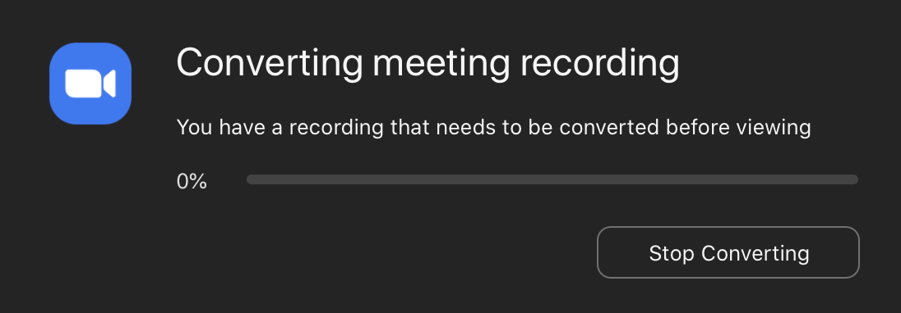
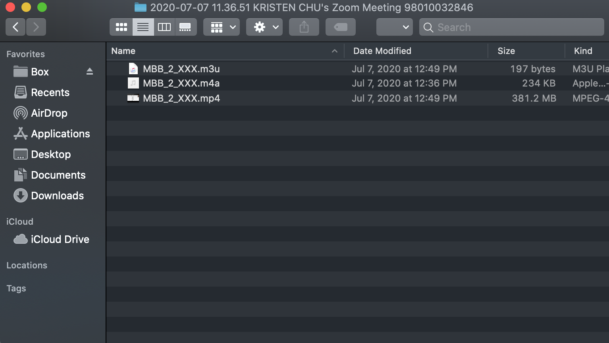
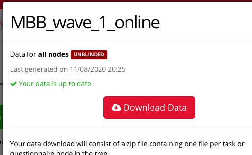
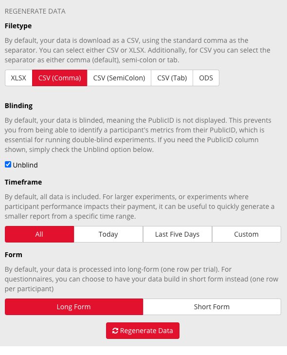

## Protocols - Post-Session 1  

### Protocol - Saving the Video

Step 1:
When the session is complete, click the bottom right hand button to end the meeting.  You will immediately see this window pop up to indicate the recording is being converted and saving to your computer. 
Step 2:
When the video conversion is complete, the video files will be saved in a folder titled "Zoom" on your computer, wherever your current automatic working directory is saved. 

To check where your automatic working directory is saved, login to Zoom and click on "Recordings" on the left menu column. Then switch to "Local Recordings" and view the Location for correct Meeting Recording you have just camptured.  

Step 3:
There will be three files in the folder- find the mp4 file and click open to ensure you have captured and converted the file successfully.  
Step 4:
Check the External drive for the participant's secondary ID number, and rename all 3 files with their secondary ID (MBB_2_XXX). Then upload to Box. 

### Protocol - Downloading the Gorilla task data

1. Login to Gorilla and navigate to the experiment's data tab.

2. If data is up to date, you can go ahead and click download. 

3. If data is not up to date, scroll down and click the necessary options, then click "Regenerate Data".

4. You will see a wait screen as it generates.

5. After a few minutes click into "Manage experiment data" again and download. 

- Unzip the file to your desktop. The first and third files are the task data we need. 
- Open the first file, and delete the rows for all participants except the participant in question.
- Save the file in the participants Box folder as "MBBXXX_halloween_training.csv"
- Open the third file, and delete the rows for all participants except the participant in question.
- Save this file in the participants Box folder as "MBBXXX_halloween_test_immediate.csv"
- The delayed test will be saved as "MBBXXX_halloween_test_delay.csv"

### Protocol - Session 2 Confirmation Email

- If session scheduling has not changed, copy Zoom link and Session 2 time information into Session 2 Confirmation Email and send
- If session scheduling has changed, update google calendar. Then, copy Zoom link and updated Session 2 time information into Session 2 Confirmation Email and send. 