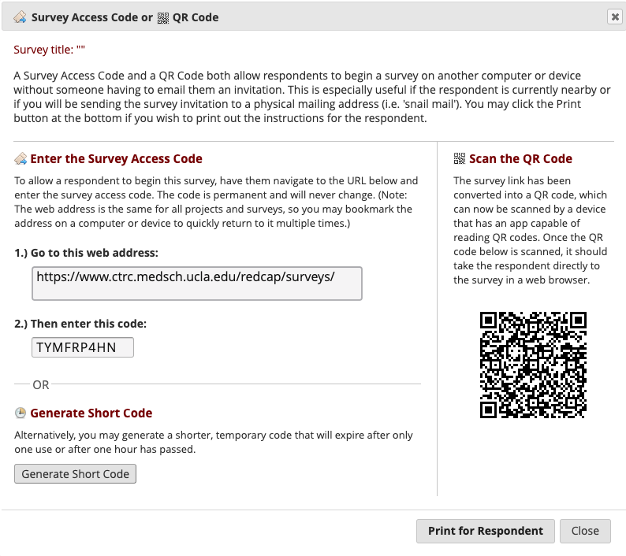

## Protocols - Session 2

### Protocol - Halloween Test Delay

[Once Zoom is Connected]

*Hello! Welcome back to Session 2!* [Ask how they are doing, and if they were able to try the Stool Sample collection. Answer any questions they have about their Home Session tasks (Stool sample, BSS sheet, Contact list)]

*So today we are just going to do one quick task and then I will walk you through how to close up package and send it back to us, then answer any questions you might have*

[Log into REDCap, pull up the instrument titled "halloween_test_delay" for this participant in the home_child arm and click into the survey options. You can either send them the general link and unique password, or give them a shortcode that expires within 1-hour]

### Protocol - Mailing Package

*Next, I just want to check-in with you about mailing the package back to the lab.*

- Reference the Package Checklist which has a checklist for every item they need to send back to the lab
- Everything goes into the mailer with the FedEx sheet on top
- Double check that stool and saliva sample are correctly packed (tube in biohazard bag with cotton balls, inside rigid white box)
- Drop off at any FedEx location or post box

### Protocol - Payment

- Confirm mailing address
- Explain that once the return mailer has been received to the lab after the second session, we will send payment through the mail along with a few educational science kits
- Explain that they should expect an email from us when we send the package, and if they haven't heard from us one week after we have sent the package, call to check-in about the payment