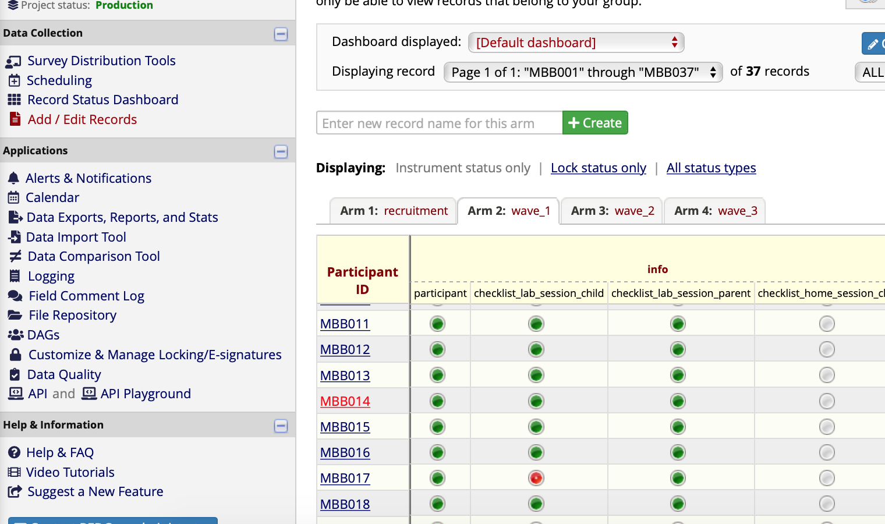
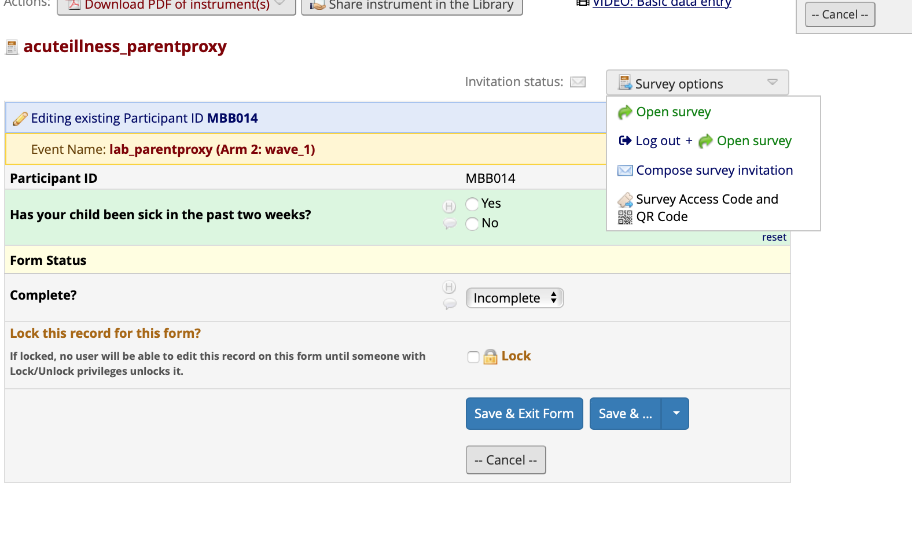
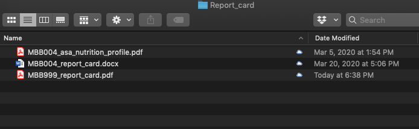
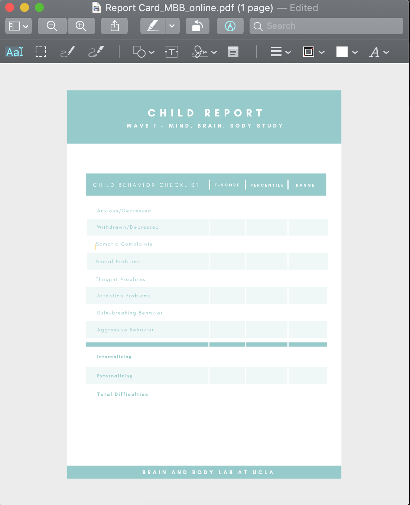

## Protocols - Final

### Protocol - Storing Saliva Sample 

- Screw lids on very tight (to prevent evaporation)
- Log the location (grid) on the sample storage log

-----------------

### Protocol - Storing Hair Sample 

- Store the sample in a dry area at room temperature

-----------------

### Protocol - Storing Stool Sample

#### Sample Quality 

- Put on gloves.
- Open the mailer to ensure that it contains both the stool sample (in biohazard bag) and the Bristol Stool Scale.
- Check for quality of the stool sample by shaking it up and down vigorously (keep the sample in the biohazard bag), then check for its consistency and color - It should be a dark-brown liquid.
- If stool sample does not meet requirement (e.g. sample is in solid form or amount collected is too little), contact the family to see if they would be willing to send another sample with compensation. 
- Contact family if the Bristol Stool Scale is missing in the mailer. 

#### Sample Transfer

- Wear appropriate PPE:
    - Gloves
    - Lab coat
    - Safety glasses
    - Surgical Mask
    - Closed-toe shoes
    - Long pants
    - Hair tied back
    

- Prepare your station and ensure that you have the following:
    - Drape
    - 2.0mL cryogenic vials 
    - Stool samples in biohazard bag 
    - Test tube racks
    - Transport box with divider
    - Sharpie for labeling

**Steps:**

- Lay a new drape on the work station and keep all equipments and sample on the drape throughout the transfer process.
- With the stool sample collection vial still in the biohazard bag, shake it up and down vigorously.
- Take the stool sample out of the bag and put it on the test tube rack.
- Untwist two 2.0mL vials and place them on the test tube rack. 
- Untwist the stool sample collection vial, and carefully pour the sample into the first 2.0mL vial. (It’s okay if the ball does or does not get transferred)
- Stop pouring when solution reached the 1.8mL line to prevent overflow, and pour the remaining sample (if any) in a second 2.0mL vial. 
- Cap the 2.0mL vials tightly to prevent spills. 
- Label the 2.0mL vials with a sharpie, ensure it has the participant ID and vial number.
- Place the labeled 2.0mL vials in the transport box with divider.
- Close the now-empty stool sample collection vial, put it back in the biohazard bag, and dispose it in the biohazard waste bin. 
- Clean up work station, dispose the drape, and wipe down the table top with disinfectant wipe.
- Remove PPE and wash hands with soap and water thoroughly.
- Bring the transport box to C454 where the -80˚C freezer is located (key in BABLab Lock Box).
- Place the 2.0mL vials in their designated space in the freezer box (in accordance to the Sample Storage Log Diagram). 
- Log the sample in the [Sample Storage Log](https://app.box.com/file/630322897864).

-----------------

### Protocol - Data Entry & Data Quality

#### Data Entry
<iframe width="560" height="315" src="https://www.youtube.com/embed/aKdWA0ABOrU" frameborder="0" allow="accelerometer; autoplay; encrypted-media; gyroscope; picture-in-picture" allowfullscreen></iframe>

#### Data Quality

<iframe width="560" height="315" src="https://www.youtube.com/embed/ZJJMLXLyiaw" frameborder="0" allow="accelerometer; autoplay; encrypted-media; gyroscope; picture-in-picture" allowfullscreen></iframe>

-----------------

### Protocol - Data Review & Data Audit 

#### Follow-Up (completed by Scheduling Coordinator)

- Before sending Home Reminder 3, make sure RA’s have completed Data Entry, Data Quality Check 1, and Data Quality Check 2.
- After sending Home Reminder 3 - create blank Trello card for participant on "In Data Review" list of Data Audit Board.

#### Data Review

- Once card has been created, do Data Review.
- Checking for completion of:
  - child questionnaires (see child questionnaire table)
  - parent proxy questionnaires (see parentproxy questionnaire table)
  - parent self questionnaires (see parentself questionnaire table)
  - hair sample
  - saliva sample
  - stool sample
  - bss sheet
  - contact sheet
  - halloween delay test
  - height, weight, waist
  - PC interaction video
  - halloween training and test data captured
- After completing Data Review, move card to Good Sample, Bad Sample, or No Sample list based on the stool sample.

#### Data Audit

**If Good Sample:**

- Send payment, thank you letter, certificate, and science kits via mail
- Send [MBB - PAID] email and attach thank you letter, certificate, and parent report (including outstanding items).
- Move to Paid list.
- One week after payment is sent, check outstanding items and do Audit Call #1.
- One week following Audit Call #1, check outstanding items do Audit Call #2.
- Within 2 days, check outstanding items and do Audit Call #3.
- After Audit Call #3 (or all items completed), send [MBB - DONE] email and move to Done list.
- If participant completes item on list, check card on Trello, mark off on participang log and data check sheets, and note in partipant's README in data folder.

**If Bad Sample:**

- Send payment, thank you letter, certificate, and science kits via mail. Include a new stool sample kit.
- Send [MBB - PAID] email and attach thank you letter, certificate, and parent report (including outstanding items - emphasize stool sample kit).
- Move to Paid list in Trello.
- One week after payment is sent, check outstanding items do Audit Call #1.
- One week following Audit Call #1, check outstanding items do Audit Call #2.
- Within 2 days, check outstanding items and do Audit Call #3.
- After Audit Call #3 (or all items completed), send [MBB - DONE] email and move to Done list.
- If participant completes item on list, check card on Trello, mark off on participang log and data check sheets, and note in partipant's README in data folder.

**If No Sample:**

- Send [MBB - UNPAID] email and attach thank you letter, certificate, and parent report (including outstanding items - emphasize stool sample kit).
- Leave participant on Unpaid list.
- If stool sample recieved - send payment, thank you letter, certificate, and science kits via mail and move to Paid list.
- If stool sample not received, one week after email is sent, check outstanding items do Audit Call #1.
- One week following Audit Call #1, check outstanding items do Audit Call #2.
- Within 2 days of Audit Call #2, check outstanding items and do Audit Call #3.
- After Audit Call #3 (or all items completed), send [MBB - DONE] email and move to Done list.
- If participant completes item on list, check card on Trello, mark off on participang log and data check sheets, and note in partipant's README in data folder.

##### Getting A Code From REDCap

1. Log onto REDCap and click on "record status dashboard" 

2. Click on designated participant 

3. Click on the first incomplete questionnaire for the parentself, parentproxy, or child questionnaire sets 

4. Click on Survey Options 

5. Click Survey Access Code and QR Code 

6. Copy and paste web address and code + send to email to participant

### Protocol - Report Card

1. Open a participant data folder

2. Navigate to the report card folder and rename the template file - MBB999 to the relevant participant - and open the file

3. Navigate to the last pge of the pdf and fill in the scores for this participant. You can type directly on the page- it is a fillable form.

4. After you have entered teh data, it should look like this:

**photo coming soon**

5. If there are any comments, enter them on the comments page.
  - For example, if any NA’s are present due to less than 70% of data for that subset being available to calculate a score - note that here.
  - If there are no comments, delete this page.

6. **Important**- Once you have completed the edits to the pdf, you must follow these steps to “lock” the data so that it is no longer editable before sending to the participant. To do so, click file/print/PDF/Save as PDF. Save the PDF to your desktop, then replace the original PDF with the desktop version.

7. The report card is now ready to be sent to the participant.

-----------------

### Protocol - Payment

**Payment package contents:**

- Payment box
- Type in participant's name and print copy of certificate
- Print thank you letter
- Include $65 Amazon gift card
- Check stool sample quality- if poor, send another stool kit
- Science kit- Neuron
  - 4 pipe cleaners
  - Pipe Cleaner Neuron photo directions quarter sheets
  - goodie bag + tie
- Science kit- Brain hat
  - left + right side brain hat sheet
  - Brain hat photo directions quarter sheets
  - plastic sheet cover
- Science kit- Petri Dish
  - petri dish sheet
  - Microbiome photo directions quarter sheets
  - plastic sheet cover
  - virus stickers

**Mailing payment package**

- Once the package has been created and sealed, it is time to bring the package down to Tyler's office in the Psychology building.
- To mail the package to the participant, you will need the following information:
  - Recharge ID
  - Participant name
  - Participant mailing address
- From Tyler's office, you will receive a FedEx label in which you can write this information
- Take a picture of the FedEx label and upload to Box
- Leave the package in Tyler's office for FedEx pickup
- Send payment confirmation email to participants 

**Recording Payment**

- Log participant payment in reimbursement log book
- Log participant payment in reimbursement spreadsheet

-----------------
