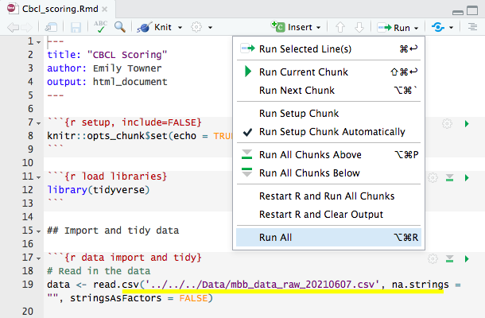
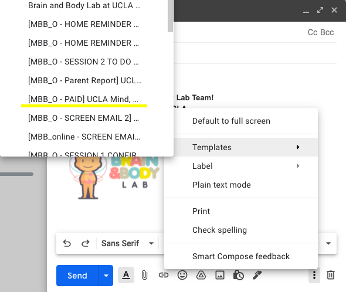

## W1-O Protocols - Final

### W1-O Protocol - Storing Saliva Sample 

- Screw lids on very tight (to prevent evaporation)
- Log the location (grid) on the sample storage log

-----------------

### W1-O Protocol - Storing Hair Sample 

- Store the sample in a dry area at room temperature

-----------------

### W1-O Protocol - Storing Stool Sample

#### Sample Quality 

- Put on gloves.
- Open the mailer to ensure that it contains both the stool sample (in biohazard bag) and the Bristol Stool Scale.
- Check for quality of the stool sample by shaking it up and down vigorously (keep the sample in the biohazard bag), then check for its consistency and color - It should be a dark-brown liquid.
- If stool sample does not meet requirement (e.g. sample is in solid form or amount collected is too little), contact the family to see if they would be willing to send another sample with compensation. 
- Contact family if the Bristol Stool Scale is missing in the mailer. 

#### Sample Transfer

- Wear appropriate PPE:
    - Gloves
    - Lab coat
    - Safety glasses
    - Surgical Mask
    - Closed-toe shoes
    - Long pants
    - Hair tied back
    

- Prepare your station and ensure that you have the following:
    - Drape
    - 2.0mL cryogenic vials 
    - Stool samples in biohazard bag 
    - Test tube racks
    - Transport box with divider
    - Sharpie for labeling

**Steps:**

- Lay a new drape on the work station and keep all equipments and sample on the drape throughout the transfer process.
- With the stool sample collection vial still in the biohazard bag, shake it up and down vigorously.
- Take the stool sample out of the bag and put it on the test tube rack.
- Untwist two 2.0mL vials and place them on the test tube rack. 
- Untwist the stool sample collection vial, and carefully pour the sample into the first 2.0mL vial. (It’s okay if the ball does or does not get transferred)
- Stop pouring when solution reached the 1.8mL line to prevent overflow, and pour the remaining sample (if any) in a second 2.0mL vial. 
- Cap the 2.0mL vials tightly to prevent spills. 
- Label the 2.0mL vials with a sharpie, ensure it has the participant ID and Wave and vial number.
- Place the labeled 2.0mL vials in the transport box with divider.
- Close the now-empty stool sample collection vial, put it back in the biohazard bag, and dispose it in the biohazard waste bin. 
- Clean up work station, dispose the drape, and wipe down the table top with disinfectant wipe.
- Remove PPE and wash hands with soap and water thoroughly.
- Bring the transport box to C454 where the -80˚C freezer is located (key in BABLab Lock Box).
- Place the 2.0mL vials in their designated space in the freezer box (in accordance to the Sample Storage Log Diagram). 
- Log the sample in the [Sample Storage Log](https://app.box.com/file/630322897864).

-----------------

### W1-O Protocol - Data Entry & Data Quality

#### Data Entry
<iframe width="560" height="315" src="https://www.youtube.com/embed/fp9M56f8ViY" frameborder="0" allow="accelerometer; autoplay; encrypted-media; gyroscope; picture-in-picture" allowfullscreen></iframe>

#### Data Entry Checks

[Data Entry Checks Video](https://app.box.com/file/805857407548) 

#### Data Quality

<iframe width="560" height="315" src="https://www.youtube.com/embed/ZJJMLXLyiaw" frameborder="0" allow="accelerometer; autoplay; encrypted-media; gyroscope; picture-in-picture" allowfullscreen></iframe>

#### Relevant Protocols

[How to burn a CD](https://bablab.github.io/wiki_bablab/lab-protocols.html#burning-cd)

[How to make a high to low resolution video](https://bablab.github.io/wiki_bablab/lab-protocols.html#high-to-low-res-video)

-----------------

### W1-O Protocol - Data Review & Data Audit 

#### Follow-Up (completed by Scheduling Coordinator)

- Before sending Home Reminder 3, make sure RA’s have completed Data Entry, Data Quality Check 1, and Data Quality Check 2.
- After sending Home Reminder 3 - create blank Trello card for participant on "In Data Review" list of Data Audit Board.

#### Data Review

[Data Review Video](https://youtu.be/z_mQGyguaEY)

- Once card has been created, do Data Review.
- Checking for completion of:
  - child questionnaires (see child questionnaire table)
  - parent proxy questionnaires (see parentproxy questionnaire table)
  - parent self questionnaires (see parentself questionnaire table)
  - hair sample
  - saliva sample
  - stool sample
  - bss sheet
  - contact sheet
  - halloween delay test
  - height, weight, waist
  - PC interaction video
  - halloween training and test data captured
- After completing Data Review, move card to Good Sample, Bad Sample, or No Sample list based on the stool sample.

#### Data Audit

**If Good Sample:**

- Send payment, thank you letter, certificate, and science kits via mail
- Send [MBB - PAID] email and attach thank you letter, certificate, and parent report (including outstanding items).
- Move to Paid list.
- One week after payment is sent, check outstanding items and do Audit Call #1.
- One week following Audit Call #1, check outstanding items do Audit Call #2.
- Within 2 days, check outstanding items and do Audit Call #3.
- After Audit Call #3 (or all items completed), send [MBB - DONE] email and move to Done list.
- If participant completes item on list, check card on Trello, mark off on participang log and data check sheets, and note in partipant's README in data folder.

**If Bad Sample:**

- Send payment, thank you letter, certificate, and science kits via mail. Include a new stool sample kit.
- Send [MBB - PAID] email and attach thank you letter, certificate, and parent report (including outstanding items - emphasize stool sample kit).
- Move to Paid list in Trello.
- One week after payment is sent, check outstanding items do Audit Call #1.
- One week following Audit Call #1, check outstanding items do Audit Call #2.
- Within 2 days, check outstanding items and do Audit Call #3.
- After Audit Call #3 (or all items completed), send [MBB - DONE] email and move to Done list.
- If participant completes item on list, check card on Trello, mark off on participang log and data check sheets, and note in partipant's README in data folder.

**If No Sample:**

- Send [MBB - UNPAID] email and attach thank you letter, certificate, and parent report (including outstanding items - emphasize stool sample kit).
- Leave participant on Unpaid list.
- If stool sample recieved - send payment, thank you letter, certificate, and science kits via mail and move to Paid list.
- If stool sample not received, one week after email is sent, check outstanding items do Audit Call #1.
- One week following Audit Call #1, check outstanding items do Audit Call #2.
- Within 2 days of Audit Call #2, check outstanding items and do Audit Call #3.
- After Audit Call #3 (or all items completed), send [MBB - DONE] email and move to Done list.
- If participant completes item on list, check card on Trello, mark off on participang log and data check sheets, and note in partipant's README in data folder.

##### Getting A Code From REDCap

1. Log onto REDCap and click on "record status dashboard" 

2. Click on designated participant 

3. Click on the first incomplete questionnaire for the parentself, parentproxy, or child questionnaire sets 

4. Click on Survey Options 

5. Click Survey Access Code and QR Code 

6. Copy and paste web address and code + send to email to participant

-----------------

### W1-O Protocol - Data Entry Check Board Audits 

RA’s will be conducting Data Entry Checks to ensure that all data collected from MBB participants is accurately entered in REDcap. To audit the data entry checks, read over all notes in the Data Entry CHECK tab in the MBB_participant_log to identify errors that need to be fixed (ie. data entered incorrectly, discrepancy between paper copy and REDcap form).

1.	Open the MBB_participant_log and go to the Data Entry CHECK tab for whichever wave you are checking.

    **GREEN** items are attributed to completed/accurate sections, OR if an RA had found a discrepancy between the REDcap and paper copy and was able to fix it themselves.

    **YELLOW** items are attributed to incomplete sections where:
      - participant did not complete (paper is blank)
      - participant was not given this survey (not given on paper)

      These items were most likely not completed by the participant, so there will be no data to verify.

    **RED** items are attributed to sections where:
      - data is missing on REDCap from paper copy, but no place to put it on REDCap
      - data is added on REDCap but not on paper copy
      - data entry is missing but illegible
      - any other less common discrepancies that need to be double checked
      
      **These items have been flagged by an RA and require auditing.**

2. Open REDcap and go to corresponding MBB participant that requires auditing.
    - For any flagged items, read notes on Participant Log and the participant’s REDCap to get an idea of the issue.  If necessary, locate the participant’s paper copy in their “Data” folder to verify the discrepancy. (Can be found in BABLAB > Studies >  Mind_Brain_Body > Data > (wave) > Wave_online_data)

**IF** the issue is fixable, edit the item on REDcap to match the paper copy, and note the item as Complete on the MBB_participant_log.

**IF** there is a discrepancy between the paper copy and REDcap, check an updated version of the paper copy to verify whether this discrepancy has been fixed since the participant completed the study. The paper copies can be found at BABLAB > Studies > Mind_Brain_Body > Documents > Questionnaires > Wave_X (specific to which wave you are checking)
  - If the paper copy has not been updated, make a note and report to lab manager.
  - Either way, ask lab manager whether we need to contact participant to retrieve the missing data. 

**IF** the issue is not fixable – write detailed notes of where the discrepancy needs to be fixed, and report it to the Lab Manager. Lab Manager should assess the amount of items missing, the importance of the items to the scale and to the overall study, and the process in which audits have been conducted to see if it would be convenient to re-request such information. After assessing such details, the Lab Manager should decide how to proceed with the issue on a base-by-base situation. 

**IF** there is an instance where the paper copy is illegible, or multiple options have been selected, verify with Lab Manager on how it should be entered onto REDcap. Lab Manager should refer to the above details to assess what the importance of the item is. Lab Manager should then decide whether or not to recontact the participant for explanations on illegible handwriting.

**Examples:** 

**Participant:** MBB033

**Item:** Covid_Objective_Parentproxy

**Issue:** “Did your child’s school close due to outbreak” answer not inputted into Redcap, which didn’t activate the rest of questions to be entered. Participant answered “Yes” and “homeschooled” and answered rest of questions, however the follow-up questions were not inputted into redcap, because only one option can be selected for “Did your child’s school close due to outbreak”

**Resolve:** In this situation, we may assume that the participant should have circled “yes” in order to activate the branch logic-ed items on REDCap that they did fill out on paper, which must have applied to them. 

**Participant:** MBB033

**Item:** Demographics_parentproxy

**Issue:** Participant selected “bachelors degree” AND “other” and wrote Theatre degree

**Resolve:** Because we are looking how many years they studied (professional; bachelors, etc.) it doesn’t matter which type of degree they specify if so.

**Participant:** MBB035

**Item:** Cbcl_parentproxy

**Issue:** Participant selected “not true” AND “sometimes true” however, it looks like a mistake because they often erased and changed their answers and may have forgotten to erase one of the checkmarks.

**Resolve:** For not true and sometimes true, probably would make it sometimes true (not zero)
For sometimes true and true, choose the middle - So select sometimes true in this case. The one that would impact composite the least.

-----------------

### W1-O Protocol - Report Card

Scored Cbcl data for the report cards can be found in BABLAB/Studies/Mind_Brain_Body/Scripts/Wave_1/Data_scoring/Cbcl/cbcl_scored

**Running script to get cbcl data ready**

1. Ask lab manager to update REDCap raw data file

2. Open the R script for scoring cbcl using RStudio BABLAB/Studies/Mind_Brain_Body/Scripts/Wave_1/Data_scoring/Cbcl/cbcl_scoring.Rmd

3. Change the line with file name so it has the most updated date 

4. Run the script by clicking run all
    *if there is an error saying data file couldn't be found make sure the file name is correct*

**Making report card**

1. Open a participant data folder - BABLAB/Studies/Mind_Brain_Body/Data/Wave_1_online/Wave_1_online_data/

2. Navigate to the report card folder and rename the template file - MBB999 to the relevant participant - and open the file

3. Navigate to the last page of the pdf and fill in the scores for this participant. You can type directly on the page- it is a fillable form.

4. After you have entered the data, it should look like this:

5. If there are any comments, enter them on the comments page.
  - For example, if any NA’s are present due to less than 70% of data for that subset being available to calculate a score - note that here.
  - If there are no comments, delete this page.

6. **Important**- Once you have completed the edits to the pdf, you must follow these steps to “lock” the data so that it is no longer editable before sending to the participant. To do so, click file/print/PDF/Save as PDF. Save the PDF to your desktop, then replace the original PDF with the desktop version.

7. The report card is now ready to be sent to the participant.

Notes: 

  - If the scores for a particular participant seem off check in with the lab manager so they can verify there isn't something wrong with the cbcl script

  - The fill in spots for the aggressive behavior row don't match the rest of the document so there are two small text boxes where you can put in the values

**Sending report card email**

1. Make a copy of certificate template, type in participant name, and save as a pdf
    - certificate is in BABLAB/Studies/Mind_Brain_Body/Payment/Wave_1/Wave_1_print

2. Open participant's report card pdf and save a copy to your desktop *without the participant ID* which will be attached to email

3. Open up report card email template & fill in highlighted parts

4. Attach thank you letter, cerificate, and report card to email
    - thank you letter is in BABLAB/Studies/Mind_Brain_Body/Payment/Wave_1/Wave_1_print
  
-----------------

### W1-O Protocol - Payment

**Payment package contents:**

- Payment box
- Type in participant's name and print copy of certificate
- Print thank you letter
- Include $65 Amazon gift card
  - gift card code will be sent in payment email as well as sending physical gift card in mail 
- Check stool sample quality- if poor, send another stool kit
- Science kit- Neuron
  - 4 pipe cleaners
  - Pipe Cleaner Neuron photo directions quarter sheets
  - goodie bag + tie
- Science kit- Brain hat
  - left + right side brain hat sheet
  - Brain hat photo directions quarter sheets
  - plastic sheet cover
- Science kit- Petri Dish
  - petri dish sheet
  - Microbiome photo directions quarter sheets
  - plastic sheet cover
  - virus stickers

**Mailing payment package**

- Once the package has been created and sealed, it is time to bring the package down to Tyler's office in the Psychology building.
- To mail the package to the participant, you will need the following information:
  - Recharge ID
  - Participant name
  - Participant mailing address
- From Tyler's office, you will receive a FedEx label in which you can write this information
- Take a picture of the FedEx label and upload to Box
- Leave the package in Tyler's office for FedEx pickup
- Send payment confirmation email to participants 

**Recording Payment**

- Log participant payment in reimbursement log book
- Log participant payment in reimbursement spreadsheet

**Payment emails**

1. In the same email thread that you've been emailing participant open up the payment email template 

2. Fill in highlighted parts.

3. Add in the gift card codes
    - gift card codes are under last name of caregiver in BABLAB/Studies/Mind_Brain_Body/Payment/Wave_1/Gift_card_codes

4. If we're still missing anything from them ( a survey, contact list, etc) also request it in the payment email

5. Mark payment email as complete on the MBB participant log in column called " Send payment confirmation email to participant"
  

-----------------
