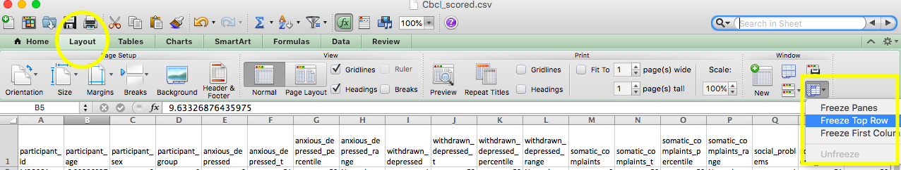
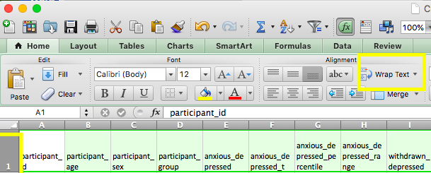

----------- 

 

## W2 Protocols - Final 

  

### W2 Protocol - Storing Saliva Sample  

  
- Screw lids on very tight (to prevent evaporation) 
- Log the location (grid) on the sample storage log 

----------------- 

### W2 Protocol - Processing Saliva Sample

#### Sample Transfer 

- Wear appropriate PPE: 

    - Gloves 
    - Lab coat 
    - Safety glasses 
    - Surgical Mask 
    - Closed-toe shoes 
    - Long pants 
    - Hair tied back

- Prepare your station and ensure that you have the following: 

    - Incubator with thermometer
    - Vortex machine
    - Eppendorf pipette (1000uL)
    - Pipette tips (wide bore, sterile, universal fit)
    - 2.0mL cryogenic vials (with O rings, sterile)
    - Saliva samples in room temperature plastic box  
    - Test tube rack
    - Transport box with divider 
    - Industrial Sharpie for labeling 
    - Notebook for sample logs with pen

**Steps for incubation:** 

- Retrieve the box of saliva samples at room temperature in BAB Lab Cabinet 1 and carry them to HPL.
- Plug in and turn on the incubator, turn the dial to level 10 and ensure the red "heating light" is on.
- Continuously check the incubator to see what if temperature has reached 50-55C.
- While waiting for the incubator to hit 50 C, clean workspace using ethynol and paper towels (dispose these in the regular trash bin)
- Open the saliva sample box in HPL and note down the list of samples to be processed today, and ensure the lid on each of these samples is shut very tight. If the lid is slightly opened, the sample may risk evaporation during incubation. 
- Ensure you are wearing gloves when grabbing the 2.0mL cryovials. Label two cryovials per sample for those that will be processed today (use the Industrial Sharpie). Place them in the transport box for temporary storage.
- When the incubator has reached 50C, turn down the heat to level 6. The incubator temperature will still rise slowly, but when the door is opened for samples to be put in, the temperature can drop anywhere between 5-10C, depending upon how long the door is opened. To account for this temperature loss, heat the incubator to about 55C.
- When the temperature reaches 55C, open the incubator door and place all saliva tubes standing upright on the incubator tray.
- **IMPORTANT NOTE:** the incubator is extremely sensitive to movement - the saliva samples are likely to fall over with any large tap and/or placement of saliva samples on the tray inside. Be very careful placing samples onto the tray, closing the incubator door, and opening the incubator door once the incubation has completed. 
- Close the incubator door *very* carefully and turn the knob as needed to regulated the temperature towards 50C. If the heat has dropped significantly, turn to level 10. If the heat has dropped slightly, move towards 6-8. If the heat is still too high, drop to level 2-4. If the heat is about right, keep the knob at level 5. 
- Note down the current time and set an alarm for 2 hours to continue processing. Continue to check the incubator regularly to ensure temperature level is still at 50C and heat level does not need adjusting. 

**Steps for processing:** 

- Once the tubes have incubated for 2 hours, retrieve the cryovials, test tube rack, pipettes, pipette tips, and sample log notebook with pen.
- **Very carefully**, open the incubator door and remove five samples to place in the test tube rack. Close the incubator door. (NOTE: the samples are not very hot, so no additional safety protection is needed beyond gloves. If extremely sensitive to heat touch, use a paper towel to grab the samples out of the incubator.)
- Carry the five samples in the test tube rack to the vortex machine. Place one sample on the vortex machine and press down, holding for 20 seconds while the sample is shaken. 
- After each sample is vortexed, turn the sample upside down and back up to see if any is still too viscous. If so, vortex for an additional 20 seconds.
- Carry the samples back to the Pipettes in the BAB area of HPL. Select the 1000uL pipette and spin the dial until the numbers on the back of the pipette read 1000. Open the box of pipette tips.
- **PIPETTING SAMPLE:** Locate the labeled cryovials for the sample you will process. Open the sample tube and place back down into the test tube holder. Open the cryovial and hold tube with one hand. Grab the pipette, push down into a new pipette tip, place into sample, press down until first stop, release to suck in first 1000uL. Release the sample into the cryovial, pressing down until second stop. Place pipette down on its side. Close the cryovial and place back into transfer box. Open the second cryovial, pipette what is left from the saliva sample into the second cryovial before placing into the transfer box. When there is no saliva left in the sample tube, close it and dispose in the biohazard bin. Release the pipette tip by pressing on the button located on the back of the pipette into the biohazard bin. Write down the sample quality and location in the sample log notebook.
- Wipe down the table with ethynol before replacing gloves, disposing in biohazard bin. 
- Return to the incubator for the next five samples, repeating the **PIPETTING SAMPLE** step above for the rest of the samples.
- Once the samples have been processed, transfer the samples to the -20 freezer in the saliva box. 
- Turn the knob on the incubator back to zero, and turn the incubator off. If researcher would like to return the incubtaor to room temperature quick, the incubator door may be opened to release heat faster.
- Take a picture of the sample log notebook and transfer notes to the sample log on Box

----------------- 

### W2 Protocol - Storing Hair Sample  

- Store the sample in a dry area at room temperature 

----------------- 

### W2 Protocol - Storing Stool Sample 

#### Sample Quality  

- Put on gloves. 
- Open the mailer to ensure that it contains both the stool sample (in biohazard bag) and the Bristol Stool Scale. 
- Check for quality of the stool sample by shaking it up and down vigorously (keep the sample in the biohazard bag), then check for its consistency and color - It should be a dark-brown liquid. 
- If stool sample does not meet requirement (e.g. sample is in solid form or amount collected is too little), contact the family to see if they would be willing to send another sample with compensation.
- Contact family if the Bristol Stool Scale is missing in the mailer.  

  
#### Sample Transfer 

- Wear appropriate PPE: 

    - Gloves 
    - Lab coat 
    - Safety glasses 
    - Surgical Mask 
    - Closed-toe shoes 
    - Long pants 
    - Hair tied back

- Prepare your station and ensure that you have the following: 

    - 2.0mL cryogenic vials  
    - Stool samples in biohazard bag  
    - Test tube racks 
    - Transport box with divider 
    - Sharpie for labeling 

**Steps:** 

- Clean workspace prior to placing shield down and paper towel over shield 
- Untwist two 2.0mL vials and place them on the side of the shield to prepare 
- With the stool sample collection vial still in the biohazard bag, shake it up and down vigorously 
- Take the stool sample out of the bag and label with industrial sharpie 
- Take a photo of the sample to store on Box 
- Untwist the stool sample collection vial, and carefully pour the sample into the first 2.0mL vial (It’s okay if the ball does or does not get transferred) 
- Stop pouring when solution reached the 1.8mL line to prevent overflow, and pour the remaining sample (if any) in a second 2.0mL vial 
- Cap the 2.0mL vials tightly to prevent spills 
- Label the 2.0mL vials with an industrial sharpie, ensure it has the participant ID and Wave and vial number 
- Place the labeled 2.0mL vials in the transport box with divider 
- Close the now-empty stool sample collection vial, put it back in the biohazard bag, and dispose it in the biohazard waste bin 
- Clean-up work station, dispose the drape, and wipe down the table top with disinfectant wipe. 
- Remove PPE and wash hands with soap and water thoroughly 
- Bring the transport box to the -20 upright freezer in HPL 
- Place the 2.0mL vials in their designated space in the freezer box (in accordance to the Sample Storage Log Diagram) 
- Log the sample in the [Sample Storage Log](https://app.box.com/file/630322897864) 
- Update the Stool Quality on REDCap 

  

#### Taking out the Hazards 

 

-Take the Hazards key with you from the lock box in the Lab. Make sure there are two keys attached- a large gold key and a small gold key. 
-Head to HPL. Once inside, put on PPE. 
-Find the large gray cart in the back room, and wheel into the main HPL lab space. This will assist you in carrying the Hazards bin to the waste area. Put the entire Hazards bin (with the hazards bag full of materials) onto the gray cart.  
-Ensure you either leave the HPL keys in the lockbox on the door or take them with you. 
-Wheel the cart to the elevator and take it down to level A. Turn right into the hallway and take another right out to the double doors that lead to the loading dock. Exit the building and be sure to close both doors- these doors cannot be propped open. 
-Wheel the cart to the gate. Use the small gold key to open the lock holding together the chains that lock the gate closed. Once you have the gate open, carry the hazards bin inside. 
-Take out the hazards bag and tie it closed. Leave the tied hazards bag in one of the red bins in the corner. 
-Bring the hazards bin back to the gray cart. Use the gold key to lock the chains and gate back up.  
-Use the large gold key to reenter through the double doors. Take the elevator back to floor 1. Head back to HPL. 
-Once back in HPL, find a new hazards bag- the Brain and Body Lab hazards bags are located on the first shelf above our space in the corner. If we run out, Dr. Robles kindly invited us to use the Hazards bags in the HPL space which are located underneath the tables by the refrigerator.  
-Discard your gloves into the newly replaced hazards bag.  
-Make sure to return the Hazards keys to the lock box in BABLAB. 

### W2 Protocol - Tasso Blood Sample Storage  

 
- Lab manager should try to store sample within one day of receiving sample
- Take the blood samples to HPL
- Take out the blood sample and twist off the button (counterclockwise until it stops, then release the sample from the button), leaving only the blood sample itself to be stored
- Discard the button in the biohazard bin in HPL
- Place silver Tasso biohazard bag with blood sample and silica gel in its designated space in the freezer box (in accordance to the Sample Storage Log Diagram) in -20 freezer
- Update MBB log
- Log the sample in the [Sample Storage Log](https://app.box.com/file/630322897864) 

  

### W2 Protocol - Data Entry & Data Quality 

  

#### Data Entry 

<iframe width="560" height="315" src="https://www.youtube.com/embed/fp9M56f8ViY" frameborder="0" allow="accelerometer; autoplay; encrypted-media; gyroscope; picture-in-picture" allowfullscreen></iframe> 

  

#### Data Quality 

  

<iframe width="560" height="315" src="https://www.youtube.com/embed/ZJJMLXLyiaw" frameborder="0" allow="accelerometer; autoplay; encrypted-media; gyroscope; picture-in-picture" allowfullscreen></iframe> 

  

#### Relevant Protocols 

  

How to burn a CD - https://bablab.github.io/wiki_bablab/lab-protocols.html#burning-cds 

  

How to make a high to low resolution video - https://bablab.github.io/wiki_bablab/lab-protocols.html#high-to-low-res-video 

  

----------------- 

  

### W2 Protocol - Data Review & Data Audit  

  

#### Follow-Up (completed by Scheduling Coordinator) 

- Before sending Home Reminder 3, make sure RA’s have completed Data Entry, Data Quality Check 1, and Data Quality Check 2. 
- After sending Home Reminder 3 - create blank Trello card for participant on "In Data Review" list of Data Audit Board. 

  

#### Data Review 

  

https://youtu.be/z_mQGyguaEY 

  

- Once card has been created, do Data Review. 

- Checking for completion of: 

  - child questionnaires (see child questionnaire table) 
  - parent proxy questionnaires (see parentproxy questionnaire table) 
  - parent self questionnaires (see parentself questionnaire table) 
  - hair sample 
  - saliva sample 
  - stool sample 
  - blood sample  
  - bss sheet 
  - contact sheet 
  - halloween delay test 
  - height, weight, waist 
  - PC interaction video 
  - halloween training and test data captured 

- After completing Data Review, move card to Good Sample, Bad Sample, or No Sample list based on the stool sample. 

  

#### Data Audit 

**Before reaching out to participants** 

It is important to check that information marked as missing on the participant's Trello card is *actually* missing before reaching out to participant to request it.  

  - Check for the missing information in the participant's folder on Box  

  - If a REDCap survey is missing check if it was maybe just not input on REDCap but is there in participant folder 

  - Look through email threads with participant for info on why a file might be missing or if they sent it to us in the past  

  - If it is info the researcher collected during the session ( height, weight, waist) check if researcher has that info  

IF the information is actually missing then you can go ahead and reach out to the participant 

  - You will be sending them editable copies of the files they are missing. It is advised you create some way to track each file ( ex. you can name file as date of session and then delete that name later on) 

  - There is an email template available in the BAB email under templates titled "MBB_O - Data Audits Mind Brain Body Study" 

**Timeline for Data Audits:** 

1) Call participant and request missing information from them (surveys, contact list, etc). After calling ( and leaving a voicemail if they don'tt answer) send them an email requesting they fill out missing info and upload it to our [Box folder](https://ucla.app.box.com/f/3c52df2afb1a446ab363b793f8af22c1) 

2) *One week later* call them again and send another email. Leave a voicemail if they don't answer.  

3) *One week later* call them again and send a third email. Leave a voicemail if they don't answer. At this point if you have not heard from them *at all* you can end the audit for that person. 

    - if you *have* heard from participant but haven't gotten the missing info then extend the audit a week or two at your discrection if you think they will complete the missing info. 

  
#### **Documenting the audits** 

**The folder for Box uploads is in BABLAB/Studies/Mind_Brain_Body/Data/Wave_1_online/Uploads** Check it to see if participant's have uploaded the missing info 

**After each contact** 

  - Make sure you write in the description the date you reached out to participant and any notes from the contact  

  - If the participant did not seem willing to provide the missing info make a note 

  - If participant emailed add date of contact into description too 

**Successful Audit** 

1) Add the missing info to the participant's folder on Box. 

2) Make a note on participant's Trello card that you received the missing info.  

3) Add the info to the ammend list on the Trello card.  

3.1) If you know how to input the information into REDCap and have time to do so you can add the info and then mark that item on amend list as completed.  

   - **If you input the missing data then go to the participant log and mark it as complete on the Data Quality Check tab** 

4) If there are any items that need to be amended add an amend label to the Trello card

5) Move the Trello card to the appropriate Done column of Audit dashbaord 

**Unsuccesful Audit** 

1) Make a note in the description of participant's trello card that the data was not received 

2) Add the no response label to the card. 

3) Move to the appropriate Done pile of Audit board  
  

##### Getting A Code From REDCap 

  

1. Log onto REDCap and click on "record status dashboard"  
2. Click on designated participant  
3. Click on the first incomplete questionnaire for the parentself, parentproxy, or child questionnaire sets  
4. Click on Survey Options  
5. Click Survey Access Code and QR Code  
6. Copy and paste web address and code + send to email to participant 

  

*Refer to Wave 1 protocol for more details* 

--------- 

### W2 Protocol - Report Card 

Scored Cbcl data for the report cards can be found in BABLAB/Studies/Mind_Brain_Body/Scripts/Wave_2/Data_scoring/Cbcl/cbcl_scored

**Running script to get cbcl data ready**

1. Ask lab manager to update REDCap raw data file.

2. Open the R script for scoring cbcl using RStudio. **Make sure you open with desktop Box** BABLAB/Studies/Mind_Brain_Body/Scripts/Wave_2/Data_scoring/Cbcl/cbcl_scoring.Rmd

3. Change the line with file name so it has the most updated file. 

3.1 To access the raw data file name go to BABLAB/Studies/Mind_Brain_Body/Scripts/Data and look for most recent date. 

4. Run the script by clicking run all. 
   -  *if there is an error saying data file couldn't be found make sure the file name is correct*
   - *Make sure you have all the "packages" needed for the script downloaded in your RStudio*

**Making report card**

1. Open a participant data folder - BABLAB/Studies/Mind_Brain_Body/Data/Wave_2/Wave_2_data

2. Navigate to the report card folder and rename the template file - MBB999 to the relevant participant - and open the file

3. Navigate to the last page of the pdf and fill in the scores for this participant. You can type directly on the page- it is a fillable form.

4. The data you are inputting into the report card comes from the file titled "Cbcl_scored.csv" which can be found in BABLAB/Studies/Mind_Brain_Body/Scripts/Wave_2/Data_scoring/Cbcl

4.1 Some info about the scored cbcl data file

  - *Make sure you do not save any changes you make to the cbcl file. Open the file on Desktop Box*
  
  - You can freeze the first row of the data by going to Layout tab and then the Window section. Click on freeze first row

  - Make the names of the columns fully visible by clicking on the 1 to highlight row 1 then clicking Wrap text.
  

5. After you have entered the data, it should look like this:

6. If there are any comments, enter them on the comments page.
  - For example, if any NA’s are present due to less than 70% of data for that subset being available to calculate a score - note that here.
  - If there are no comments, delete this page.

7. **Important**- Once you have completed the edits to the pdf, you must follow these steps to “lock” the data so that it is no longer editable before sending to the participant. To do so, click file/print/PDF/Save as PDF. Save the PDF to your desktop, then replace the original PDF with the desktop version.

8. The report card is now ready to be sent to the participant.

Notes: 

  - If the scores for a particular participant seem off check in with the lab manager so they can verify there isn't something wrong with the cbcl script

  - The fill in spots for the aggressive behavior row don't match the rest of the document so there are two small text boxes where you can put in the values

**Sending report card email**

1. Make a copy of certificate template on your desktop, type in participant name, and save as a pdf
    - certificate is in BABLAB/Studies/Mind_Brain_Body/Payment/Wave_2/Wave_2_print
    - when you save it as a pdf open it then rotate it so the pdf is oriented correctly

2. Open participant's report card pdf and save a copy to your desktop *without the participant ID* which will be attached to email

3. Open up report card email template & fill in highlighted parts

4. Attach thank you letter, cerificate, and report card to email
    - thank you letter is in BABLAB/Studies/Mind_Brain_Body/Payment/Wave_2/Wave_2_print

----------

### W2 Protocol - Payment 

  

**Payment package contents:** 

  

- Payment box 
- Type in participant's name and print copy of certificate 
- Print thank you letter 
- include prize chosen by participant (check REDCap session 2 checklist for choice) 
- Include Amazon gift card payment 
- send gift card codes in payment email 
- Check stool sample quality- if poor, send another stool kit 

  

**Mailing payment package** 

  

- Once the package has been created and sealed, it is time to bring the package down to Tyler's office in the Psychology building. 
- To mail the package to the participant, you will need the following information: 
  - Recharge ID 
  - Participant name 
  - Participant mailing address 
- From Tyler's office, you will receive a FedEx label in which you can write this information 
- Take a picture of the FedEx label and upload to Box 
- Leave the package in Tyler's office for FedEx pickup 
- Send payment confirmation email to participants  

  

**Recording Payment** 

- Log participant payment in reimbursement log book 
- Log participant payment in reimbursement spreadsheet 

**Payment emails**

1. In the same email thread that you've been emailing participant open up the payment email template 

2. Fill in highlighted parts.

3. Add in the gift card codes
    - gift card codes are under last name of caregiver in BABLAB/Studies/Mind_Brain_Body/Payment/Wave_2/Gift_card_codes

4. If we're still missing anything from them ( a survey, contact list, etc) also request it in the payment email

5. Mark payment email as complete on the MBB participant log in column called " Send payment confirmation email to participant"
  
 