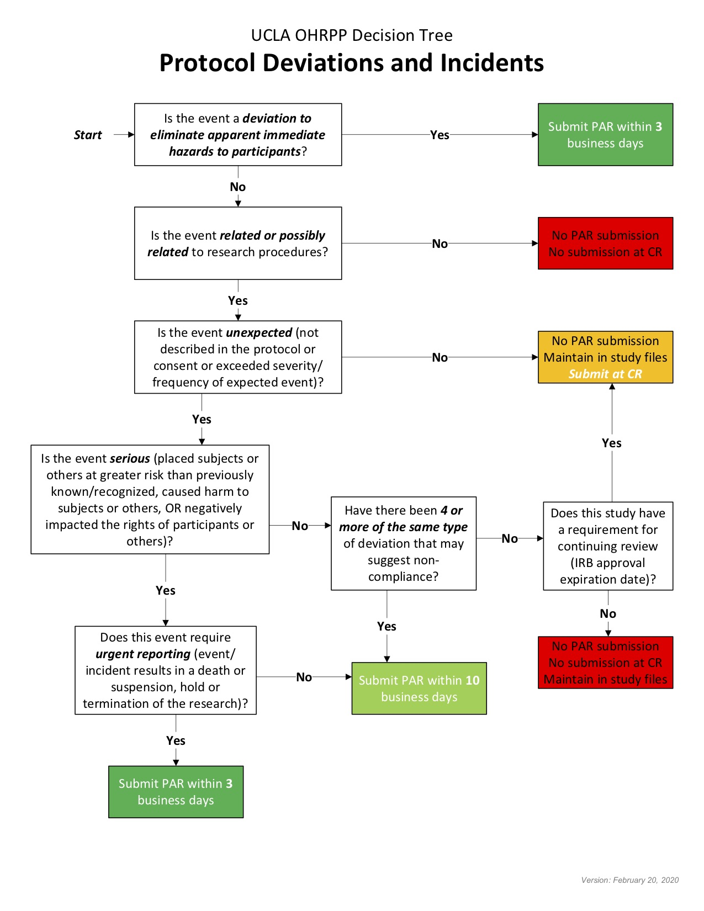

# Troubleshooting

## Troubleshooting - Links

#### If links in chat are not working... 

  

[Get them to have the links email open just in case] 

*You should have received an email from us right before this session full of links for today. Can you please pull that up to have it ready just in case? I will be sending you all of these links through the Zoom chat, but it will a good reference in case we have any technical difficulties! Once you have it up, you can co ahead and minimize the window.* 

## Troubleshooting - Internet Issues  

#### If internet/wifi seems to be malfunctioning... 

  

[Try to get the best internet connection possible.] 

*Are you working on a computer that is connected via ethernet cable? We want to ensure you have the best internet connection possible for the session, as we will be doing many activities today that may need strong internet connection. Can you possibly transfer to a computer that is connected to an ethernet cable?* 

  

[If so, proceed] 

  

[If not, say] *Thats alright! If possible, can you please move to the best area of your house for internet connection?*  

  

[If this does not work, we are not IRB approved to use FaceTime or conduct session via phone yet. May need to reschedule session and/or contact Lab Manager for troubleshooting help.] 

  

## Troubleshooting - PC Interactions

#### Plan B to Zoom recording on PC interaction 

  

If Zoom recording is not possible, parents will be given same instructions - but told to record on their cell phone and upload to a secure private link. 

  

Participants can access the link [here](https://ucla.app.box.com/f/3c52df2afb1a446ab363b793f8af22c1). Parents can access this link from their mobile phone or computer.  

  

When they click on the link, they will see the screen below. 

  

  

  

Parents can drag their video file directly from their phone/computer into the folder. 

  

The video will appear to the researchers in our Box under BABLAB/Studies/Mind_Brain_Body/Data/Wave_1_online/Wave_1_online_parent_child_interactions/Uploads 

  

Videos can then be renamed and organized by the researcher.  

## Troubleshooting - Protocol Deviations
 
 

 