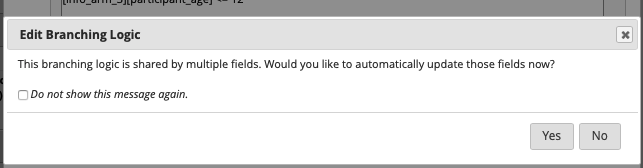

# Between Waves Protocol

Protocol relevant to moving from one wave of MBB to the next wave of study.

### Between Waves - Database Formation

### Between Waves - Redcap

Reminders on what to change in REDCap (NOTE: this is not an exhaustive list, just some things Lab Manager should remember. Reach out to Kristen for questions): 

- do NOT click the branch button that says "apply to all." If you copy a survey and make a change on branch logic, sometimes it will ask you if you want to apply the change to more than one item. This is dangerous because the logic does not work 100% accurately- it may change items you do not want to shift the branch logic on, and it applies to every survey where these items are related, so it is VERY hard to change back. 

- applied to all surveys that are age specific, you need to remember change surveys that should only be given to each ages
- need to make sure any branch logic on a specific variable that is branching from a different survey (age, what wave, etc.) is redone between waves because its on a different arm

### Between Waves - Gorilla

### Between Waves - Ordering

### Between Waves - Bio Sample Shipping 

#### Shipping with Dry Ice

*supplies need to obtain:*

	- styrofoam box (bioshipper) – HPL or recycling bin
	- newspaper
	- rubber bands
	- gallon ziplock bags
	- dry ice 
	- box for the outer later of styrofoam – tyler or recycling bin or purchase
	- class 9 label for dry ice - black and white diamond - obtain from dry ice dept or tyler 
	- markings for UN1845/dry ice/weight - tyler
	- Air waybill – tyler 

*Reorganize Samples*

- extract storage boxes from the freezer
- place samples on dry ice
- take first sample of every participant for stool and saliva, place in new box (if only shipping 1 sample rube per participant to collabator)
- re-label boxes
- create new spreadsheet detailing new location of every sample

*Packing*

determine dry ice amounts and sizing:

- determine volume of specimens to pack per size of bioshipper
- determine amount of dry ice per volume of samples, and ensure it all fits within bioshipper(s)

packaging it up:

- secure each storage box with rubber bands
- place boxes inside biohazard zip bloc bags
- weigh and record amount of dry ice per box:
  - weigh shipping box prior to adding dry ice
  - surround freezer boxes with dry ice (about 2 blocks worth per box)
  - weigh freezer box + dry ice together 

- subtract point 1 from point 3 to get total weight of dry ice and record it on shipping label
- place required amount of dry ice in bottom of insulated shipper and cover with crumpled newspaper 
- place biohazard zip bloc bag with storage boxes inside on top of newspaper
- fill any remaining space on sides and between boxes with crumpled paper
- place newspaper on top of specimens
- place remaining dry ice for volume on top and place lid on box 
- do not overstuff box, do not tape the lid, do not tape the box the bioshipper goes in
- fill out and place dry ice sticker on outside of bioshipper?
- print and add other labeling (ask tyler) to regular box, that styrofoam box goes in
- attach fedex courier forms to outside of box

*shipping*

- coordinate with Tyler about where and when to pick it up – typically needs to be by 11 am on either Monday or Tuesday of the week 

### Between Waves - Analysis

#### Saliva Sample Analysis

Notes from Dr. Meyer: Please note the following regarding the data: (1) sample MBB073 had too little hair to process (you will not be charged for that sample); (2) several of the samples were shorter than 3 cm, which is noted in the file; this is just informational ....you don't have to do any correction for the shorter length in your data analysis; same thing with the one sample that showed the presence of hair dye; (3) we recommend performing a statistical test for outliers and considering removing those data points from subsequent analysis; (4) lastly, hair CORT distributions are often non-normal due to right skewness, even after removal of outliers; we recommend checking for that, and if present, the most common approach is to perform a log transformation of the data before further analysis.